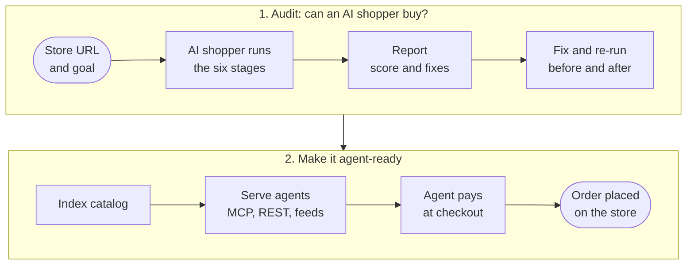

<div align="center">


# Shopper Zero

**Lighthouse for agentic checkout**

Shopper Zero sends a real AI shopper through your store, right up to the payment page, and shows you exactly where the sale breaks. Then it makes the store agent-ready.


**[Live demo](https://shopper-zero.vercel.app)**

</div>

> **Status:** this repository is an MVP in progress. You can run a local before/after storefront and a working checkout demo with simulated payments. The live-store scanner, scoring and report experience are still being built, and the scan and crawl services are placeholders for now.

## Contents

- [Can an AI shopper buy from your store?](#can-an-ai-shopper-buy-from-your-store)
- [How it works](#how-it-works)
- [The six-stage gauntlet](#the-six-stage-gauntlet)
- [The report](#the-report)
- [Make it agent-ready](#make-it-agent-ready)
- [Run the demo](#run-the-demo)
- [Agent interface](#agent-interface)
- [Configuration](#configuration)
- [Development](#development)
- [Deployment](#deployment)
- [How the shopper behaves](#how-the-shopper-behaves)
- [From prospect to demonstrated blocker](#from-prospect-to-demonstrated-blocker)

## Can an AI shopper buy from your store?

AI assistants are starting to shop on people's behalf. Most stores were built for humans, and an agent can fail quietly: a price that only appears after JavaScript runs, a size picker that carts the wrong variant, shipping costs hidden in a pop-up, a bot check at the checkout door.

Paste a store URL and an optional shopping goal, such as *"Buy a pair of running shoes, size 9"*. Shopper Zero:

1. **Tests the shopping journey.** A real AI shopper finds the product, reads its price and stock, selects the right variant, adds it to the cart and attempts checkout.
2. **Shows where it breaks.** It records the failing step and the evidence: a bot challenge, missing product data, the wrong size in the cart, or a step that needs a person.
3. **Ranks the fixes.** The merchant gets a readiness score and a prioritised list of blockers, each with a concrete fix.
4. **Retests after changes.** It runs the same journey again to show whether the fixes helped.
5. **Makes the store agent-ready.** It indexes the catalog and serves it to agents over MCP, UCP and a Shopify-compatible `products.json`, with a checkout agents can buy through.

Reaching checkout and completing an order are separate outcomes. On live stores, the shopper stops before payment. A completed purchase needs a controlled checkout test, like the Lumière demo below.

Every run follows three rules:

- It stops at the payment form on stores we don't own.
- It identifies itself honestly with its own user agent.
- It does not solve CAPTCHAs. A block is a result.

## How it works



## The six-stage gauntlet

The shopper works through the same six stages a person would. Each stage is weighted by how much it matters to a sale, for 100 points in total.

| Stage | Points | What the shopper has to do |
|---|---|---|
| Discover | 10 | Find a product that matches the goal, from the homepage or site search |
| Understand | 15 | Read the name, price and currency, and match them against structured data and the cart line |
| Availability | 10 | Confirm the requested variant is in stock |
| Cart | 20 | Select the variant, add it to the cart, and check the cart holds exactly that item |
| Ship & policy | 15 | Find the shipping cost, delivery time and returns policy as plain text before checkout |
| Checkout | 30 | Reach the payment form with the right item in the order |

To get through each stage, the shopper uses the cheapest way in that works: the store's APIs first, then the page structure, then driving a real browser.

**Scoring:**

- A pass earns the stage's full points, a warning earns half, and a failure earns none.
- Inconclusive stages are left out, and the score is `round_half_up(100 × earned / measured)`.
- If the checkout stage fails, the score is capped at 70.
- Score bands follow Lighthouse: 0 to 49 is poor, 50 to 89 needs work, 90 to 100 is good. The report also gives an A to F grade.

**Grading is done by fixed checks, not by the model.** For example, the harness compares the variant selected on the page with the variant in the store's own cart data. The model never grades itself.

## The report

Each run produces a report with:

- **Verdict:** the outcome in one line, for example *"Sale corrupted at cart"*.
- **Where the points went:** points earned per stage, sized by weight.
- **Evidence:** what the page showed next to what the store actually recorded, from each access method.
- **Blockers and fixes:** root causes first, each with a fix, the effort involved and who can act on it.
- **Side door:** machine-readable entry points such as `products.json`, Product JSON-LD, `/.well-known/ucp` and `llms.txt`, plus the detected platform. These are shown beside the score, not counted in it.
- **Journey:** the full event log, stage by stage.
- **Test conditions:** user agent, model, region, network, guest checkout, goal and date, so every run can be reproduced.

### Example: before and after

An illustrative run on a running-shoe store, with the goal *"Buy a pair of running shoes, size 9"*:

| Run | Score | Verdict |
|---|---|---|
| Before | 35 | Sale corrupted at cart. The page confirmed size 9, but the cart held size 8. |
| After three fixes | 93 | Test purchase completed with size 9 on a test gateway. |

It scored 93, not 100, because shipping was still only "calculated at checkout", and the scorer caught it.

The three fixes were: repair the variant mapping, restore the Product JSON-LD, and move shipping and returns out of the pop-up. Fixes are applied and re-run only on stores you control. On anyone else's store, Shopper Zero gives recommendations only.

## Make it agent-ready

The audit shows where agents fail. The catalog and checkout components fix what it finds: an agent-readable product feed fixes discovery problems, and a checkout integration lets an agent complete the purchase. A human handoff still means the journey needs a person.

### Index

The catalog is indexed through the cheapest path that works:

1. **Platform API:** WooCommerce, Magento, Squarespace, SFCC, or a Shopify passthrough.
2. **Sitemap and JSON-LD:** finds the sitemaps through `robots.txt`, then reads `Product` / `ProductGroup` JSON-LD from each product page. This covers most custom stores.

Products are normalized into one schema (prices as integer minor units) and stored in Supabase.

### Serve

Every indexed store gets the agent surfaces Shopify stores get for free: an MCP server, a REST API, a Shopify-compatible `products.json`, a UCP profile, an ACP product feed and `llms.txt`. See [Agent interface](#agent-interface).

### Checkout

1. `create_checkout` gets a live quote from the store: items, shipping and tax.
2. The agent confirms and pays. Payments are simulated in this MVP; Stripe is the planned rail.
3. Shopper Zero places the order through the store's own cart and order routes. The payment is authorized first and captured only after the order exists. If capture fails, the merchant order is cancelled and the authorization released.

Stores without a checkout integration get a handoff, and a person finishes the purchase on the merchant's site.

## Run the demo

Requires Node 22 or newer. No vendor credentials or Supabase setup are needed.

```sh
npm ci
npm run demo:provence
```

| What | URL |
|---|---|
| Checkout | http://127.0.0.1:4174/demo/checkout |
| Lumière before | http://127.0.0.1:4001/en-us/ |
| Lumière after | http://127.0.0.1:4002/en-us/ |

Choose a product, size and shipping method, then confirm the purchase. Orders appear in the Lumière storefront with matching receipt IDs. Payments are simulated. `npm run dev:mock` starts the same demo.

The before store still rejects declared shopping agents and keeps its original variant bug, so you can see the blockers the audit is built to find.

To watch an agent buy on its own, run this in a second terminal:

```sh
npm run demo:agent      # MCP catalog → 75 ml hand cream → checkout → receipt
```

See the [checkout guide](docs/guides/checkout.md) for scenarios (declined payment, stock and price changes, handoff) and where demo data is stored.

### Database development

Install Docker and the [Supabase CLI](https://supabase.com/docs/guides/cli), then:

```sh
npm run db:start               # boots local Postgres, Auth and Storage, applies migrations
cp .env.example .env.local     # fill in the Supabase values printed by db:start
npm run dev                    # http://localhost:3000
```

Supabase Studio runs at http://127.0.0.1:54323.

## Agent interface

### Connect an MCP client

With the demo running:

```bash
claude mcp add --transport http shopper-zero http://127.0.0.1:4174/api/mcp
```

Then ask: *"Find the shea butter hand cream in 75 ml and buy it."*

### MCP endpoints

| Endpoint | What it serves |
|---|---|
| `/api/ucp/mcp` | The composed agent surface: catalog, crawl and checkout tools |
| `/api/mcp` | The local checkout demo |
| `/api/mock/mcp` | Catalog helpers and the six checkout and order tools, for the demo |

### MCP tools

Tool names follow Shopify / UCP. Each tool's structured output matches the response body of its REST equivalent.

| Group | Tools |
|---|---|
| Catalog | `list_stores`, `search_catalog`, `lookup_catalog`, `get_product` |
| Checkout | `create_checkout`, `update_checkout`, `get_checkout`, `complete_checkout`, `cancel_checkout`, `get_order` |
| Scan and index | `scan_store`, `get_scan`, `index_store`, `get_crawl_status` (placeholders until the scanner lands) |

### REST API

| Route | Purpose |
|---|---|
| `GET /api/v1/search` | Search products across stores |
| `GET /api/v1/products/{id}` | Product detail |
| `GET /api/v1/stores/{slug}` | Store status |
| `POST /api/v1/checkouts` | Create a checkout |
| `GET`, `PUT /api/v1/checkouts/{id}` | Read or update a checkout (items, buyer, shipping) |
| `POST /api/v1/checkouts/{id}/complete` | Pay and place the order |
| `POST /api/v1/checkouts/{id}/cancel` | Cancel a checkout |
| `GET /api/v1/checkouts/{id}/events` | Checkout timeline |
| `GET /api/v1/orders/{id}` | Order status |
| `POST /api/mock/checkouts` | Demo helper: start a checkout for a `scenario`, with optional `variant_id` and `quantity` |

Conventions:

- The full spec is at `/openapi.json`.
- Errors use `{ "error": { "code", "message", "details?" } }`.
- Checkout writes honor an `Idempotency-Key` header.
- Money is `{ amount, currency }` in integer minor units.
- Public JSON routes send `Access-Control-Allow-Origin: *`.

### Per-store outputs

| URL | Format |
|---|---|
| `/s/{store}/products.json` | Shopify-compatible product list (`?limit=` up to 250, `?page=`) |
| `/s/{store}/products/{handle}.json` | Single product, Shopify shape |
| `/s/{store}/feed.acp.jsonl` | ACP / OpenAI product feed, one row per variant |
| `/s/{store}/llms.txt` | Agent-readable store docs |
| `/s/{store}/.well-known/ucp` | UCP profile |

Root discovery: `/.well-known/ucp`, `/.well-known/agent-card.json`, `/llms.txt`, `/openapi.json`, `/robots.txt`.

## Configuration

Local values go in `.env.local` (git-ignored). The demo needs none of them: `npm run demo:provence` sets what it needs. For the full app, only the core variables are required. When a feature's keys are missing, that feature responds with `not_implemented` and the rest of the app keeps working. The full list is in [`.env.example`](.env.example).

### Core

| Variable | Default | Notes |
|---|---|---|
| `NEXT_PUBLIC_SUPABASE_URL` | `http://127.0.0.1:54321` | Supabase API URL |
| `NEXT_PUBLIC_SUPABASE_PUBLISHABLE_KEY` | | Browser reads and Realtime |
| `SUPABASE_SECRET_KEY` | | Server only, never exposed to the browser |
| `APP_URL` | `http://localhost:3000` | Public base URL, no trailing slash |
| `LOG_LEVEL` | `info` | |

### Local demo

| Variable | Default | Notes |
|---|---|---|
| `SHOPPERZERO_MOCK_ENABLED` | `0` | `1` enables the local simulated checkout |
| `CHECKOUT_DEMO_STORE` | `provence` | `fixtures` selects the isolated fixture store used in regression tests |
| `PROVENCE_STORE_URL` | `http://127.0.0.1:4002` | Lumière after-store origin; only loopback HTTP origins are accepted |
| `MOCK_CHECKOUT_APP_URL` | `http://localhost:3000` | Checkout app origin |
| `MOCK_CHECKOUT_DATA_FILE` | `.mock-checkout/ledger.json` | Checkout sessions, events and simulated payments |
| `PROVENCE_DATA_FILE` | `.demo-stores/provence-orders.json` | Merchant orders and inventory |

### Shopper runs

| Variable | Default | Notes |
|---|---|---|
| `ANTHROPIC_API_KEY` | | Model access for the AI shopper; browser runs are skipped without it |
| `SCAN_MODEL` | `claude-opus-5-5` | `claude-sonnet-5` or `claude-haiku-4-5` are cheaper |
| `SCAN_MAX_CONCURRENT` | `3` | Global cap on active runs |
| `SCAN_CU_ENABLED` | `1` | `0` disables browser runs |
| `SCAN_CU_MAX_STEPS` | `15` | Hard cap on browser steps per run |
| `BROWSERBASE_API_KEY`, `BROWSERBASE_PROJECT_ID` | | Remote browser. Required on Vercel; local Playwright otherwise |

### Crawling

| Variable | Default | Notes |
|---|---|---|
| `CRAWLER_USER_AGENT` | `ShoperZeroBot/0.1 (+{APP_URL}/bot)` | |
| `CRAWL_MAX_PRODUCTS` | `150` | Per store |
| `CRAWL_TIME_BUDGET_MS` | `240000` | Per crawl run |
| `CRAWL_MAX_CONCURRENT_RUNS` | `3` | |
| `CRAWL_TIERS` | `platform_api,jsonld` | |
| `ALLOW_PRIVATE_STORE_HOSTS` | `false` | `true` only for a store on localhost or a private IP |

### Checkout and payments

| Variable | Default | Notes |
|---|---|---|
| `STRIPE_SECRET_KEY` | | Test keys (`sk_test_`) only |
| `STRIPE_PREVIEW_VERSION` | `2026-04-22.preview` | For Shared Payment Token endpoints |
| `STRIPE_SPT_MODE` | `spt` | `fallback` uses a plain test card |
| `WOO_DEMO_URL` | | WooCommerce store used for headless checkout |
| `CHECKOUT_ALLOWED_DOMAINS` | | Hosts allowed for headless checkout; empty = `WOO_DEMO_URL` only |
| `CHECKOUT_FORCE_HANDOFF` | `false` | Dev only: send every checkout to handoff |
| `DEMO_WALLET_ENABLED` | `false` | Optional demo-token helper |
| `DEMO_WALLET_MAX_USD` | `$25` | Per-payment cap for the demo helper |

## Development

### Scripts

| Command | What it does |
|---|---|
| `npm run demo:provence` | Start Lumière before (4001), Lumière after (4002) and checkout (4174) |
| `npm run demo:agent` | Scripted agent purchase through MCP; saves evidence under `artifacts/mock-checkout` |
| `npm run demo:before` / `demo:after` / `demo:stores` | Start one or both Lumière storefronts |
| `npm run dev` | Dev server |
| `npm run dev:mock` | Same as `demo:provence` |
| `npm run build` / `npm start` | Production build and serve |
| `npm run lint` | ESLint |
| `npm run typecheck` | Generate Next route types, then `tsc --noEmit` |
| `npm test` | Unit tests |
| `npm run test:integration` | Integration tests against isolated storefronts and app servers |
| `npm run test:browser` | Browser tests against the running checkout on port 4174 |
| `npm run test:demo-store` | Lumière storefront tests |
| `npm run db:start` | Start local Supabase |
| `npm run db:reset` | Recreate the local database and reapply all migrations |
| `npm run db:push` | Push migrations to the linked remote project |
| `npm run db:types` | Regenerate `src/infrastructure/database/types.gen.ts` from the local database |
| `npm run db:types:remote` | Same, from the linked remote project |
| `npm run db:smoke` | Smoke-test the database helpers against `.env.local` |

Before pushing, run `npm test && npm run lint && npm run typecheck && npm run build`.

### Database changes

1. `supabase migration new <name>`
2. `npm run db:reset` to reapply locally
3. `npm run db:types` to refresh the generated types

Migrations are add-only. Never edit one that is already on `main`.

### Project structure

| Directory | Purpose |
|---|---|
| `src/app` | Next.js pages and API entry points |
| `src/features` | Checkout, catalog, crawling and scanning logic; feature UI and adapters |
| `src/contracts` | Shared schemas and interfaces |
| `src/infrastructure` | Database, Supabase and MCP integration |
| `src/shared` | Environment, errors, HTTP, logging, money and URL utilities |
| `demos` | Lumière storefronts and preserved design prototypes |
| `tests` | Unit, integration and browser suites |
| `scripts` | Demo and database commands |
| `docs` | Guides, specs and background research |
| `supabase` | Configuration, add-only migrations and seed |

The main application is one Next.js project. Prototype dependencies and builds are separate and ignored. See the [repository map](docs/guides/repository-structure.md) for where older paths moved.

This project uses Next.js 16, which has breaking changes from earlier versions. Check `node_modules/next/dist/docs/` before writing route handlers or proxy code.

### Design prototypes

```sh
npm run demo:original                          # original static design, port 4173
npm ci --prefix demos/prototypes/grok
npm run demo:grok                              # extracted Vite prototype, port 4175
npm --prefix demos/prototypes/grok run build
```

## Deployment

Every push to `main` runs [`.github/workflows/deploy.yml`](.github/workflows/deploy.yml): Supabase migrations are applied first, then the app is deployed to Vercel production. Merge only once the build passes.

- **Repo secrets:** `SUPABASE_ACCESS_TOKEN`, `SUPABASE_DB_PASSWORD`, `VERCEL_TOKEN`
- **App env vars:** set in the Vercel project for both Production and Preview

The local demo uses file-backed state and runs only on your computer.

## How the shopper behaves

**During a shopper run:**

- It stops at the payment form on any store we don't own, and never changes a store we don't control.
- It identifies itself honestly and does not solve CAPTCHAs. A bot check is recorded as a result.
- `robots.txt` rules on `/cart` and `/checkout` are reported as informational. They govern crawlers, not purchases.

**While indexing**, the crawler identifies itself as `ShoperZeroBot`. It:

- respects `robots.txt`, including `Crawl-delay`;
- fetches at most 2 requests per second per store and backs off when throttled;
- only reads public pages and APIs.

`/bot` explains how to opt out. Merchants can claim their store with a DNS TXT record or a meta tag to get a verified badge and control their listing.

## From prospect to demonstrated blocker

**SFCC usage identifies a prospect. A demonstrated failed purchase journey establishes the sales opportunity.**

Salesforce Commerce Cloud (SFCC), also known as Demandware, is a useful starting segment for prospecting. The research below comes from the supplied discussion and has **not been independently verified for this README**.

### L’Occitane: a demonstration prospect

The discussion reports an SFCC storefront using Cloudflare and Adyen, with DataDome bot protection. In the reported browser session, a **DataDome challenge appeared before the cart rendered**, preventing that agent session from continuing towards a purchase.

That is a concrete example of the problem Shopper Zero aims to diagnose. It is evidence about the reported session, not a current assessment of every L’Occitane storefront or shopping agent. Some payment details came from an **April 2025 archive** and need fresh verification.

### Find similar merchants through certificate logs

The proposed approach is to search **Certificate Transparency (CT) logs** for Salesforce hosting domains. Those certificate hostnames can contain merchant names or storefront domains; the discussion identifies them as more useful for this task than searching DataDome’s own domain.

| Reported source | What it can reveal | What still needs checking |
|---|---|---|
| `cc-ecdn.net` | Hostnames that can encode public storefront domains | Extract the domain and verify that it is a live production store |
| `demandware.net` | Hostnames containing merchant or brand tokens | Map each token to the actual storefront, then verify it |

The pasted research reports roughly **2,000 production domains**, including about **82 UK domains**. Treat these as reported counts, not a verified current market size. Certificates can be historical, and a hostname alone does not establish current SFCC usage, bot protection, or a checkout failure.

The proposed prospecting workflow is:

1. Collect certificate hostnames from the reported hosting domains.
2. Filter for production storefronts, removing staging, development, and unrelated hosts.
3. Extract merchant domains, map brand tokens to storefronts, and deduplicate.
4. Prioritise UK and EU retailers.
5. Verify each live storefront and its current platform.
6. Test product discovery, cart, and checkout; record the exact blocker and supporting evidence.

Suggested prospects from the discussion: **Clarins, Space NK, Elemis, Lancôme, Kiehl’s, AllSaints, Kurt Geiger, and Currys**. These are candidates for verification, not confirmed blocked stores or customers.
