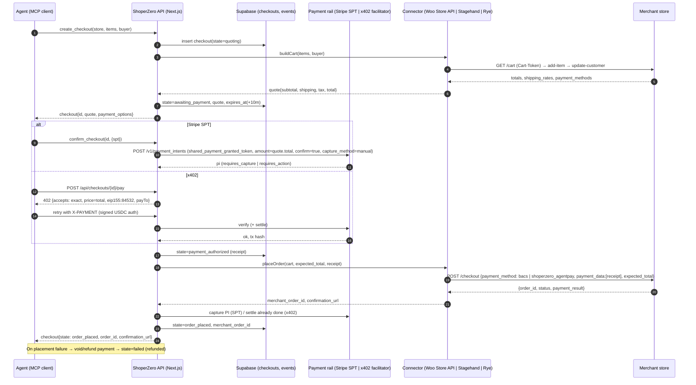
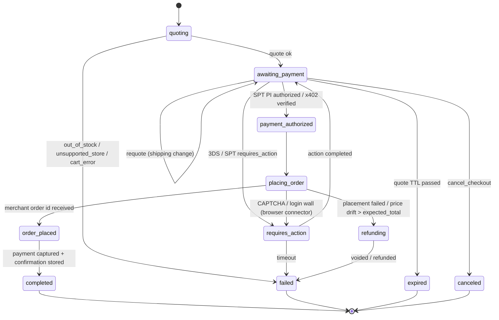

# 07 — Checkout Execution: completing a purchase on a store with no agent API

_Research date: 2026-09-26. Track: "actually placing the order". Anything not verified against a primary source is marked **UNVERIFIED**._

---

## TL;DR

- **Headless card checkout on a random store is basically impossible to do cleanly.** Card gateways (Stripe Payment Element, Braintree Hosted Fields, Adyen Web) tokenize card data **in the browser with the merchant's publishable key**, and 3DS challenges need a human. Without a browser you can only complete **offline methods** (WooCommerce `cod`/`bacs`/`cheque`, Magento `checkmo`/`banktransfer`/`cashondelivery`/`free`).
- **WooCommerce is the best API-driven target.** The public, unauthenticated Store API (`/wp-json/wc/store/v1/cart` → `/checkout`) builds a cart and places an order with just a `Cart-Token` header. With `payment_method: "bacs"` or `"cod"` it returns `order_id` + `payment_result` right away ([docs](https://developer.woocommerce.com/docs/apis/store-api/resources-endpoints/checkout/)). Magento guest-carts do the same over REST. BigCommerce, PrestaShop, Wix and Squarespace need merchant credentials or a browser.
- **For the agent-to-us payment leg, use Stripe Shared Payment Tokens (SPT) in test mode, x402 on Base Sepolia, or both.** SPT has a **test helper** that mints a granted token (`POST /v1/test_helpers/shared_payment/granted_tokens`), and you charge it with `payment_method_data[shared_payment_granted_token]` ([docs](https://docs.stripe.com/agentic-commerce/concepts/shared-payment-tokens.md?agent-seller=seller)). x402 v2 ships `@x402/next@2.27.0`, which exports `paymentProxy` (made for Next 16 `proxy.ts`) and `withX402` for route handlers ([README](https://github.com/coinbase/x402/tree/main/typescript/packages/http/next)).
- **Rye is the only universal-checkout API a hackathon team can use today.** Its self-serve staging (`https://staging.api.rye.com`) takes a product URL, a buyer and `tok_visa`, and returns a confirmed order through `checkout-intents` (npm `checkout-intents@0.31.0`). It has 3 endpoints, ships to US addresses only, and costs $149/mo + $0.05/order after a 30-day trial ([quickstart](https://rye.com/docs/api-v2/example-flows/simple-checkout), [pricing](https://rye.com/pricing)). **Crossmint Agent Checkouts is production-only**: staging keys return 401 ([docs](https://docs.crossmint.com/agents/payment-flows/worldstore/inventory)). Skip it for the demo.
- **Browser automation is the universal fallback, but it is slow and flaky.** Use **Stagehand (`@browserbasehq/stagehand@4.1.0`) on Browserbase**. The $20 Developer plan includes 100 browser-hours, CAPTCHA solving and proxies ([pricing](https://www.browserbase.com/pricing)). Expect 1–4 minutes per checkout and roughly 90% success on common CAPTCHAs, lower on Akamai/Kasada. Never run it live against a third-party store without dry-run mode.
- **Payment instruments the agent can put into a browser form:** Stripe **Issuing for agents** issues single-use virtual cards with spend and MCC controls plus real-time auth webhooks ([docs](https://docs.stripe.com/issuing/agents)), but you must apply for Issuing. Lithic has a self-serve sandbox with `SINGLE_USE` cards. Visa Intelligent Commerce and Mastercard Agent Pay tokens reach us **through Stripe SPTs**, so don't integrate the networks directly.
- **Recommended demo:** run our own WooCommerce store in Docker behind a `cloudflared` tunnel. **Primary path:** Store API connector + offline gateway, with the agent paying ShoperZero via SPT (test) or x402 (Base Sepolia), and the order note/meta carrying the payment receipt. **Fallback 1:** the Stagehand browser connector on the *same* store (proves it works "with no API"). **Fallback 2:** Rye staging for a "real merchant" order.
- **Stretch goal (high demo value):** a roughly 80-line WordPress plugin, "ShoperZero Agent Pay", that registers a WooCommerce gateway. It accepts `payment_data: [{key:"spt"|"x402_receipt", value}]`, verifies the receipt against our API and marks the order `processing`. That makes an honest "merchant installs one plugin and becomes agent-payable" story.

---

## 1. API-driven carts (no browser)

### 1.1 WooCommerce Store API (best target; public, no auth)

Base: `https://{store}/wp-json/wc/store/v1`. Every cart/checkout call needs a `Nonce` **or** `Cart-Token` header. Get the token from the response headers of `GET /cart` ([cart tokens](https://developer.woocommerce.com/docs/apis/store-api/cart-tokens/)).

```bash
S=https://shop.example.com/wp-json/wc/store/v1
# 1) get a cart token
TOKEN=$(curl -si $S/cart | grep -i '^cart-token:' | awk '{print $2}' | tr -d '\r')
# 2) add item (id = product or variation id from /products)
curl -s -X POST $S/cart/add-item -H "Cart-Token: $TOKEN" -H 'Content-Type: application/json' \
  -d '{"id": 123, "quantity": 1}'
# 3) set addresses → recalculates shipping rates
curl -s -X POST $S/cart/update-customer -H "Cart-Token: $TOKEN" -H 'Content-Type: application/json' \
  -d '{"billing_address":{...},"shipping_address":{...}}'
# 4) choose shipping rate (package_id + rate_id from cart.shipping_rates)
curl -s -X POST $S/cart/select-shipping-rate -H "Cart-Token: $TOKEN" -H 'Content-Type: application/json' \
  -d '{"package_id":0,"rate_id":"flat_rate:1"}'
# 5) place order
curl -s -X POST $S/checkout -H "Cart-Token: $TOKEN" -H 'Content-Type: application/json' -d '{
  "billing_address": {"first_name":"Ada","last_name":"L","address_1":"1 Main St","city":"SF","state":"CA","postcode":"94105","country":"US","email":"ada@example.com","phone":"5555555555"},
  "shipping_address": {"first_name":"Ada","last_name":"L","address_1":"1 Main St","city":"SF","state":"CA","postcode":"94105","country":"US"},
  "payment_method": "bacs",
  "customer_note": "Placed by ShoperZero agent. receipt=pi_123",
  "payment_data": []
}'
# → {"order_id":146,"status":"on-hold","payment_result":{"payment_status":"success","redirect_url":".../order-received/146/?key=..."}}
```

- The POST `/checkout` schema is `billing_address`, `shipping_address`, `payment_method` (required), and `payment_data[]`, `customer_note`, `expected_total` (minor units) as optional fields ([checkout docs](https://developer.woocommerce.com/docs/apis/store-api/resources-endpoints/checkout/)). **Use `expected_total`** as a price-drift guard so we don't charge more than we quoted.
- `GET /checkout` returns the draft order and the available `payment_methods`. **Read it to detect whether `cod`/`bacs`/`cheque` are enabled.** Most real stores disable them.
- Store API endpoints (`cart/add-item`, `cart/update-customer`, `cart/select-shipping-rate`, `checkout`) are from memory of the Store API. They are stable, but double-check paths in the [Store API index](https://developer.woocommerce.com/docs/apis/store-api/).
- **Card via Store API:** the WooCommerce Stripe gateway accepts `payment_method:"stripe"` with `payment_data:[{key:"wc-stripe-payment-method", value:"pm_..."}]`. The key name changed across plugin versions (`stripe_source` → `wc-stripe-payment-method` → `wc-stripe-confirmation-token`), so it is version-dependent. The blocker is that the `pm_` must be created **with the merchant's Stripe publishable key**. That key is public in page HTML, but Stripe blocks raw-PAN API calls by default, so in practice it needs Stripe.js in a browser. If 3DS triggers, you get a redirect/`requires_action` that needs a human. **Verdict: don't try card-via-Store-API at the hackathon.**
- The Checkout Order API (`/checkout/{order_id}`) re-pays an existing pending order ([docs](https://developer.woocommerce.com/docs/apis/store-api/resources-endpoints/checkout-order/)). It is useful for a retry after the payment leg.

### 1.2 Magento 2 / Adobe Commerce guest REST (public, no auth for guest carts)

```
POST /rest/V1/guest-carts                                  → "maskedCartId"
POST /rest/V1/guest-carts/{id}/items                       {cartItem:{sku, qty, quote_id:id}}
POST /rest/V1/guest-carts/{id}/estimate-shipping-methods   {address:{...}} → carrier_code/method_code
POST /rest/V1/guest-carts/{id}/shipping-information        {addressInformation:{shipping_address, billing_address, shipping_carrier_code, shipping_method_code}}
                                                           → payment_methods[] + totals
POST /rest/V1/guest-carts/{id}/payment-information         {email, paymentMethod:{method:"checkmo"}, billingAddress:{...}} → orderId
```

Refs: [guest order walkthrough](https://www.rakeshjesadiya.com/guest-customer-place-an-order-by-rest-api-magento-2/), [shipping-information](https://www.rakeshjesadiya.com/v1-guest-carts-cartid-shipping-information-rest-api-magento/). Only `checkmo`, `banktransfer`, `cashondelivery`, `purchaseorder` and `free` complete headless. Braintree/Stripe/Adyen need a client-side nonce. Many production Magento stores block `/rest/V1/guest-carts` behind a WAF or disable anonymous REST (**UNVERIFIED** prevalence). GraphQL (`createEmptyCart` → `placeOrder`) is the equivalent and is often the only one left open for PWA storefronts.

### 1.3 BigCommerce, PrestaShop, Wix, Squarespace

| Platform | Buyer-side (no merchant creds) | Can we place an order headless? |
|---|---|---|
| BigCommerce | Storefront API `/api/storefront/carts`, `/api/storefront/checkouts/{id}` (same-origin, cookie session) | Cart/checkout: yes. **Payment: no.** The Payments API (`payments.bigcommerce.com`) needs a store-issued payment access token from a merchant-credentialed call. Use the browser. (**UNVERIFIED** detail) |
| PrestaShop | No public storefront cart API. The Webservice needs a merchant key. | Browser only. |
| Wix | Wix Headless needs the site owner's OAuth client ID. | Browser only (unless the merchant opts in). |
| Squarespace | Commerce APIs are merchant-keyed (orders/inventory). No buyer checkout API. | Browser only. |
| Shopify (for reference) | Storefront API cart → `checkoutUrl`. Also Rye/Crossmint/ACP coverage. | Via Rye, or the merchant's own agent channels. |

### 1.4 Why cards don't work without a browser (tell the judges this)

1. **Tokenization is client-side and merchant-scoped.** The PAN goes from an iframe (Stripe Elements, Braintree Hosted Fields, Adyen) straight to the PSP, and the merchant server only sees a token. Our backend can't mint that token for the merchant's PSP account without running their JS. Sending raw PANs server-to-server puts us in PCI DSS SAQ-D scope, and Stripe disables raw card API access by default.
2. **3DS / SCA.** EU/UK issuers (and increasingly US risk engines) can challenge. The challenge UI needs the cardholder, so an agent can't complete it without a human-in-the-loop hop. SPT exposes this as `requires_action` + `next_action` ([agent SPT docs](https://docs.stripe.com/agentic-commerce/concepts/shared-payment-tokens.md?agent-seller=agent)).
3. **Fraud/bot controls.** Radar, Signifyd and similar tools see datacenter IPs, a headless UA and new devices, which lowers approval rates. Checkout pages are the most bot-protected pages on a site (Cloudflare Bot Management, Akamai, HUMAN/PerimeterX, DataDome, Kasada).
4. **The industry answer** is either merchant opt-in to an agent protocol (ACP/SPT, UCP, x402, Visa Trusted Agent Protocol / Web Bot Auth signatures) or an intermediary that runs the browser for you (Rye, Crossmint, Henry). ShoperZero's pitch fits between the two: **index + normalized checkout adapter, with a merchant plugin as the upgrade path.**

---

## 2. Browser-automation checkout

| Tool | What it is | Hackathon fit | Notes |
|---|---|---|---|
| **Stagehand** (`@browserbasehq/stagehand@4.1.0`, TS) + **Browserbase** | Playwright + AI primitives `act` / `extract` / `observe` / `agent`, running in hosted Chromium | **USE (primary fallback)** | TS-native, fits our Next.js repo. Browserbase: Free = 1 browser-hour, 3 concurrent, no CAPTCHA solving. **Developer $20/mo = 100 h (then $0.12/h), 25 concurrent, CAPTCHA solving, 1 GB proxy** ([pricing](https://www.browserbase.com/pricing)). Get a Developer plan today; the Free tier has no CAPTCHA solving. The v4 API surface is **UNVERIFIED**; check the Stagehand README before coding (v3 moved `act/extract` from `page.*` to `stagehand.*`). |
| **Browser Use** (Python OSS; `browser-use-sdk@3.11.3` for Cloud) | LLM agent loop over the DOM | Maybe | Cloud: $0.01/task + ~$0.006/step + $0.02/browser-hour (third-party summary of [pricing](https://browser-use.com/pricing), **UNVERIFIED** exact). Python-first, so it would need a sidecar service. |
| **Playwright (scripted)** | Deterministic selectors | **USE for our own Woo store** | Fastest and most reliable (under 10 s) when we know the DOM. Write a hard-coded "WooCommerce classic/blocks checkout" script and use LLM steps only for unknown sites. |
| **Anthropic computer use** / **OpenAI computer-use (ChatGPT agent, formerly Operator)** | Screenshot → action models | Skip for the demo | Slow (a screenshot loop per step, often 3–10 min per checkout) and costly in tokens. Good for "any site" narratives, bad for a live demo. |
| **Skyvern** | OSS + cloud, vision-driven workflows | Skip | Credit-based: Free 5k credits, Hobby $29, Pro $149 ([pricing](https://www.skyvern.com/pricing)). Python. |

**Realities:**
- **Speed:** an LLM-driven checkout (cart → address → shipping → payment iframe → submit) takes 20–60 steps, usually **1–4 minutes**. Rye advertises <35 s and >90% success for its production pipeline, which sets the bar ([Rye](https://rye.com/products/universal-checkout-api)).
- **Payment iframes:** Stripe/Braintree fields live in cross-origin iframes. Stagehand/Playwright can target frames, but LLM `act()` on iframes is the most common failure point. For our store, use Playwright `frameLocator('iframe[name^="__privateStripeFrame"]')` and hard-code it.
- **CAPTCHA/bot walls:** Browserbase auto-solves reCAPTCHA v2/v3, hCaptcha and Turnstile on paid plans, with lower success on Akamai/Kasada (per third-party reviews, **UNVERIFIED** percentages). Web Bot Auth / Visa **Trusted Agent Protocol** (RFC 9421 signatures verified against a Visa key directory; Cloudflare, Stripe, Adyen, Shopify and others participate) is the legit path for identified agents ([Visa TAP](https://developer.visa.com/capabilities/trusted-agent-protocol), [Cloudflare](https://blog.cloudflare.com/secure-agentic-commerce/)). Mention it in the pitch and skip it in the build.
- **Ethics/ToS:** only submit orders on stores we control or on vendor sandboxes. For third-party stores, run the browser connector in `dry_run` (stop at the final "Place order" button and screenshot it).

Minimal Stagehand sketch (**verify method names against the v4 README**):

```ts
import { Stagehand } from "@browserbasehq/stagehand";
const sh = new Stagehand({ env: "BROWSERBASE", apiKey: process.env.BROWSERBASE_API_KEY, projectId: process.env.BROWSERBASE_PROJECT_ID });
await sh.init();
const page = sh.context.pages()[0];           // v3+ shape (UNVERIFIED for v4)
await page.goto(productUrl);
await sh.act("add this product to the cart with quantity 1");
await sh.act("go to checkout");
await sh.act(`fill the shipping form: ${JSON.stringify(buyer)}`);
const quote = await sh.extract("extract subtotal, shipping, tax and total", QuoteZodSchema);
// payment: prefer a hard-coded frame fill on known gateways, else act()
await sh.act(`enter card number ${card.pan} expiry ${card.exp} cvc ${card.cvc}`);
if (!dryRun) await sh.act("click the place order button");
const confirmation = await sh.extract("extract order number and confirmation message", ConfirmationSchema);
```

---

## 3. Payment instruments for agents

| Instrument | How the agent uses it | Access speed | Verdict |
|---|---|---|---|
| **Stripe Shared Payment Token (SPT)** | The agent issues `POST /v1/shared_payment/issued_tokens` (payment_method + `seller_details[network_business_profile]` + `usage_limits{currency,max_amount,expires_at}`). The seller charges via `POST /v1/payment_intents` with `payment_method_data[shared_payment_granted_token]=spt_…&confirm=true`. Header `Stripe-Version: 2026-04-22.preview`. States: `active`, `requires_action`, `deactivated`. Webhooks: `shared_payment.issued_token.{requires_action,active,used,deactivated}`. **Test helper:** `POST /v1/test_helpers/shared_payment/granted_tokens` with `payment_method=pm_card_visa`. Test seller profile `profile_test_61TU90nIeGjU7NNVXA6TU90m7ISQWsBxpcx9lASWWXTk`. Available in the US, CA and much of Europe. ([seller](https://docs.stripe.com/agentic-commerce/concepts/shared-payment-tokens.md?agent-seller=seller), [agent](https://docs.stripe.com/agentic-commerce/concepts/shared-payment-tokens.md?agent-seller=agent)) | Test mode now. Preview ToS click-through (it may need preview enablement on the account, **UNVERIFIED**). | **USE** as the "agent pays ShoperZero" rail. Visa IC / Mastercard Agent Pay / Klarna / Affirm come along for free under SPT ([Stripe blog](https://stripe.com/blog/supporting-additional-payment-methods-for-agentic-commerce)). |
| **Link agent wallet / `@stripe/link-cli@0.23.0`** | `npx @stripe/link-cli spend-request create --credential-type shared_payment_token ...` issues a live SPT, or a one-time card, from a personal Link wallet ([link.com/agents](https://link.com/agents)) | Minutes | Nice for a "real money" moment, but not needed. |
| **x402 (USDC)** | The server returns 402 with payment requirements, the client signs an EIP-3009 transfer and retries with the payment header, and the facilitator verifies and settles. `@x402/next@2.27.0` exports `paymentProxy` (for `proxy.ts`) and `withX402(handler, {accepts:{scheme:"exact",price:"$0.01",network:"eip155:84532",payTo}}, server)`. The client uses `@x402/fetch@2.27.0` ([README](https://github.com/coinbase/x402/tree/main/typescript/packages/http/next), [CDP quickstart](https://docs.cdp.coinbase.com/x402/quickstart-for-sellers)) | Instant (testnet faucet) | **USE** as the crypto rail. Per-checkout dynamic price: check whether `price` accepts a function in v2 (**UNVERIFIED**). Otherwise, 402 from a custom route handler with a computed amount. |
| **Stripe Issuing for agents** | Single-use virtual cards, `spending_controls[allowed_categories]`, `spending_limits[{amount,interval:"per_authorization"}]`, and `issuing_authorization.request` webhook with a 2 s decision window. Card details are retrieved for browser checkout ([docs](https://docs.stripe.com/issuing/agents)) | **Requires applying** in the Dashboard. Not same-day. | Great story ("ShoperZero mints a card scoped to this merchant + amount"). Only use it if the account already has Issuing. Test mode Issuing cards only work on test-mode merchants, which our Woo+Stripe-test store is. |
| **Lithic** | `POST https://sandbox.lithic.com/v1/cards {type:"SINGLE_USE", spend_limit, spend_limit_duration:"TRANSACTION"}`. Sandbox can simulate auths ([docs](https://docs.lithic.com/docs/create-card), [simulate](https://docs.lithic.com/docs/simulating-transactions)). SDK `lithic@0.147.0`. | Self-serve sandbox key | **Alternative** if Stripe Issuing isn't enabled. Sandbox PANs won't pass real Stripe test-mode checkout (Stripe only accepts its own test cards), so it's for the demo UI only. |
| Privacy.com / Ramp / Brex | Card APIs exist (Privacy API; Ramp/Brex virtual card APIs for business accounts) | Account approval is slow | Skip. |
| **Visa Intelligent Commerce / Mastercard Agent Pay** | Agent-bound network tokens + mandates. Direct APIs on [Visa Developer](https://developer.visa.com/capabilities/visa-intelligent-commerce) need partner onboarding. | Weeks | Skip direct. Mention "via Stripe SPT". |
| Crossmint / Coinbase stablecoin → card or MoR | Crossmint Agent Checkouts: `POST /agent-checkouts {request:{startUrl}, constraints:{maxCost}}` + SSE message stream. **Production only; staging returns 401** ([docs](https://docs.crossmint.com/agents/payment-flows/worldstore/inventory)) | Real money only | Skip for the live demo. Cite it as prior art. |

---

## 4. "Universal checkout" vendors

| Vendor | Coverage | Access for a hackathon | Verdict |
|---|---|---|---|
| **Rye** (Universal Checkout / Checkout Intents API v2) | Any PDP URL: Shopify, Amazon, and "any merchant" (claims 90%+ reliability, <35 s). US shipping only. | **Self-serve staging key** at [staging.console.rye.com](https://staging.console.rye.com/account). $149/mo Developer plan + $0.05/order + $0.02/product fetch, 30-day trial ([pricing](https://rye.com/pricing)) | **USE as fallback #2.** `POST /api/v1/checkout-intents {buyer, productUrl, quantity}` → poll until `awaiting_confirmation` (offer with `cost.subtotal/tax/total` in `amountSubunits` + shipping options) → `POST /api/v1/checkout-intents/{id}/confirm {paymentMethod:{type:"stripe_token", stripeToken:"tok_visa"}}` → `completed` / `failed`. Auth header `Authorization: Basic $RYE_API_KEY`. The SDK has `createAndPoll` / `confirmAndPoll` ([quickstart](https://rye.com/docs/api-v2/example-flows/simple-checkout)). **Copy its state names and offer shape for our own API.** |
| **Crossmint** | Amazon, Shopify, "any URL" agent checkouts. Crossmint is merchant of record. USDC wallets or cards. | Production only for agent checkouts | Skip for the live demo. |
| **Firmly** | Merchant-onboarded network (Best Buy, Backcountry…). "Firmly Connect" is no-code merchant onboarding ([press](https://www.globenewswire.com/news-release/2026/03/24/3261349/0/en/Firmly-Launches-Firmly-Connect-the-First-Agentic-Commerce-Platform-that-Allows-Merchants-to-Directly-Connect-to-Any-Agent-or-Agentic-Marketing-Channel-Without-Deploying-Any-Code.html)) | Partner sales process. Docs at [developers.firmly.ai](https://developers.firmly.ai/) | Skip. It's a competitor/prior art on the *merchant-side* story. |
| **Henry Labs** | "OS for agentic commerce". Runs checkout-form automation on non-protocol merchants ([docs](https://docs.henrylabs.ai)) | **UNVERIFIED** self-serve | Skip. |
| **Nekuda** | Was an agent card wallet + "agentic mandates", and a Visa IC launch partner. The docs quickstart now describes **"WebMCP Kit"** (turns a website into verified agent tools), which suggests a pivot ([docs](https://docs.nekuda.ai/quickstart)) | **UNVERIFIED** | Skip for payments. The WebMCP angle is relevant to the discoverability track. |
| **Skyfire** | KYA identity + KYAPay (USDC) agent checkout. Partnered with Rye ([blog](https://skyfire.xyz/skyfire-x-rye-universal-checkout-kya-and-whats-on-the-other-side-of-the-agent-identity-wall/)) | Self-serve dashboard keys (**UNVERIFIED**) | Skip. x402 covers the same demo beat. |
| **Payman** | Agent-to-payee payouts (ACH/USDC), not merchant checkout | — | Skip. |

---

## 5. Recommended hackathon checkout architecture

### 5.1 Shape

ShoperZero acts as a **checkout orchestrator** with one normalized API/MCP surface and pluggable **connectors**:

```
Agent (MCP client) ──► ShoperZero API / MCP  (Next.js route handlers, Supabase state)
                          │
                          ├─ Payment leg (agent → ShoperZero):   Stripe SPT (test)  |  x402 USDC (Base Sepolia)
                          │
                          └─ Placement leg (ShoperZero → merchant), connector chosen per store:
                               1. woo_store_api      (Store API + offline gateway / ShoperZero Agent Pay plugin)   ← PRIMARY
                               2. magento_guest_rest (checkmo)                                                     ← cheap bonus
                               3. browser_stagehand  (any site; dry_run by default on 3rd-party)                    ← FALLBACK 1
                               4. rye                (real merchants, staging)                                      ← FALLBACK 2
```

The money story in the demo is **"agent pays ShoperZero, ShoperZero places the order."** On our own store the order is placed with an offline method, with the receipt ID in order meta (or with the plugin gateway that verifies it). In production this becomes either merchant settlement via the plugin/Stripe Connect or a single-use Issuing card filled into the merchant checkout.

### 5.2 MCP tools / API (mirror Rye + ACP shapes)

- `create_checkout({ store_id | product_url, items:[{product_id|variant_id, qty}], buyer:{name,email,phone,address} })` → `{ checkout_id, state:"quoting" }`
- `get_checkout(checkout_id)` → `{ state, quote:{ subtotal, shipping_options[], tax, total, currency, expires_at }, payment_options:["stripe_spt","x402"], x402?:{ url, amount, network } }`
- `select_shipping(checkout_id, option_id)` → requote
- `confirm_checkout(checkout_id, { type:"stripe_spt", token:"spt_…" } | { type:"x402" })`: for x402, the agent calls `POST /api/checkouts/{id}/pay`, which answers 402, and pays with `@x402/fetch`
- `cancel_checkout(checkout_id)`
- Webhook/SSE: `checkout.updated` (states below), including `requires_action` with a `next_action.url` for a human (3DS or a CAPTCHA the solver can't handle).

### 5.3 Sequence (primary path)



Key design choice: **authorize first, place the order, then capture** (Stripe `capture_method=manual`). If placement fails we void instead of refunding. x402 `exact` settles immediately, so on failure we must refund with an on-chain transfer back (for the demo, log it and show the "refund" state).

### 5.4 Order state machine



Supabase tables (minimal): `checkouts(id, store_id, connector, state, buyer jsonb, items jsonb, quote jsonb, payment jsonb, merchant_order_id, confirmation_url, error jsonb, expires_at, created_at, updated_at)` and `checkout_events(id, checkout_id, from_state, to_state, payload jsonb, created_at)`. Enforce transitions in one `transition(checkoutId, to, payload)` function. Stream `checkout_events` to the UI with Supabase Realtime for the live demo timeline.

### 5.5 Controlled WooCommerce store (build this first, ~30 min)

**Option A: local Docker + public tunnel (recommended; full control, and Stripe test mode works)**

```yaml
# docker-compose.woo.yml
services:
  db:
    image: mariadb:11
    environment: { MARIADB_ROOT_PASSWORD: root, MARIADB_DATABASE: wp, MARIADB_USER: wp, MARIADB_PASSWORD: wp }
  wp:
    image: wordpress:latest
    ports: ["8080:80"]
    environment: { WORDPRESS_DB_HOST: db, WORDPRESS_DB_USER: wp, WORDPRESS_DB_PASSWORD: wp, WORDPRESS_DB_NAME: wp }
    depends_on: [db]
    volumes: [wp:/var/www/html]
  cli:
    image: wordpress:cli
    user: "33:33"
    depends_on: [wp]
    volumes: [wp:/var/www/html]
    environment: { WORDPRESS_DB_HOST: db, WORDPRESS_DB_USER: wp, WORDPRESS_DB_PASSWORD: wp, WORDPRESS_DB_NAME: wp }
volumes: { wp: {} }
```

```bash
docker compose -f docker-compose.woo.yml up -d
URL=https://<your-tunnel>.trycloudflare.com   # from: cloudflared tunnel --url http://localhost:8080
docker compose -f docker-compose.woo.yml run --rm cli wp core install --url=$URL --title="ShoperZero Demo" --admin_user=admin --admin_password=admin --admin_email=a@b.co --skip-email
docker compose -f docker-compose.woo.yml run --rm cli wp plugin install woocommerce --activate
docker compose -f docker-compose.woo.yml run --rm cli wp plugin install wordpress-importer --activate
docker compose -f docker-compose.woo.yml run --rm cli wp import wp-content/plugins/woocommerce/sample-data/sample_products.xml --authors=create
docker compose -f docker-compose.woo.yml run --rm cli wp option update permalink_structure '/%postname%/'   # Store API needs pretty permalinks
# enable offline gateways (bacs, cod) in WooCommerce → Settings → Payments, add a flat-rate shipping zone
# optional: wp plugin install woocommerce-gateway-stripe --activate (test keys) for the browser+card path
```

Caveats: the WordPress site URL must equal the tunnel URL. A quick `trycloudflare` URL changes on restart, so use a named tunnel or re-run `wp option update home/siteurl`. The sample-data path and import command are from memory (**UNVERIFIED**; WooCommerce ships `sample-data/sample_products.xml`/`.csv`). The WooCommerce docs also describe `wp-env` ([dev env](https://developer.woocommerce.com/docs/getting-started/development-environment/)).

**Option B: hosted throwaway WP.** InstaWP/TasteWP-style sandboxes give a public URL in about 1 minute. Install WooCommerce + sample data from wp-admin. They expire and may block some plugins (**UNVERIFIED** limits). Use it if Docker is a problem for a teammate.

**Option C: someone else's demo store.** Magento Luma or PrestaShop public demos exist, but they reset, may be slow, and placing orders there is borderline. Use them **only for dry-run browser demos** (fill everything, screenshot before "Place order").

### 5.6 Stretch: "ShoperZero Agent Pay" WooCommerce gateway plugin (~80 lines PHP)

- `class WC_Gateway_ShoperZero extends WC_Payment_Gateway` with `id = 'shoperzero_agentpay'`.
- Store API path: hook `woocommerce_rest_checkout_process_payment_with_context` to read `$context->payment_data['sz_receipt']`, call `https://<our-app>/api/receipts/verify`, and on success run `$order->payment_complete($receipt_id)` then `$result->set_status('success')`.
- It proves the upgrade story: **"install one plugin and any WooCommerce store accepts agent payments (SPT/x402) through ShoperZero."** Hook name is from the WooCommerce Blocks payment integration docs ([docs](https://developer.woocommerce.com/docs/cart-and-checkout-payment-method-integration-for-the-checkout-block/)). **Verify the exact signature.**

### 5.7 Mock vs build (for a convincing live demo)

| Build for real | Mock / stub |
|---|---|
| Woo Store API connector (cart → quote → place order) against our store | Refunds on x402 (show the state and log it) |
| Checkout state machine + Supabase events + live timeline UI | Real-money SPT (use the test helper `granted_tokens` with `pm_card_visa`) |
| x402 pay endpoint on Base Sepolia (`withX402` or a manual 402) and an agent client using `@x402/fetch` | Issuing/Lithic single-use card, unless the account already has Issuing (show a "virtual card minted: •••• 4242, limit $23.00, MCC-locked" card in the UI from test-mode data) |
| SPT charge path in Stripe test mode (`payment_method_data[shared_payment_granted_token]`) | 3DS `requires_action` (trigger it with test card `4000 0027 6000 3184` on the browser path if time allows, else a canned event) |
| MCP server exposing `create_checkout` / `get_checkout` / `confirm_checkout` | Visa/Mastercard network tokens (a slide saying "via SPT") |
| Stagehand browser connector on **our** store (with a Playwright hard-coded fallback for the Stripe iframe) | Browser connector on third-party stores: `dry_run` only, recorded video as backup |
| Rye staging call for one Shopify/Amazon test URL (e.g. `https://www.raakachocolate.com/products/blueberry-lemon?variant=41038993227863`) | — |

Demo script (3 minutes): (1) the agent searches the index and picks a product on "ShoperZero Demo" (Woo). (2) `create_checkout` shows the quote on screen. (3) The agent pays with x402 USDC, and the timeline shows the 402 → paid → tx hash. (4) The order appears in WooCommerce admin with the receipt in its notes. (5) Repeat with an SPT. (6) "No-API store" mode: the Stagehand run is streamed from the Browserbase live view. (7) A real-merchant order via Rye staging.

---

## 6. Open questions / risks

- **SPT preview access:** the test-helper endpoint needs `Stripe-Version: 2026-04-22.preview` and preview ToS. Confirm our Stripe account can call it in the first 15 minutes. If it can't, fall back to a plain PaymentIntent with `pm_card_visa` labelled "SPT-compatible".
- **x402 dynamic pricing:** check whether `@x402/next` v2 `price` accepts a function or per-request config. If not, write a hand-rolled route returning 402 with a computed `maxAmountRequired`, and verify/settle via `HTTPFacilitatorClient`. The default facilitator URL in the README is `https://facilitator.x402.org` (**UNVERIFIED** vs `https://x402.org/facilitator`; test it).
- **Stagehand v4 API** changed from v3. Pin `@browserbasehq/stagehand@4.1.0` and read its README before writing the connector.
- **Browserbase Free tier has no CAPTCHA solving and only 1 browser-hour.** Buy Developer ($20) today if we demo the browser path more than a few times.
- **Rye:** $149/mo after the trial, US addresses only, and staging "any merchant" coverage beyond the listed test URLs is **UNVERIFIED**. Test the exact URL we'll demo.
- **Price drift / inventory races** between quote and placement: always send `expected_total` (Woo) and re-quote if the TTL has expired.
- **Legal/merchant-of-record:** in production, "agent pays ShoperZero, ShoperZero buys from the merchant" makes us a reseller/MoR (sales tax, chargebacks). The plugin/Connect model avoids that. Say this in the pitch.
- **Idempotency:** use `checkout_id` as the Stripe idempotency key and guard `placeOrder` with a DB state check so a retry doesn't double-order.
- **Bot protection on real stores** will break the browser connector often. Position it as "fallback + bootstrap until merchants adopt the plugin/feed".

---

## Sources

- WooCommerce Store API: Checkout https://developer.woocommerce.com/docs/apis/store-api/resources-endpoints/checkout/ · Cart tokens https://developer.woocommerce.com/docs/apis/store-api/cart-tokens/ · Checkout order https://developer.woocommerce.com/docs/apis/store-api/resources-endpoints/checkout-order/ · Payment method integration https://developer.woocommerce.com/docs/cart-and-checkout-payment-method-integration-for-the-checkout-block/ · Dev env https://developer.woocommerce.com/docs/getting-started/development-environment/
- Magento guest REST: https://www.rakeshjesadiya.com/guest-customer-place-an-order-by-rest-api-magento-2/ · https://github.com/rakeshmagento/magento2-create-order-for-guest-customer-rest-api
- Stripe SPT (seller) https://docs.stripe.com/agentic-commerce/concepts/shared-payment-tokens.md?agent-seller=seller · (agent) https://docs.stripe.com/agentic-commerce/concepts/shared-payment-tokens.md?agent-seller=agent · ACP https://docs.stripe.com/agentic-commerce/acp · Network tokens/BNPL via SPT https://stripe.com/blog/supporting-additional-payment-methods-for-agentic-commerce
- Stripe Issuing for agents https://docs.stripe.com/issuing/agents · Link for agents https://link.com/agents · TechCrunch on the Link agent wallet https://techcrunch.com/2026/04/30/stripe-link-digital-wallet-ai-agents-shopping/
- x402: @x402/next README https://github.com/coinbase/x402/tree/main/typescript/packages/http/next · CDP seller quickstart https://docs.cdp.coinbase.com/x402/quickstart-for-sellers
- Rye quickstart https://rye.com/docs/api-v2/example-flows/simple-checkout · Pricing https://rye.com/pricing · Product https://rye.com/products/universal-checkout-api · Environments https://docs.rye.com/get-started/environments
- Crossmint Agent Checkouts https://docs.crossmint.com/agents/payment-flows/worldstore/inventory · MCP checkout https://github.com/Crossmint/mcp-crossmint-checkout
- Browserbase pricing https://www.browserbase.com/pricing · Browser Use pricing https://browser-use.com/pricing · Skyvern pricing https://www.skyvern.com/pricing
- Lithic create card https://docs.lithic.com/docs/create-card · Simulating transactions https://docs.lithic.com/docs/simulating-transactions
- Visa Intelligent Commerce https://developer.visa.com/capabilities/visa-intelligent-commerce · Visa TAP https://developer.visa.com/capabilities/trusted-agent-protocol · Cloudflare agentic commerce https://blog.cloudflare.com/secure-agentic-commerce/
- Firmly https://developers.firmly.ai/ · https://www.globenewswire.com/news-release/2026/03/24/3261349/0/en/Firmly-Launches-Firmly-Connect-the-First-Agentic-Commerce-Platform-that-Allows-Merchants-to-Directly-Connect-to-Any-Agent-or-Agentic-Marketing-Channel-Without-Deploying-Any-Code.html · Nekuda https://docs.nekuda.ai/quickstart · Henry Labs https://docs.henrylabs.ai · Skyfire x Rye https://skyfire.xyz/skyfire-x-rye-universal-checkout-kya-and-whats-on-the-other-side-of-the-agent-identity-wall/
- npm versions checked 2026-09-26 via `npm view`: `@x402/next` 2.27.0, `@x402/fetch` 2.27.0, `checkout-intents` 0.31.0, `@browserbasehq/stagehand` 4.1.0, `browser-use-sdk` 3.11.3, `lithic` 0.147.0, `@stripe/link-cli` 0.23.0.
