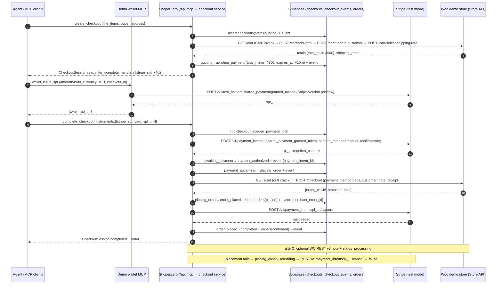

# 04: WS4 Checkout and payments (implementation spec)

> **Round-2 changes (binding: `docs/specs/DECISIONS.md`; canonical contracts: `00-overview-and-contracts.md` §6)**
> - **B5 connectors:** `CheckoutConnector.quote(store, input: QuoteInput, prev)` and `continueUrl(store, lines: ResolvedLine[])` exactly as in 00. The round-1 `_resolved` workaround is gone. `CheckoutState` includes **`handoff`** (→ `requires_escalation`). The handoff connector now goes `quoting → handoff`, and `requires_action` is used only for SPT 3DS (mocked).
> - **Transitions** come from the contract's `ALLOWED_TRANSITIONS`. Same-state updates that the table doesn't list (requote while quoting, placement unknown, capture failed) use `annotate()`, which patches the row and logs an event without changing state. Only `awaiting_payment` expires; a 3DS `requires_action` fails after the TTL.
> - **Errors** use `AppError` + `ApiErrorCode` from `src/lib/errors.ts` (00 §6.2). HTTP goes through WS1's `src/lib/http.ts` (`route`, `json`, `errorResponse`, `preflight`, `parseJsonBody`). DB access goes through WS1's `src/lib/db` checkout helpers (B12). The WS4 `repo.ts` keeps only the payment-lock RPC wrappers.
> - **Service signatures** take `ctx: RequestContext` and implement `CheckoutService` (00 §6.7), including `listCheckoutEvents`. The MCP tool input schemas and wallet schemas come from contracts (00 §6.8); the round-1 local `schemas.ts` is dropped. The one exception: `create_checkout`/`update_checkout` extend the contract schemas to also accept Shopify-style line items `{item:{id}, quantity}` (§12.1).
> - **Session shape** follows 00:
>   - `store.name`, `links[]` with the timeline link, `LineItem.variant_title/url`;
>   - `PaymentHandler` config per rail, and handlers only in `awaiting_payment`;
>   - `MESSAGE_CODES`;
>   - Woo shipping option ids `"{package}:{rate_id}"`;
>   - `QUOTE_TTL_SECONDS` constant (the `CHECKOUT_QUOTE_TTL_SECONDS` env var is removed);
>   - demo wallet guard `DEMO_WALLET_ENABLED` (`flags.demoWalletEnabled()`).
> - **Accepted (no longer requests):** B6 (`/pay/x402`), B9 (Woo ids), B10 (`resolveCheckoutConnector`), B15 (WS4 migration), B4 (`get_order` in WS4's registrar), B14 (WS5 CCR-5 event keys and CCR-6 `timeline_url`).
> - **Scan feature:** `resolveCheckoutConnector(store)` reads `stores.best_method` and `stores.dom_recipe` (§8.0). A **stretch** `browser` connector (§8.3) replays the DOM recipe with Playwright/Stagehand. It builds a cart and hands off a live browser session or a filled checkout, and it never submits payment unless the store is on the placement allowlist.
> - **MCP (coordinator round-2 items + WS3 CR-5):**
>   - `registerCheckoutTools` does **not** log tool calls; WS3's `instrumentServer` is the only writer of `agent_requests`. Checkout events still go to `checkout_events`.
>   - Shopify-style line items `{item:{id}, quantity}` (and the `sz:variant:` prefix) are accepted alongside `{variant_id, quantity}`.
>   - Before the checkout service works, the tools return a handoff/`requires_escalation` session, never `not_implemented`.
>   - `complete_checkout` has `destructiveHint: true`.
>   - The `ucp` envelope (CR-5d) is declined because structuredContent must equal the REST body. See §12.

- **Stream:** WS4 (checkout state machine, connectors, payment rails, checkout REST, x402 pay route, demo wallet MCP, Woo demo store infra).
- **Precedence:**
  1. `docs/specs/DECISIONS.md` wins over everything.
  2. `00-overview-and-contracts.md` §6 is the canonical contract; this spec never redefines a contract type, it imports it.
  3. Sibling specs win for their own files; this spec wins for WS4 files.
  4. Remaining requests are in §17.
- **Research inputs:** `docs/research/00-SYNTHESIS.md`, `07-checkout-execution.md`, `02-x402-payments.md`, `03-stripe-agentic-payments.md`, and the checkout parts of `01`/`04`.
- **Stack facts checked for this spec (2026-09-26):**
  - `next@16.3.6`: route handlers get `ctx.params` as a Promise. The `edge` runtime is deprecated, so don't export `runtime`. `after()` comes from `next/server` and runs up to the route's `maxDuration`. See `node_modules/next/dist/docs/01-app/03-api-reference/03-file-conventions/route.md` and `.../04-functions/after.md`.
  - `npm view`: `@x402/{core,next,evm,fetch}@2.27.0`, `mcp-handler@2.2.0` (peer `@modelcontextprotocol/server ^2.0.0`), `@modelcontextprotocol/server@2.1.0`, `stripe@22.6.2`, `viem@2.56.9`, `zod@4.6.5`.
  - x402 package internals were read from the 2.27.0 tarballs:
    - `withX402(handler, routes, server)` passes the handler **only `request`**.
    - `x402HTTPResourceServer.onProtectedRequest(hook)` can abort with 403 before any pricing.
    - `ExactEvmScheme` (server) supports `paymentFlow: "upfront"` for EIP-3009.
    - A throwing `price()` surfaces as HTTP 500.
    - The client default spend cap is **`$1`**, so we must raise it.
  - `curl https://x402.org/facilitator/supported` today lists `{x402Version:2, scheme:"exact", network:"eip155:84532"}`.

---

## 0. TL;DR for the implementer

1. At T+0, run the two spikes (§4). Record `STRIPE_SPT_MODE=spt|fallback` in `.env.local` and fund the demo wallet.
2. Bring up the Woo demo store (§5): run `infra/woo/setup.sh`, start the tunnel, run `infra/woo/smoke.sh` → PASS. Index the store through WS2 (`POST /api/v1/stores`).
3. Build in this order:
   - `src/lib/checkout/{state,repo,session}.ts`
   - `connectors/woo.ts`
   - `service.ts` (create, update, get)
   - REST create/get/update
   - `payments/stripe.ts` + complete (SPT)
   - `connectors/handoff.ts`
   - `payments/x402.ts` + the pay route
   - demo wallet MCP
   - `scripts/agent-x402.ts`
   - The stretch `connectors/browser.ts` comes only after M10.
4. Ship `src/lib/checkout/mcp-tools.ts` (`registerCheckoutTools`) and the one-line re-export `src/lib/mcp/checkout-tools.ts` by **T+60**. WS3 imports the latter. Until the Woo path works, `create_checkout` uses the handoff connector (WS3 CR-5b).
5. Safety invariants. Never break these:
   - Headless orders are placed **only** on allowlisted domains (our Woo store).
   - No connector ever types card data or clicks "pay" on a merchant site.
   - Stripe runs on `sk_test_` keys only.
   - x402 runs on `eip155:84532` only.
   - `checkout_events.message`/`data` never contain PII.

---

## 1. Scope, ownership, dependencies

### 1.1 In scope
- The checkout state machine (`transition()` + `annotate()` over the contract's `ALLOWED_TRANSITIONS`), events written to `checkout_events`, idempotency, quote TTL and the payment lock.
- Connectors:
  - `woo_store_api` (primary; allowlisted stores only);
  - `handoff` (every other store);
  - `browser` (**stretch**, DOM-recipe replay, §8.3);
  - `magento_guest` (stretch; not specified beyond §16).
- Payment rails behind `PaymentRail`: `stripe_spt` (manual capture, then place, then capture or void) and `x402` (v2 `exact`, Base Sepolia USDC, `upfront`).
- REST: `/api/v1/checkouts`, `/api/v1/checkouts/{id}`, `/complete`, `/cancel`, `/pay/x402`, and `/api/v1/orders/{id}`.
- The MCP checkout tool registrar (`registerCheckoutTools`), which WS3's `/api/mcp` composes (B4).
- The demo wallet MCP at `/api/demo-wallet/mcp` and the scripts `scripts/agent-x402.ts` and `scripts/agent-spt.ts`.
- Woo demo store infrastructure (`infra/woo/**`).

### 1.2 Out of scope
- Catalog reads and `search_catalog` (WS3).
- Crawling, scanning, `dom_recipe` discovery and `verifyOffer` (WS2). WS4 only **reads** `stores.best_method` / `stores.dom_recipe`.
- UI (WS5). WS5 reads `getCheckout()` and `checkout_events`.
- `src/lib/db/**`, `src/lib/errors.ts`, `src/lib/http.ts`, `src/lib/env.ts` and the proxy matcher (WS1).
- Package installs (WS1 installs the union; WS4 installs nothing).

### 1.3 Owned files

```
src/lib/checkout/
  index.ts              # barrel: export const checkoutService: CheckoutService + named functions (00 §6.7)
  service.ts            # service implementation (§2.1, §10)
  state.ts              # transition(), annotate(), expireIfDue() over ALLOWED_TRANSITIONS
  repo.ts               # ONLY: acquirePaymentLock / releasePaymentLock (RPC wrappers); everything else via @/lib/db
  session.ts            # CheckoutRecord -> CheckoutSession, payment handlers, messages, summarize()
  payment-errors.ts     # internal: PaymentDeclinedError, PaymentActionRequiredError, PaymentNotFoundError, WooError, PriceDriftError
  mcp-tools.ts          # registerCheckoutTools(server) (00 §6.8 location)
  connectors/index.ts   # getConnector(), resolveCheckoutConnector(), checkoutAllowlist()
  connectors/woo.ts     # wooConnector
  connectors/handoff.ts # handoffConnector
  connectors/browser.ts # browserConnector (STRETCH, §8.3)
src/lib/payments/
  index.ts              # getRail(), railForHandler()
  stripe.ts             # stripeRequest(), stripeSptRail, issueTestSpt()
  x402.ts               # x402 resource server + HTTP server, x402Rail, checkoutIdFromPath()
src/lib/mcp/checkout-tools.ts          # one line: export { registerCheckoutTools } from "@/lib/checkout/mcp-tools";  (WS3's import path)
src/lib/demo-wallet/tools.ts           # registerDemoWalletTools(server)
src/app/api/v1/checkouts/route.ts                 # POST
src/app/api/v1/checkouts/[id]/route.ts            # GET, PUT
src/app/api/v1/checkouts/[id]/complete/route.ts   # POST
src/app/api/v1/checkouts/[id]/cancel/route.ts     # POST
src/app/api/v1/checkouts/[id]/pay/x402/route.ts   # POST (x402-protected)
src/app/api/v1/orders/[id]/route.ts               # GET
src/app/api/demo-wallet/mcp/route.ts              # GET, POST (test mode only)
infra/woo/docker-compose.woo.yml
infra/woo/.env.woo.example
infra/woo/setup.sh
infra/woo/setup.php
infra/woo/smoke.sh
scripts/agent-x402.ts
scripts/agent-spt.ts
supabase/migrations/20260926024000_ws4_checkout.sql
```

### 1.4 Dependencies

| Need | From | Name | If late |
|---|---|---|---|
| Contract types + schemas | WS1 `@/lib/contracts` | `CheckoutState`, `STATE_TO_STATUS`, `ALLOWED_TRANSITIONS`, `QuoteInput`, `ResolvedLine`, `Quote`, `CheckoutConnector`, `PaymentRail`, `PaymentReceipt`, `CheckoutRecord`, `CheckoutPaymentRecord`, `CheckoutSession`, `Order`, `CheckoutEvent`, `MESSAGE_CODES`, `QUOTE_TTL_SECONDS`, `PAYMENT_HANDLER_IDS`, `X402_NETWORKS`, `RequestContext`, `CheckoutService`, the MCP/wallet input schemas (00 §6.8), `DomRecipe`, `AccessMethod` (DECISIONS A) | Temporary local copy in `src/lib/checkout/_contracts.tmp.ts`; delete at T+30 |
| Errors / HTTP / env / log | WS1 `src/lib/{errors,http,env,log}.ts` | `AppError`, `toAppError`, `route`, `json`, `errorResponse`, `preflight`, `parseJsonBody`, `CORS_HEADERS`, `optionalEnv`, `requireEnv`, `appUrl`, `flags`, `log` | Minimal local shims with the same names, deleted when WS1 lands |
| DB helpers | WS1 `@/lib/db` (B12) | `getVariantsForCheckout`, `getStoreById`, `insertCheckout`, `getCheckoutRecord`, `getCheckoutByIdempotencyKey`, `updateCheckoutRecord(id, patch, {expectState})`, `insertCheckoutEvent`, `listCheckoutEvents`, `insertOrder`, `getOrder`, `getOrderByCheckoutId`, `updateOrderStatus`, `logAgentRequest` | none; these are blocking. Use the seed |
| Tables | WS1 core migration | `checkouts` (incl. `messages` jsonb), `checkout_events`, `orders`, `stores.best_method`, `stores.dom_recipe` | none |
| MCP glue | WS1/WS3 `src/lib/mcp/{types,result}.ts` | `McpServer` type, `toolResult`, `toolError` | `import type { McpServer } from "@modelcontextprotocol/server"` |
| Packages | WS1 install | `zod@^4`, `mcp-handler@2.2.0`, `@modelcontextprotocol/server@2.1.0`, `stripe`, `@x402/*@2.27.0`, `viem`; stretch `playwright-core`, `@browserbasehq/stagehand@4.1.0` | none |
| Indexed demo store | WS2 `POST /api/v1/stores {url}` (Woo adapter) | products + variants rows for the demo store | Seed SQL in §5.7 |

---

## 2. Exports (exact signatures)

### 2.1 `src/lib/checkout` (`index.ts` re-exports from `service.ts`)

```ts
import "server-only";
import type {
  CheckoutEvent, CheckoutService, CheckoutSession, CompleteCheckoutInput, CreateCheckoutInput,
  Order, RequestContext, UpdateCheckoutInput,
} from "@/lib/contracts";

export function createCheckout(input: CreateCheckoutInput, ctx: RequestContext): Promise<CheckoutSession>;
export function updateCheckout(id: string, input: UpdateCheckoutInput, ctx: RequestContext): Promise<CheckoutSession>;
export function getCheckout(id: string): Promise<CheckoutSession>;
export function completeCheckout(id: string, input: CompleteCheckoutInput, ctx: RequestContext): Promise<CheckoutSession>;
export function cancelCheckout(id: string, ctx: RequestContext): Promise<CheckoutSession>;
export function getOrder(id: string): Promise<Order>;
export function listCheckoutEvents(checkoutId: string): Promise<CheckoutEvent[]>;
export const checkoutService: CheckoutService;   // object literal of the seven functions above

// WS4-internal (used only by the x402 pay route; not in the cross-stream contract):
export type X402Settlement = { transaction: string; payer: string | null; network: string; amount_atomic: string | null };
export function recordX402Settlement(checkoutId: string, s: X402Settlement): Promise<void>;
export function finalizeX402Checkout(checkoutId: string, fallback?: X402Settlement | null): Promise<CheckoutSession>;
export function getX402PayableCheckout(checkoutId: string): Promise<{ total_minor: number; currency: "USD" } | { reason: string }>;
```

- Protocol errors throw `AppError` (00 §6.2). Business outcomes **return** a `CheckoutSession` with `messages[]` (HTTP 200): missing info, out of stock, declined, handoff, placement failure.
- `ctx.idempotency_key` comes from the REST `Idempotency-Key` header or the MCP `idempotency_key` arg. `ctx.agent_profile` is stored in `checkouts.agent_profile`.

### 2.2 Plug-in implementations (types from 00 §6.6)

```ts
// src/lib/checkout/connectors/woo.ts
export const wooConnector: CheckoutConnector;          // id: "woo_store_api"
// src/lib/checkout/connectors/handoff.ts
export const handoffConnector: CheckoutConnector;      // id: "handoff"
// src/lib/checkout/connectors/browser.ts  (STRETCH)
export const browserConnector: CheckoutConnector;      // id: "browser"
// src/lib/checkout/connectors/index.ts
export type ConnectorStore = Pick<Store, "domain" | "base_url" | "platform"> & {
  best_method?: AccessMethod | "none" | null;          // stores.best_method (DECISIONS A)
  dom_recipe?: DomRecipe | null;                       // stores.dom_recipe  (DECISIONS A)
};
export function getConnector(id: CheckoutConnectorId): CheckoutConnector;   // "magento_guest" -> AppError not_implemented
export function resolveCheckoutConnector(store: ConnectorStore): CheckoutConnectorId;
export function checkoutAllowlist(): string[];         // lowercased hosts

// src/lib/payments/stripe.ts
export const stripeSptRail: PaymentRail;               // id: "stripe_spt"
export function issueTestSpt(args: { amount: number; currency: string; ttlSeconds?: number }): Promise<{ token: string; mode: "spt" | "fallback"; expires_at: string }>;
// src/lib/payments/x402.ts
export const x402Rail: PaymentRail;                    // id: "x402"
export const X402_PAY_ROUTE = "/api/v1/checkouts/[id]/pay/x402";
export function getX402HttpServer(): x402HTTPResourceServer;
export function checkoutIdFromPath(path: string): string | null;
export function usdPrice(minor: number): `$${string}`;           // 4900 -> "$49.00"
// src/lib/payments/index.ts
export function getRail(id: PaymentRailId): PaymentRail;
export function railForHandler(handlerId: string): PaymentRailId | null;
```

### 2.3 Registrars

```ts
// src/lib/checkout/mcp-tools.ts   (re-exported from src/lib/mcp/checkout-tools.ts)
import type { McpServer } from "@/lib/mcp/types";      // fallback: "@modelcontextprotocol/server"
export function registerCheckoutTools(server: McpServer): void;
// registers: create_checkout, update_checkout, get_checkout, complete_checkout, cancel_checkout, get_order (B4)

// src/lib/demo-wallet/tools.ts
export function registerDemoWalletTools(server: McpServer): void;
// registers: wallet_issue_spt, wallet_pay_x402 (00 §6.8 DEMO_WALLET_TOOL_INPUTS)
```

### 2.4 Errors

Protocol errors are `new AppError(code, message, details?)` with `ApiErrorCode` from 00 §6.2:

| Situation | `ApiErrorCode` (HTTP) | `details` |
|---|---|---|
| Body/args fail zod | `validation_error` (400) | `z.flattenError(err)` |
| Unknown shipping option id | `validation_error` (400) | `{ field: "selected_shipping_option_id", allowed: string[] }` |
| Checkout/order/variant not found | `not_found` (404) | `{ ids }` for variants |
| Store opted out | `forbidden` (403) | |
| Transition not allowed, or payment lock held | `invalid_state` (409) | `{ state, allowed }` / `{ reason: "payment_in_progress" }` |
| Same `Idempotency-Key`, different body | `idempotency_conflict` (409) | |
| Complete/update on an expired checkout | `gone` (410) | |
| Variants from two stores; handler not offered; non-USD for x402 | `unprocessable` (422) | |
| Missing Stripe/x402 env, or stubbed code | `not_implemented` (501) | |
| Merchant / Stripe / facilitator error at quote | `upstream_error` (502) / `upstream_timeout` (504) | |

Internal (never leave the service; mapped to messages or AppError), in `src/lib/checkout/payment-errors.ts`:
```ts
export class PaymentDeclinedError extends Error { constructor(public declineCode: string, public reference?: string) { super(declineCode); } }
export class PaymentActionRequiredError extends Error { constructor(public reference: string) { super("requires_action"); } }
export class PaymentNotFoundError extends Error {}            // x402 receipt not matched
export class WooError extends Error { constructor(public code: string, message: string, public status: number) { super(message); } }
export class PriceDriftError extends Error { constructor(public expected: number, public actual: number) { super("price_drift"); } }
```

---

## 3. Environment variables (WS4 reads, via `optionalEnv`/`requireEnv`/`flags`, never at module top level)

| Var | Example | Required | Notes |
|---|---|---|---|
| `APP_URL` (`appUrl()`) | `https://shoperzero.vercel.app` | yes | Builds `pay_url` and the timeline link |
| `STRIPE_SECRET_KEY` | `sk_test_…` | for SPT | The rail refuses anything that doesn't start with `sk_test_` |
| `STRIPE_PREVIEW_VERSION` | `2026-04-22.preview` | yes | Sent as `Stripe-Version` on SPT calls |
| `STRIPE_SPT_MODE` | `spt` / `fallback` | yes | Set from the spike result. `fallback` means the wallet issues `pm_card_visa` |
| `X402_NETWORK` | `eip155:84532` | yes | Anything else is refused |
| `X402_FACILITATOR_URL` | `https://x402.org/facilitator` | yes | |
| `X402_PAY_TO` | `0x…` | for x402 | Our receiving address. It needs no funding |
| `X402_FLOW` | `upfront` / `authorization` | no | Defaults to `upfront`. Use `authorization` only if upfront fails in M7 |
| `DEMO_WALLET_ENABLED` (`flags.demoWalletEnabled()`) | `true` | wallet | 00 variable. The demo wallet route answers 404 unless it is `true` |
| `DEMO_WALLET_PRIVATE_KEY` | `0x…` | wallet | The buyer wallet, funded with Base Sepolia USDC |
| `DEMO_WALLET_MAX_USD` | `$25` | no | Per-payment cap for the demo wallet's x402 client. Default `$25` |
| `DEMO_WALLET_TOKEN` | random | no | If set, the demo wallet MCP requires `Authorization: Bearer <token>` |
| `WOO_DEMO_URL` | `https://shop.example.dev` | yes | Origin of our Woo store. Its host is allowlisted automatically |
| `CHECKOUT_ALLOWED_DOMAINS` | `shop.example.dev,localhost:8080` | no | Extra hosts allowed for headless placement. Default: host of `WOO_DEMO_URL` |
| `WOO_CONSUMER_KEY` / `WOO_CONSUMER_SECRET` | `ck_…` / `cs_…` | no | Printed by `setup.php`. They enable "mark paid + admin note" (M3+) |
| `CHECKOUT_BROWSER_ENABLED` | `1` | no (stretch) | Enables the `browser` connector (§8.3) |
| `CHECKOUT_BROWSER_HOSTS` | `shop.example.dev` | no (stretch) | Allowlisted hosts to route through the browser connector instead of `woo_store_api` (demo of §8.3 (B)) |
| `CHECKOUT_FORCE_HANDOFF` | `1` | no (dev only) | Forces `handoff` for every store until the Woo path passes M2 |
| `BROWSERBASE_API_KEY` / `BROWSERBASE_PROJECT_ID` | | no (stretch) | DECISIONS A vars. Without them the browser connector uses local Playwright (dev only) |
| `CRAWLER_USER_AGENT` (`flags.crawlerUserAgent()`) | `ShoperZeroBot/0.1 (+https://…/bot)` | yes | Also sent on Store API calls |

The quote TTL is the contract constant `QUOTE_TTL_SECONDS` (600). It has no env override.
---

## 4. T+0 spikes (15 minutes each, run in parallel)

Record every result in the team channel. The decisions these spikes produce are env values.

### 4.1 Spike A: Stripe SPT test helper

**Prep:** get a test secret key from https://dashboard.stripe.com/test/apikeys.
```bash
export STRIPE_SECRET_KEY=sk_test_xxx
export SV=2026-04-22.preview
```

**A1. Mint a granted SPT (seller-side test helper).**
```bash
curl -sS https://api.stripe.com/v1/test_helpers/shared_payment/granted_tokens \
  -u "$STRIPE_SECRET_KEY:" \
  -H "Stripe-Version: $SV" \
  -d payment_method=pm_card_visa \
  -d "usage_limits[currency]=usd" \
  -d "usage_limits[max_amount]=5000" \
  -d "usage_limits[expires_at]=$(( $(date +%s) + 3600 ))" | tee /tmp/spt.json | jq '{id, object, error}'
export SPT=$(jq -r .id /tmp/spt.json)
```
- **Pass:** HTTP 200 and `.id` starts with `spt_`.
- **Fail:** any `error`. Typical failures are `resource_missing`/unrecognized URL, a preview-access message, or an unknown API version.
- Also run `curl -sS https://api.stripe.com/v1/shared_payment/granted_tokens/$SPT -u "$STRIPE_SECRET_KEY:" -H "Stripe-Version: $SV" | jq` and note the fields (card brand, last4, limits).

**A2. Authorize with manual capture.** This is the exact call the rail makes.
```bash
curl -sS https://api.stripe.com/v1/payment_intents \
  -u "$STRIPE_SECRET_KEY:" \
  -H "Stripe-Version: $SV" \
  -H "Idempotency-Key: spike-$(date +%s)" \
  -d amount=4900 -d currency=usd \
  -d capture_method=manual -d confirm=true \
  -d "payment_method_data[shared_payment_granted_token]=$SPT" \
  -d "automatic_payment_methods[enabled]=true" \
  -d "automatic_payment_methods[allow_redirects]=never" \
  -d "metadata[checkout_id]=spike" | tee /tmp/pi.json | jq '{id, status, amount_capturable, error}'
export PI=$(jq -r .id /tmp/pi.json)
```
- **Pass:** `status == "requires_capture"` and `amount_capturable == 4900`.
- **If it errors on `automatic_payment_methods`:** retry without the two `automatic_payment_methods[...]` lines. **If it errors because `return_url` is required:** add `-d return_url=https://example.com/return`. Note which variant worked; the rail uses the same one (flag `STRIPE_PI_VARIANT` in code comments, not env).
- **Also try once without the `Stripe-Version` header.** Note whether `payment_method_data[shared_payment_granted_token]` is accepted on the account's default version. The rail always sends the preview header on SPT calls regardless.

**A3. Capture, then void a second one.**
```bash
curl -sS -X POST https://api.stripe.com/v1/payment_intents/$PI/capture -u "$STRIPE_SECRET_KEY:" | jq '{id,status}'   # expect succeeded
# mint another SPT (A1), authorize (A2) -> PI2, then:
curl -sS -X POST https://api.stripe.com/v1/payment_intents/$PI2/cancel -u "$STRIPE_SECRET_KEY:" -d cancellation_reason=abandoned | jq '{id,status}'  # expect canceled
```
- **Pass:** `succeeded`, then `canceled`.

**A-fallback (run only if A1 or A2 fails):** use a plain PaymentIntent with `pm_card_visa`.
```bash
curl -sS https://api.stripe.com/v1/payment_intents -u "$STRIPE_SECRET_KEY:" \
  -d amount=4900 -d currency=usd -d capture_method=manual -d confirm=true \
  -d payment_method=pm_card_visa \
  -d "automatic_payment_methods[enabled]=true" -d "automatic_payment_methods[allow_redirects]=never" | jq '{id,status}'
```
- **Pass:** `requires_capture`. Then set `STRIPE_SPT_MODE=fallback`.
- The code path stays identical: the instrument token is `pm_card_visa` instead of `spt_…`. The UI labels it "SPT-compatible (test)".

**Decision:**
- A1, A2 and A3 pass → `STRIPE_SPT_MODE=spt`.
- Otherwise → `STRIPE_SPT_MODE=fallback`.
- Both paths failing means the Stripe key is wrong. Fix the key; don't cut the rail.

### 4.2 Spike B: x402 facilitator, packages, wallet

**B1. Facilitator.**
```bash
curl -sS https://x402.org/facilitator/supported | jq '.kinds[] | select(.network=="eip155:84532")'
```
- **Pass:** the output includes `{"x402Version":2,"scheme":"exact","network":"eip155:84532"}`. It was present on 2026-09-26, along with `upto` and `batch-settlement`.

**B2. Packages exist.** These commands are read-only and install nothing.
```bash
for p in @x402/core @x402/next @x402/evm @x402/fetch; do echo "$p $(npm view $p@2.27.0 version)"; done
npm view mcp-handler@2.2.0 peerDependencies
npm view @modelcontextprotocol/server@2.1.0 version
npm view viem version; npm view stripe version; npm view zod version
```
- **Pass:** every `@x402/*` prints `2.27.0`, and mcp-handler's peers include `@modelcontextprotocol/server: '^2.0.0'`.
- These were verified on 2026-09-26: 2.27.0, 2.2.0/2.1.0, viem 2.56.9, stripe 22.6.2, zod 4.6.5.

**B3. Create two keys.** One is the buyer (demo wallet); the other is the receiver `X402_PAY_TO`. Use a scratch dir outside the repo so the project lockfile isn't touched.
```bash
mkdir -p /tmp/sz-wallet && cd /tmp/sz-wallet && npm init -y >/dev/null && npm i --silent viem@2.56.9
node -e '
const {generatePrivateKey, privateKeyToAccount} = require("viem/accounts");
for (const n of ["DEMO_WALLET", "X402_PAY_TO"]) {
  const pk = generatePrivateKey();
  console.log(`# ${n}\n${n}_PRIVATE_KEY=${pk}\n${n}_ADDRESS=${privateKeyToAccount(pk).address}\n`);
}'
```
- Put these in `.env.local`:
  - `DEMO_WALLET_PRIVATE_KEY=<DEMO_WALLET_PRIVATE_KEY>`
  - `X402_PAY_TO=<X402_PAY_TO_ADDRESS>`
- Store the pay-to private key in the team password manager. It is only needed for the stretch real refund.
- Never commit either key.

**B4. Fund the buyer.**
- Open https://faucet.circle.com, choose **Base Sepolia** and **USDC**, paste `DEMO_WALLET_ADDRESS`, and submit.
- The faucet gives about 10–20 USDC per request, rate-limited per address (**UNVERIFIED** exact limits).
- No ETH is needed, because the facilitator pays gas for EIP-3009 transfers.
- Check the balance (USDC on Base Sepolia is `0x036CbD53842c5426634e7929541eC2318f3dCF7e`):
```bash
ADDR=0xYourDemoWalletAddress
DATA=0x70a08231$(printf '%064s' "$(echo ${ADDR#0x} | tr 'A-F' 'a-f')" | tr ' ' 0)
curl -sS https://sepolia.base.org -H 'content-type: application/json' \
  -d "{\"jsonrpc\":\"2.0\",\"id\":1,\"method\":\"eth_call\",\"params\":[{\"to\":\"0x036CbD53842c5426634e7929541eC2318f3dCF7e\",\"data\":\"$DATA\"},\"latest\"]}" \
  | jq -r .result | xargs printf '%d\n' | awk '{printf "%.2f USDC\n", $1/1e6}'
```
- **Pass:** the balance is at least 8.00 USDC. That covers the x402 demo purchase (Sticker Pack $3 + Standard shipping $5 = $8.00, see §5.4). Request the faucet again or from teammates' browsers to build a buffer.
- **Fail (faucet down):** use the CDP faucet (https://portal.cdp.coinbase.com → Faucets, Base Sepolia USDC; **UNVERIFIED**), or cut the x402 act per synthesis cut-list item 9.

**Spike B decision:** B1 and B2 pass and the wallet is funded → build x402 at M7. The upfront flow itself is verified later, in M7 (§16).

---

## 5. WooCommerce demo store infrastructure

Target:
- a public HTTPS WooCommerce store whose `siteurl` equals its public URL;
- pretty permalinks and a Store API that answers;
- USD, US base address, no tax;
- `bacs` enabled;
- a US zone with two flat rates (Standard $5, Express $15) and a rest-of-world rate;
- 6 products, including **a hoodie under $50** and a **$3 item for the x402 act**.

### 5.1 `infra/woo/docker-compose.woo.yml` (full content)

```yaml
name: shoperzero-woo

x-wp-env: &wp_env
  WORDPRESS_DB_HOST: db
  WORDPRESS_DB_USER: wp
  WORDPRESS_DB_PASSWORD: wp
  WORDPRESS_DB_NAME: wp
  WOO_PUBLIC_URL: ${WOO_PUBLIC_URL:-http://localhost:8080}
  # Evaluated at runtime by the image's wp-config.php (getenv_docker + eval), in BOTH wp and cli containers.
  # WP_HOME/WP_SITEURL follow WOO_PUBLIC_URL, so a tunnel URL change = edit .env.woo + `up -d wp` (no DB edits).
  WORDPRESS_CONFIG_EXTRA: |
    define('WP_HOME', getenv_docker('WOO_PUBLIC_URL', 'http://localhost:8080'));
    define('WP_SITEURL', getenv_docker('WOO_PUBLIC_URL', 'http://localhost:8080'));
    define('WP_MEMORY_LIMIT', '256M');
    define('WP_ENVIRONMENT_TYPE', 'local');
    if (isset($_SERVER['HTTP_X_FORWARDED_PROTO']) && $_SERVER['HTTP_X_FORWARDED_PROTO'] === 'https') { $_SERVER['HTTPS'] = 'on'; }

services:
  db:
    image: mariadb:11
    restart: unless-stopped
    environment:
      MARIADB_ROOT_PASSWORD: root
      MARIADB_DATABASE: wp
      MARIADB_USER: wp
      MARIADB_PASSWORD: wp
    volumes:
      - db:/var/lib/mysql
    healthcheck:
      test: ["CMD", "healthcheck.sh", "--connect", "--innodb_initialized"]
      interval: 5s
      timeout: 5s
      retries: 30

  wp:
    image: wordpress:php8.3-apache
    restart: unless-stopped
    depends_on:
      db:
        condition: service_healthy
    ports:
      - "8080:80"
    environment:
      <<: *wp_env
    volumes:
      - wp:/var/www/html

  cli:
    image: wordpress:cli-php8.3
    profiles: ["cli"]
    user: "33:33"
    depends_on:
      db:
        condition: service_healthy
    environment:
      <<: *wp_env
      HOME: /tmp
    volumes:
      - wp:/var/www/html
      - ./setup.php:/setup/setup.php:ro

volumes:
  db: {}
  wp: {}
```

If the `wordpress:cli-php8.3` tag doesn't resolve, use `wordpress:cli` (**UNVERIFIED** tag name).

### 5.2 `infra/woo/.env.woo.example` (full content)

```bash
# Public origin of the store. Must equal the tunnel URL exactly (scheme + host, no trailing slash).
WOO_PUBLIC_URL=http://localhost:8080
WOO_ADMIN_PASSWORD=change-me-now
```

Add `infra/woo/.env.woo` to `.gitignore`. This is a WS1-owned file, so send the one-line request in §17.

### 5.3 `infra/woo/setup.sh` (full content; idempotent, safe to re-run)

```bash
#!/usr/bin/env bash
# ShoperZero demo WooCommerce store: install WP + WooCommerce, configure, seed products.
# Usage: infra/woo/setup.sh            (reads infra/woo/.env.woo)
set -euo pipefail
cd "$(dirname "$0")"
[ -f .env.woo ] || cp .env.woo.example .env.woo
set -a; . ./.env.woo; set +a
: "${WOO_PUBLIC_URL:?set WOO_PUBLIC_URL in infra/woo/.env.woo}"
: "${WOO_ADMIN_PASSWORD:?set WOO_ADMIN_PASSWORD in infra/woo/.env.woo}"
command -v jq >/dev/null || { echo "jq is required"; exit 1; }

DC=(docker compose -f docker-compose.woo.yml --env-file .env.woo)
WP=("${DC[@]}" run --rm -T cli wp)

"${DC[@]}" up -d db wp

echo "Waiting for WordPress files and DB..."
for i in $(seq 1 90); do
  if "${WP[@]}" core version >/dev/null 2>&1 && "${WP[@]}" db check >/dev/null 2>&1; then break; fi
  sleep 2
  [ "$i" = 90 ] && { echo "FAIL: WordPress not ready"; exit 1; }
done

if ! "${WP[@]}" core is-installed >/dev/null 2>&1; then
  "${WP[@]}" core install --url="$WOO_PUBLIC_URL" --title="ShoperZero Demo Store" \
    --admin_user=admin --admin_password="$WOO_ADMIN_PASSWORD" --admin_email=admin@example.com --skip-email
fi

# Pretty permalinks: /wp-json/* only resolves with them. The image ships a default .htaccess.
"${WP[@]}" rewrite structure '/%postname%/'
"${WP[@]}" rewrite flush

"${WP[@]}" plugin is-installed woocommerce || "${WP[@]}" plugin install woocommerce
"${WP[@]}" plugin activate woocommerce

# Store settings, payments, shipping, products, (optional) REST keys. Prints env lines at the end.
"${WP[@]}" eval-file /setup/setup.php

# Create Cart/Checkout/My account pages if activation didn't (UNVERIFIED tool id; harmless if it fails).
"${WP[@]}" wc tool run install_pages --user=admin >/dev/null 2>&1 || true
"${WP[@]}" rewrite flush

echo "--- verification against $WOO_PUBLIC_URL"
curl -fsS "$WOO_PUBLIC_URL/wp-json/" | jq -e '.namespaces | index("wc/store/v1")' >/dev/null \
  && echo "OK   Store API namespace wc/store/v1 present" || { echo "FAIL Store API namespace missing"; exit 1; }
curl -fsS -D - -o /dev/null "$WOO_PUBLIC_URL/wp-json/wc/store/v1/cart" | grep -qi '^cart-token:' \
  && echo "OK   Cart-Token issued" || { echo "FAIL no Cart-Token header"; exit 1; }
curl -fsS "$WOO_PUBLIC_URL/wp-json/wc/store/v1/products?per_page=50" \
  | jq -r '.[] | "\(.id)\t\(.prices.price)\t\(.prices.currency_code)\t\(.is_in_stock)\t\(.name)"'
echo "Next: infra/woo/smoke.sh"
```

### 5.4 `infra/woo/setup.php` (full content; run by `wp eval-file`)

```php
<?php
// ShoperZero demo store configuration. Idempotent (products keyed by SKU).
if (!class_exists('WooCommerce')) { WP_CLI::error('WooCommerce is not active'); }

// ---- store settings
update_option('woocommerce_default_country', 'US:CA');
update_option('woocommerce_store_address', '1 Market St');
update_option('woocommerce_store_city', 'San Francisco');
update_option('woocommerce_store_postcode', '94105');
update_option('woocommerce_currency', 'USD');
update_option('woocommerce_price_num_decimals', '2');
update_option('woocommerce_calc_taxes', 'no');
update_option('woocommerce_enable_guest_checkout', 'yes');
update_option('woocommerce_coming_soon', 'no');          // new stores default to "coming soon" (WC 9.1+)
update_option('woocommerce_store_pages_only', 'no');
update_option('woocommerce_ship_to_countries', '');       // ship to all countries you sell to
update_option('woocommerce_allowed_countries', 'all');

// ---- payments: enable Direct bank transfer (bacs) only
$bacs = (array) get_option('woocommerce_bacs_settings', []);
update_option('woocommerce_bacs_settings', array_merge($bacs, [
  'enabled' => 'yes',
  'title' => 'Direct bank transfer',
  'description' => 'Settled via ShoperZero agent payment (demo).',
  'instructions' => 'Paid via ShoperZero. See order note for the payment receipt.',
]));
foreach (['cod', 'cheque'] as $gw) {
  $s = (array) get_option("woocommerce_{$gw}_settings", []);
  update_option("woocommerce_{$gw}_settings", array_merge($s, ['enabled' => 'no']));
}

// ---- shipping: US zone with two flat rates, plus rest-of-world
function sz_add_flat_rate(WC_Shipping_Zone $zone, string $title, string $cost): void {
  foreach ($zone->get_shipping_methods() as $m) {
    if ($m->id === 'flat_rate' && $m->get_title() === $title) return;   // idempotent
  }
  $instance_id = $zone->add_shipping_method('flat_rate');
  update_option("woocommerce_flat_rate_{$instance_id}_settings", [
    'title' => $title, 'tax_status' => 'none', 'cost' => $cost,
  ]);
}
$us = null;
foreach (WC_Shipping_Zones::get_zones() as $z) { if ($z['zone_name'] === 'United States') { $us = new WC_Shipping_Zone($z['id']); } }
if (!$us) {
  $us = new WC_Shipping_Zone();
  $us->set_zone_name('United States');
  $us->add_location('US', 'country');
  $us->save();
}
sz_add_flat_rate($us, 'Standard shipping', '5.00');
sz_add_flat_rate($us, 'Express shipping', '15.00');
sz_add_flat_rate(new WC_Shipping_Zone(0), 'International shipping', '20.00');   // "Locations not covered"
WC_Cache_Helper::get_transient_version('shipping', true);

// ---- categories
function sz_cat(string $name): int {
  $t = term_exists($name, 'product_cat');
  if (!$t) { $t = wp_insert_term($name, 'product_cat'); }
  return (int) (is_array($t) ? $t['term_id'] : $t);
}
$hoodies = sz_cat('Hoodies'); $acc = sz_cat('Accessories'); $home = sz_cat('Home');

// ---- products
function sz_simple(string $name, string $sku, string $price, string $desc, array $cats, int $stock): int {
  $id = wc_get_product_id_by_sku($sku);
  $p = $id ? wc_get_product($id) : new WC_Product_Simple();
  $p->set_name($name);
  $p->set_sku($sku);
  $p->set_regular_price($price);
  $p->set_description($desc);
  $p->set_short_description($desc);
  $p->set_category_ids($cats);
  $p->set_manage_stock(true);
  $p->set_stock_quantity($stock);
  $p->set_stock_status($stock > 0 ? 'instock' : 'outofstock');
  $p->set_catalog_visibility('visible');
  $p->set_status('publish');
  return $p->save();
}
$ids = [];
$ids['SZ-HOODIE-CLASSIC'] = sz_simple('ShoperZero Classic Hoodie', 'SZ-HOODIE-CLASSIC', '44.00',
  'Midweight cotton-blend pullover hoodie with kangaroo pocket. Unisex fit.', [$hoodies], 50);
$ids['SZ-HOODIE-HEAVY'] = sz_simple('Heavyweight Hoodie', 'SZ-HOODIE-HEAVY', '68.00',
  '450gsm heavyweight fleece hoodie. Over the $50 budget on purpose.', [$hoodies], 20);
$ids['SZ-BEANIE'] = sz_simple('Merino Beanie', 'SZ-BEANIE', '18.00', 'Soft merino wool beanie.', [$acc], 40);
$ids['SZ-STICKERS'] = sz_simple('ShoperZero Sticker Pack', 'SZ-STICKERS', '3.00',
  'Five vinyl stickers. Cheap enough for a testnet USDC purchase.', [$acc], 500);
$ids['SZ-MUG'] = sz_simple('Enamel Camp Mug', 'SZ-MUG', '12.00', 'Out of stock on purpose (tests).', [$home], 0);

// variable product: Zip Hoodie, sizes S/M/L at 48.00
$zip_id = wc_get_product_id_by_sku('SZ-ZIP-HOODIE');
$zip = $zip_id ? wc_get_product($zip_id) : new WC_Product_Variable();
$attr = new WC_Product_Attribute();
$attr->set_name('Size');
$attr->set_options(['S', 'M', 'L']);
$attr->set_visible(true);
$attr->set_variation(true);
$zip->set_name('ShoperZero Zip Hoodie');
$zip->set_sku('SZ-ZIP-HOODIE');
$zip->set_description('Full-zip hoodie. Variable product (sizes S/M/L).');
$zip->set_category_ids([$hoodies]);
$zip->set_attributes([$attr]);
$zip->set_status('publish');
$zip_id = $zip->save();
foreach (['S', 'M', 'L'] as $size) {
  $vsku = "SZ-ZIP-HOODIE-$size";
  $vid = wc_get_product_id_by_sku($vsku);
  $v = $vid ? wc_get_product($vid) : new WC_Product_Variation();
  $v->set_parent_id($zip_id);
  $v->set_attributes(['size' => $size]);
  $v->set_sku($vsku);
  $v->set_regular_price('48.00');
  $v->set_manage_stock(true);
  $v->set_stock_quantity(30);
  $v->set_stock_status('instock');
  $v->set_status('publish');
  $ids[$vsku] = $v->save();
}
WC_Product_Variable::sync($zip_id);
$ids['SZ-ZIP-HOODIE'] = $zip_id;

// ---- optional: REST API keys for "mark paid + admin note" (M4+). Recreated on each run.
global $wpdb;
$table = $wpdb->prefix . 'woocommerce_api_keys';
$wpdb->delete($table, ['description' => 'ShoperZero']);
$ck = 'ck_' . wc_rand_hash();
$cs = 'cs_' . wc_rand_hash();
$wpdb->insert($table, [
  'user_id' => 1, 'description' => 'ShoperZero', 'permissions' => 'read_write',
  'consumer_key' => wc_api_hash($ck), 'consumer_secret' => $cs, 'truncated_key' => substr($ck, -7),
]);

WP_CLI::log('PRODUCT_IDS=' . wp_json_encode($ids));
WP_CLI::log("WOO_CONSUMER_KEY=$ck");
WP_CLI::log("WOO_CONSUMER_SECRET=$cs");
WP_CLI::success('ShoperZero demo store configured');
```

Copy the printed `WOO_CONSUMER_KEY` and `WOO_CONSUMER_SECRET` into the app's `.env.local`. They are optional; they are used only by `markWooOrderPaid()` (§8.1 step 8).

Demo product table:

| SKU | Name | Price | Purpose |
|---|---|---|---|
| SZ-HOODIE-CLASSIC | ShoperZero Classic Hoodie | $44.00 | "hoodie under $50" (SPT act): $44 + $5 = **$49.00** |
| SZ-ZIP-HOODIE-{S,M,L} | ShoperZero Zip Hoodie | $48.00 | Variation path |
| SZ-HOODIE-HEAVY | Heavyweight Hoodie | $68.00 | Excluded by "< $50" |
| SZ-BEANIE | Merino Beanie | $18.00 | Filler |
| SZ-STICKERS | ShoperZero Sticker Pack | $3.00 | **x402 act**: $3 + $5 = **$8.00 USDC** (fits the faucet) |
| SZ-MUG | Enamel Camp Mug | $12.00, stock 0 | Out-of-stock test |

### 5.5 `infra/woo/smoke.sh` (full content): a raw Store API order, which is the acceptance test for M1

```bash
#!/usr/bin/env bash
# Places one real bacs order on the demo store via the Store API. Usage: infra/woo/smoke.sh [BASE_URL] [PRODUCT_ID]
set -euo pipefail
cd "$(dirname "$0")"; [ -f .env.woo ] && { set -a; . ./.env.woo; set +a; }
B="${1:-${WOO_PUBLIC_URL:-http://localhost:8080}}"; S="$B/wp-json/wc/store/v1"
PID="${2:-$(curl -fsS "$S/products?search=Sticker" | jq -r '.[0].id')}"
H=$(mktemp)
curl -fsS -D "$H" -o /dev/null "$S/cart"
TOKEN=$(grep -i '^cart-token:' "$H" | awk '{print $2}' | tr -d '\r')
[ -n "$TOKEN" ] || { echo "FAIL: no Cart-Token"; exit 1; }
post() { curl -sS -X POST "$S/$1" -H "Cart-Token: $TOKEN" -H 'Content-Type: application/json' -d "$2"; }

post cart/add-item "{\"id\":$PID,\"quantity\":1}" | jq -c '{items_count, total_price: .totals.total_price}'
SHIP='{"first_name":"Ada","last_name":"Lovelace","address_1":"1 Market St","city":"San Francisco","state":"CA","postcode":"94105","country":"US"}'
BILL=$(jq -c '. + {email:"ada@example.com", phone:"4155550100"}' <<<"$SHIP")
CART=$(post cart/update-customer "{\"billing_address\":$BILL,\"shipping_address\":$SHIP}")
echo "$CART" | jq -c '[.shipping_rates[0].shipping_rates[] | {rate_id, name, price, selected}]'
RATE=$(echo "$CART" | jq -r '.shipping_rates[0].shipping_rates | sort_by(.price|tonumber) | .[0].rate_id')
CART=$(post cart/select-shipping-rate "{\"package_id\":0,\"rate_id\":\"$RATE\"}")
echo "$CART" | jq -c '.totals | {total_items, total_shipping, total_tax, total_price, currency_code, currency_minor_unit}'
ORDER=$(post checkout "{\"billing_address\":$BILL,\"shipping_address\":$SHIP,\"payment_method\":\"bacs\",\"customer_note\":\"ShoperZero smoke test\"}")
echo "$ORDER" | jq -c '{order_id, status, payment_status: .payment_result.payment_status, redirect_url: .payment_result.redirect_url}'
[ "$(echo "$ORDER" | jq -r '.payment_result.payment_status')" = "success" ] && echo "PASS" || { echo "FAIL"; echo "$ORDER" | jq .; exit 1; }
```

**Pass:**
- `PASS`, with `status` of `on-hold` (bacs);
- the order is visible in wp-admin → WooCommerce → Orders, with the customer note;
- `total_price` for the sticker pack is `"800"` (minor units, `currency_minor_unit: 2`).

### 5.6 Public URL: cloudflared (the site URL must match)

**Option 1: named tunnel (stable URL, recommended for the demo).** It needs a Cloudflare account with a zone.
```bash
brew install cloudflared                       # or see https://developers.cloudflare.com/cloudflare-one/connections/connect-networks/downloads/
cloudflared tunnel login
cloudflared tunnel create shoperzero-woo
cloudflared tunnel route dns shoperzero-woo shop.<your-zone>
# infra/woo/.env.woo: WOO_PUBLIC_URL=https://shop.<your-zone>
docker compose -f infra/woo/docker-compose.woo.yml --env-file infra/woo/.env.woo up -d wp   # re-reads env → WP_HOME
cloudflared tunnel run --url http://localhost:8080 shoperzero-woo
```

**Option 2: quick tunnel (no account; the URL changes on every restart).**
```bash
cloudflared tunnel --url http://localhost:8080      # prints https://<random>.trycloudflare.com
# set WOO_PUBLIC_URL to that URL in infra/woo/.env.woo, then:
docker compose -f infra/woo/docker-compose.woo.yml --env-file infra/woo/.env.woo up -d wp
infra/woo/smoke.sh
```

Rules:
- `WP_HOME`/`WP_SITEURL` come from `WOO_PUBLIC_URL`, defined in `WORDPRESS_CONFIG_EXTRA`. A URL change never needs DB edits; it needs `up -d wp`, which recreates the container with the new env.
- The `X-Forwarded-Proto` line prevents redirect loops and mixed content behind HTTPS.
- Set the app's `WOO_DEMO_URL` to the same origin. A changed quick-tunnel URL means a new store host, so re-register the store (§5.7).
- After the store is final, snapshot it (named volumes persist). Optional: `docker compose ... exec db mariadb-dump -uwp -pwp wp > infra/woo/snapshot.sql`. Don't commit it.

### 5.7 Register the store in the index

- Preferred: WS2's crawler. Run `curl -sS -X POST "$APP_URL/api/v1/stores" -H 'content-type: application/json' -d "{\"url\":\"$WOO_DEMO_URL\"}"`, then poll `GET /api/v1/crawl-runs/{id}` until `succeeded`.
- Then confirm:
  ```sql
  select v.id, p.title, v.external_id, v.price_minor
  from product_variants v join products p on p.id = v.product_id
  join stores s on s.id = v.store_id
  where s.domain = '<host>';
  ```
  `external_id` must be the Woo Store API purchasable id (DECISIONS B9).
- Fallback, if WS2 isn't ready: seed by hand. Insert one `stores` row (`platform='woocommerce'`, `domain=<host>`, `slug`, `status='indexed'`, `checkout_connector='woo_store_api'`), then one `products` + `product_variants` row per product. Use the Woo ids from `PRODUCT_IDS` as `external_id` and prices in cents.

### 5.8 Hosted-sandbox fallback (Docker is impossible, or the tunnel is flaky)

Use InstaWP (https://instawp.com) or TasteWP (https://tastewp.com), which give a public HTTPS WP in about a minute. Sandboxes expire, and plugin limits are **UNVERIFIED**.

1. Create the site and log in to wp-admin.
2. Plugins → Add New → install and activate **WooCommerce**. Skip onboarding.
3. Settings → Permalinks → **Post name** → Save.
4. WooCommerce → Settings:
   - **General:** base location United States (California), currency USD, taxes off.
   - **Site visibility:** Live.
5. WooCommerce → Settings → Payments: enable **Direct bank transfer**; disable the others.
6. WooCommerce → Settings → Shipping: add zone "United States" (region US) with Flat rate "Standard shipping" $5 and Flat rate "Express shipping" $15.
7. Products → Add New: create the 6 products from §5.4 with the same SKUs and prices. Mug stock is 0.
8. Run `infra/woo/smoke.sh https://<sandbox-host>`, which must print PASS. Set `WOO_DEMO_URL`.
9. REST keys (optional): WooCommerce → Settings → Advanced → REST API → Add key (Read/Write).

If the sandbox offers SSH or wp-cli (**UNVERIFIED**), run `wp eval-file setup.php` instead of steps 4–7.

---

## 6. Checkout state machine (`src/lib/checkout/state.ts`)

### 6.1 States (contract `CHECKOUT_STATES` → `STATE_TO_STATUS`, 00 §6.6)

| State | Status | Meaning in WS4 |
|---|---|---|
| `quoting` | incomplete | Cart built or being built. Buyer email, address or shipping option still missing, or a recoverable merchant error happened. |
| `awaiting_payment` | ready_for_complete | Quote complete. `total_minor` frozen and `expires_at = now + QUOTE_TTL_SECONDS`. |
| `handoff` | requires_escalation | No headless connector for this store. `continue_url` is set (prefilled cart, PDP, or a stretch browser live-view). Terminal except `canceled`. |
| `requires_action` | requires_escalation | SPT PaymentIntent needed 3DS (**mocked**). `continue_url` is our timeline page. |
| `payment_authorized` | complete_in_progress | SPT authorized (manual capture) or x402 settled on-chain. |
| `placing_order` | complete_in_progress | `POST /checkout` to the merchant is in flight. |
| `order_placed` | completed | The merchant order exists; SPT is not yet captured. |
| `completed` | completed | Captured (SPT) or already settled (x402); orders row `confirmed`. |
| `refunding` | complete_in_progress | Placement failed; voiding or refunding. |
| `failed` | canceled | Terminal failure (money voided, refunded or refund recorded as simulated). |
| `expired` | canceled | Quote TTL passed in `awaiting_payment`. |
| `canceled` | canceled | Canceled by the agent before payment. |

### 6.2 Transitions: the contract's `ALLOWED_TRANSITIONS` (imported, never redefined)

| From | Allowed to (00) | WS4 trigger |
|---|---|---|
| (new) | `quoting` | `createCheckout` inserts a row (event with `from_state = null`) |
| `quoting` | `awaiting_payment` | Quote complete (items, `buyer.email`, address, a selected shipping option when shipping is needed) |
| `quoting` | `handoff` | Resolved connector is `handoff` (or the stretch `browser` connector could not transact) |
| `quoting` | `failed` | Every line unpurchasable (out of stock / not purchasable) |
| `quoting` | `canceled` | `cancel_checkout` |
| `awaiting_payment` | `awaiting_payment` | Requote via `update_checkout` (new total and TTL), or payment declined (lock released) |
| `awaiting_payment` | `quoting` | An update removed required info, or a requote now misses something (e.g. item went out of stock) |
| `awaiting_payment` | `requires_action` | SPT PaymentIntent `requires_action` (3DS; mocked; the PI is canceled) |
| `awaiting_payment` | `payment_authorized` | SPT PI `requires_capture`, or x402 settlement recorded |
| `awaiting_payment` | `expired` | Lazy check: `expires_at < now()` on any read or write |
| `awaiting_payment` | `canceled` | `cancel_checkout` with no active payment lock |
| `requires_action` | `failed` | Lazy check after `expires_at` (buyer never authenticated) |
| `requires_action` | `canceled` | `cancel_checkout` |
| `requires_action` | `awaiting_payment` | Reserved (action completed). Not reachable in MVP |
| `payment_authorized` | `placing_order` | Service starts placement |
| `payment_authorized` | `refunding` | A precondition fails before placement starts |
| `placing_order` | `order_placed` | Merchant order id received |
| `placing_order` | `refunding` | Placement error, price drift, or (stretch browser) CAPTCHA at submit |
| `placing_order` | `requires_action` | Allowed by the contract; **WS4 does not use it**. Money would stay held, so we void through `refunding` instead |
| `order_placed` | `completed` | SPT capture ok, or x402 (no-op capture) |
| `refunding` | `failed` | Void, refund or simulated refund done |
| `handoff` | `canceled` | `cancel_checkout` |

**Same-state updates not in the table** go through `annotate()`: the state doesn't change, a row patch is written with `expectState`, and an event with `from_state = to_state` is logged. They are:
- a requote while still `quoting` (information still missing);
- `placing_order` with an unknown merchant result;
- `order_placed` with a capture failure (§15).

### 6.3 `transition()`, `annotate()` and `expireIfDue()`

```ts
import { ALLOWED_TRANSITIONS, type CheckoutRecord, type CheckoutState } from "@/lib/contracts";
import { AppError } from "@/lib/errors";
import { insertCheckoutEvent, updateCheckoutRecord, type NewCheckout } from "@/lib/db";
import { log } from "@/lib/log";

export type EventData = {            // exactly WS5 CCR-5 keys (B14); NO PII
  rail?: PaymentRailId; payment_intent_id?: string; tx_hash?: string; network?: X402Network;
  merchant_order_id?: string; merchant_order_url?: string; continue_url?: string;
  amount?: Money; error_code?: string; simulated?: boolean;
};

export async function transition(
  id: string, from: CheckoutState, to: CheckoutState,
  event: { message: string; data?: EventData },
  patch: Partial<NewCheckout> = {},
): Promise<CheckoutRecord> {
  if (!ALLOWED_TRANSITIONS[from].includes(to))
    throw new AppError("invalid_state", `transition ${from} -> ${to} not allowed`, { state: from, allowed: ALLOWED_TRANSITIONS[from] });
  const row = await updateCheckoutRecord(id, { ...patch, state: to }, { expectState: from });
  if (!row) throw new AppError("invalid_state", `checkout ${id} is no longer ${from}`, { state: from });
  await insertCheckoutEvent({ checkout_id: id, from_state: from, to_state: to, message: event.message, data: event.data ?? {} })
    .catch((e) => log.error("checkout.event.failed", e, { checkout_id: id }));
  log.info("checkout.transition", { checkout_id: id, from, to });
  return row;
}

export async function annotate(
  id: string, state: CheckoutState,
  event: { message: string; data?: EventData },
  patch: Partial<NewCheckout> = {},
): Promise<CheckoutRecord> {
  const row = await updateCheckoutRecord(id, patch, { expectState: state });
  if (!row) throw new AppError("invalid_state", `checkout ${id} is no longer ${state}`, { state });
  await insertCheckoutEvent({ checkout_id: id, from_state: state, to_state: state, message: event.message, data: event.data ?? {} })
    .catch((e) => log.error("checkout.event.failed", e, { checkout_id: id }));
  return row;
}

export async function expireIfDue(row: CheckoutRecord): Promise<CheckoutRecord> {
  if (!row.expires_at || new Date(row.expires_at).getTime() > Date.now()) return row;
  if (row.state === "awaiting_payment" && !lockActive(row))
    return transition(row.id, "awaiting_payment", "expired", { message: "Quote expired" },
      { messages: [{ type: "error", code: "quote_expired", content: "The quote expired. Create a new checkout." }] });
  if (row.state === "requires_action")
    return transition(row.id, "requires_action", "failed", { message: "Buyer authentication not completed", data: { error_code: "payment_requires_action", simulated: true } },
      { error: { code: "payment_requires_action", message: "Buyer authentication not completed in time" } });
  return row;
}
```

- `lockActive(row)` checks `row.payment.lock?.until > now` (the lock is stored in `payment` jsonb, §6.7).
- `quoting` and `handoff` checkouts never expire. Their `expires_at` is `null`.

### 6.4 Events written to `checkout_events`

`message` must contain **no PII**: no email, street, phone or full name. `data` uses exactly the `EventData` keys above (WS5 CCR-5, accepted in B14).

| Transition | `message` (template) | `data` |
|---|---|---|
| null → quoting | `Checkout created: {n} item(s) at {domain}` | `{}` |
| quoting → quoting (annotate) | `Cart updated on {domain}: waiting for {missing}` | `{amount}` |
| quoting → awaiting_payment | `Quote {money} frozen for 10 min` | `{amount}` |
| awaiting_payment → awaiting_payment (requote) | `Re-quoted: {money}` | `{amount}` |
| awaiting_payment → awaiting_payment (decline) | `Payment declined ({decline_code})` | `{rail, error_code, payment_intent_id?}` |
| quoting → handoff | `No agent checkout on {domain}: handing off ({kind})`, where kind is `prefilled cart`, `product page` or `live browser session` | `{continue_url}` |
| awaiting_payment → requires_action | `Card needs buyer authentication (3DS)` | `{rail:"stripe_spt", payment_intent_id, simulated:true}` |
| awaiting_payment → payment_authorized (SPT) | `Card authorized via SPT ({mode})` | `{rail:"stripe_spt", payment_intent_id, amount}` |
| awaiting_payment → payment_authorized (x402) | `Paid {money} in USDC on Base Sepolia` | `{rail:"x402", tx_hash, network, amount}` |
| payment_authorized → placing_order | `Placing order on {domain} via {WooCommerce Store API \| browser}` | `{}` |
| placing_order → order_placed | `Merchant order #{id} placed ({woo_status})` | `{merchant_order_id, merchant_order_url}` |
| order_placed → completed (SPT) | `Payment captured` | `{rail, payment_intent_id, amount}` |
| order_placed → completed (x402) | `Complete: payment already settled on-chain` | `{rail, tx_hash, network}` |
| placing_order → refunding | `Order placement failed: {error_code}` | `{error_code}` |
| refunding → failed (SPT) | `Authorization voided` | `{rail, payment_intent_id}` |
| refunding → failed (x402) | `Refund of {money} USDC to payer recorded` | `{rail, tx_hash, simulated:true}` |
| placing_order (annotate) | `Order placement result unknown ({code})` | `{error_code}` |
| order_placed (annotate) | `Capture failed; merchant order left on-hold` | `{error_code:"capture_failed", payment_intent_id}` |
| * → canceled | `Canceled by agent` | `{}` |
| awaiting_payment → expired | `Quote expired` | `{}` |

### 6.5 Idempotency

| Layer | Key | Behavior |
|---|---|---|
| Create (REST `Idempotency-Key`, MCP `idempotency_key` → `ctx.idempotency_key`) | `checkouts.idempotency_key` (unique) | `getCheckoutByIdempotencyKey(key)` first. On a hit, compare `sha256(canonical JSON of input)` with `connector_state.request_hash`: equal → return the existing session (REST 200); different → `AppError("idempotency_conflict")`. A unique violation on insert (lost race) → re-select and apply the same rule. |
| Complete | `input.idempotency_key ?? ctx.idempotency_key`, stored in `payment.idempotency_key` | Same key and the checkout has progressed past `awaiting_payment` → return the current session. No new charge. |
| Payment lock | `payment.lock = {rail, until}` via RPC `checkout_acquire_payment_lock` (§6.7) | One payment attempt at a time per checkout, across rails. Auto-expires after 120 s. |
| Stripe | `Idempotency-Key: sz_{checkoutId}_pi_{sha256(token)[:12]}` / `sz_{pi}_capture` / `sz_{pi}_cancel` / `sz_{pi}_refund` | Stripe replays the same result for 24 h. A new SPT after a decline gives a new key. |
| x402 | EIP-3009 nonce (on-chain) + the lock + `transition(awaiting_payment → payment_authorized)` with `expectState` | A replayed signature can't settle twice. A second concurrent signature is rejected by the guard (403). |
| Merchant order | `connector_state.woo_order_id` + `orders.checkout_id unique` | `placeOrder` returns the existing order when `woo_order_id` is set. On `insertOrder` conflict → `getOrderByCheckoutId`. |

### 6.6 Quote TTL and the frozen total

- On entering `awaiting_payment`, set `total_minor = totals[type=total].amount` and `expires_at = now + QUOTE_TTL_SECONDS` (600, contract constant).
- `quoting`, `handoff` and terminal checkouts have `expires_at = null`. For `requires_action` it is `now + QUOTE_TTL_SECONDS`.
- **Frozen means:**
  - `total_minor` changes only through an explicit `update_checkout` (requote event: `awaiting_payment → awaiting_payment` or `→ quoting`), and only while no payment lock is held.
  - With a lock held → `AppError("invalid_state", …, { reason: "payment_in_progress" })`.
  - Past `awaiting_payment` → `invalid_state`.
  - Expired → `gone`.
- x402 prices from `total_minor` on both the 402 and the paid retry. An update between them changes the amount, so verification fails (`value_mismatch`) and no money moves.
- SPT charges exactly `total_minor`.
- Woo placement re-reads the live cart and must equal `total_minor` (§8.1), else `PriceDriftError`.
- Lazy expiry (`expireIfDue`) runs at the top of every service entry point. The x402 guard also requires `expires_at > now + 30 s`.

### 6.7 WS4 migration `supabase/migrations/20260926024000_ws4_checkout.sql` (full content; B15)

```sql
-- WS4: atomic payment lock. Core tables and indexes come from WS1's core migration.
create index if not exists checkout_events_checkout_idx on public.checkout_events (checkout_id, id);
create index if not exists orders_store_created_idx on public.orders (store_id, created_at desc);

create or replace function public.checkout_acquire_payment_lock(p_id uuid, p_rail text, p_seconds int default 120)
returns boolean
language sql
security definer
set search_path = public
as $$
  with u as (
    update public.checkouts
       set payment = coalesce(payment, '{}'::jsonb)
                     || jsonb_build_object('lock', jsonb_build_object('rail', p_rail, 'until', now() + make_interval(secs => p_seconds)))
     where id = p_id
       and state = 'awaiting_payment'
       and (payment->'lock' is null or (payment->'lock'->>'until')::timestamptz < now())
    returning 1
  )
  select exists (select 1 from u);
$$;

create or replace function public.checkout_release_payment_lock(p_id uuid)
returns void
language sql
security definer
set search_path = public
as $$
  update public.checkouts set payment = payment - 'lock' where id = p_id;
$$;

revoke execute on function public.checkout_acquire_payment_lock(uuid, text, int) from public, anon, authenticated;
revoke execute on function public.checkout_release_payment_lock(uuid) from public, anon, authenticated;
grant execute on function public.checkout_acquire_payment_lock(uuid, text, int) to service_role;
grant execute on function public.checkout_release_payment_lock(uuid) to service_role;
```

`src/lib/checkout/repo.ts` contains only these two wrappers:
```ts
import "server-only";
import { createAdminClient } from "@/lib/supabase/admin";
export async function acquirePaymentLock(id: string, rail: PaymentRailId, seconds = 120): Promise<boolean> {
  const { data, error } = await createAdminClient().rpc("checkout_acquire_payment_lock", { p_id: id, p_rail: rail, p_seconds: seconds });
  if (error) throw toAppError(error);
  return data === true;
}
export async function releasePaymentLock(id: string): Promise<void> {
  await createAdminClient().rpc("checkout_release_payment_lock", { p_id: id });
}
```

---

## 7. Records, sessions and messages

### 7.1 `CheckoutRecord` (contract) and WS4's extra `payment` keys

WS4 reads and writes the contract `CheckoutRecord` through WS1's helpers.
- `messages` holds the messages from the **last operation**; each mutating call overwrites them.
- `error` is `{code, message}` on failure.
- `connector_state` is **never** exposed. It holds the Woo cart state, `request_hash`, and browser session ids.

`payment` is the contract `CheckoutPaymentRecord`, and `status` uses only the contract values. WS4 also stores these optional keys in the same jsonb (§17 CCR-W4-R2-3):
```ts
type WsPaymentRecord = CheckoutPaymentRecord & {
  lock?: { rail: PaymentRailId; until: string };   // written only by the RPC
  mode?: "spt" | "fallback";                        // stripe
  network?: string;                                 // x402
  idempotency_key?: string;                         // complete
  simulated_refund?: boolean;                       // x402 refund recorded, not executed
};
```

Status usage:

| Status | When |
|---|---|
| `none` | Default |
| `authorized` | SPT authorized |
| `settled` | x402 settled |
| `captured` | SPT captured |
| `voided` | SPT canceled |
| `refunded` | SPT refunded, or x402 with `simulated_refund: true` |
| `failed` | Capture failed |

### 7.2 Resolving lines

`getVariantsForCheckout(input.line_items)` returns `{ store_id, lines: ResolvedLine[] }[]`, grouped by store, and throws `not_found` listing unknown ids.
- More than one group → `AppError("unprocessable", "One store per checkout. Create one checkout per store.")`.
- The store comes from `getStoreById(store_id)`. It returns a `Store` including `base_url`, `opted_out`, and the scan fields `best_method` / `dom_recipe` (§17 CCR-W4-R2-1).
- `QuoteInput = { lines, buyer, address, selected_shipping_option_id }` is built by the service. Connectors never touch the DB.

### 7.3 `toSession(row, store, order?)` → `CheckoutSession` (00 §6.6)

```ts
{
  id: row.id, ucp_version: UCP_VERSION,
  store: { id: store.id, slug: store.slug, domain: store.domain, name: store.name },
  connector: row.connector, state: row.state, status: STATE_TO_STATUS[row.state],
  line_items: row.line_items, buyer: row.buyer ?? undefined,
  fulfillment: row.fulfillment ?? undefined,
  totals: row.totals, currency: row.currency ?? store.currency ?? "USD",
  payment: { handlers: row.state === "awaiting_payment" ? paymentHandlers(row) : [] },
  continue_url: row.continue_url ?? undefined,
  messages: [...row.messages, ...alwaysMessages(row)],
  links: [{ type: "timeline", url: `${appUrl()}/checkouts/${row.id}` }],
  order: order ?? undefined,
  expires_at: row.expires_at, created_at: row.created_at, updated_at: row.updated_at,
}
```

`paymentHandlers(row)` (only in `awaiting_payment`, only for `woo_store_api` or stretch `browser` on allowlisted stores):
- stripe_spt, if `STRIPE_SECRET_KEY` is `sk_test_…` and `total_minor >= 50`:
  `{ id: "app.shoperzero.stripe_spt", rail: "stripe_spt", config: { accepted: ["card"], test_mode: true } }`
- x402, if `X402_PAY_TO` is set and the currency is `USD`:
  `{ id: "app.shoperzero.x402", rail: "x402", config: { pay_url: `${appUrl()}/api/v1/checkouts/${row.id}/pay/x402`, network: "eip155:84532", asset: "USDC", amount: usdPrice(row.total_minor!) } }`
- If the currency isn't USD, add the message `unsupported_currency` ("x402 accepts USD checkouts only").

`alwaysMessages(row)` always adds:
- `{type:"info", code:"timeline_url", content:"Watch live: {APP_URL}/checkouts/{id}"}` (WS5 CCR-6);
- `{type:"info", code:"test_mode", content:"Test mode: Stripe test cards and Base Sepolia USDC only; no real money moves."}`.

Message codes. Use the contract `MESSAGE_CODES` wherever one fits, and extra `string` codes only where the contract has none:

| Situation | Code | Type | Contract code? |
|---|---|---|---|
| No buyer email | `missing_buyer` (`path: "$.buyer.email"`, severity `requires_buyer_input`) | error | yes |
| No address | `missing_address` (`path: "$.fulfillment.address"`) | error | yes |
| Shipping needed but none selected | `shipping_option_required` | error | yes |
| Handoff / requires escalation | `merchant_checkout_required` | warning | yes |
| 3DS | `payment_requires_action` | warning | yes |
| Out of stock | `out_of_stock` | error / warning | yes |
| Live price ≠ index price | `price_changed` | warning | yes |
| Card declined | `payment_declined` | error | yes |
| Placement failed + void/refund | `order_failed_refunded` | error | yes |
| Quote expired | `quote_expired` | error | yes |
| Non-USD x402 | `unsupported_currency` | info | yes |
| x402 not paid yet | `payment_required` | error | extra |
| Lock held | `payment_in_progress` | info | extra |
| Merchant down at quote | `merchant_unavailable` | error | extra |
| Placement result unknown | `order_reconciling` | warning | extra |
| SPT fallback path | `spt_compatible_fallback` | info | extra |
| Handoff totals from the index | `shipping_estimated_on_merchant` | info | extra |
| Handoff link carries the first item only | `multi_item_handoff` | info | extra |
| Always | `timeline_url`, `test_mode` | info | extra |

---

## 8. Connectors

### 8.0 Choosing the connector (`connectors/index.ts`), now scan-aware

```ts
export function checkoutAllowlist(): string[] {
  const hosts = (optionalEnv("CHECKOUT_ALLOWED_DOMAINS") ?? "").split(",").map((s) => s.trim().toLowerCase()).filter(Boolean);
  const demo = optionalEnv("WOO_DEMO_URL");
  if (demo) hosts.push(new URL(demo).host.toLowerCase());
  return [...new Set(hosts)];
}
const hostOf = (s: ConnectorStore) => new URL(s.base_url).host.toLowerCase();
const recipeUsable = (r?: DomRecipe | null) => !!r?.add_to_cart && !!(r.cart_link || r.checkout_link);

export function resolveCheckoutConnector(store: ConnectorStore): CheckoutConnectorId {
  const allowlisted = checkoutAllowlist().includes(hostOf(store));
  // 1. Headless API placement: our allowlisted Woo store (scan best_method "api" or platform woocommerce).
  if (optionalEnv("CHECKOUT_FORCE_HANDOFF") === "1") return "handoff";                  // dev only, before M2 (§10)
  // 0. STRETCH demo of §8.3 (B): an allowlisted host explicitly routed through the browser connector.
  if (allowlisted && optionalEnv("CHECKOUT_BROWSER_ENABLED") === "1"
      && (optionalEnv("CHECKOUT_BROWSER_HOSTS") ?? "").split(",").map((h) => h.trim().toLowerCase()).includes(hostOf(store))
      && recipeUsable(store.dom_recipe)) return "browser";
  if (allowlisted && store.platform === "woocommerce") return "woo_store_api";
  // 2. STRETCH browser connector: a verified DOM recipe from the scan (best_method "dom", or "api" stores that also have a recipe).
  if (optionalEnv("CHECKOUT_BROWSER_ENABLED") === "1"
      && (store.best_method === "dom" || store.best_method === "api")
      && recipeUsable(store.dom_recipe)) return "browser";
  // 3. Everyone else (incl. best_method "computer_use" | "none" | null): honest handoff.
  return "handoff";
}
```

- This is the only connector decision point. Everyone calls it (B10): WS2 writes `stores.checkout_connector` with it after crawl/scan; WS3 uses it for `IndexedProduct.checkout_methods`.
- The service calls it again on every create, so stale `stores.checkout_connector` values are harmless.
- `best_method` meanings:
  - `api`: platform API found. Placement is still gated by the allowlist, since we never place real orders on third-party stores.
  - `dom`: a recipe exists. The browser connector can build a cart for a handoff, or place orders only when allowlisted.
  - `computer_use` / `none`: handoff with a product-page link. The screenshot-driven agent is a scan probe, not a checkout path.
- `checkout_methods` for display: `["woo_store_api"]`, `["browser", "handoff"]` or `["handoff"]`.

### 8.1 `woo_store_api` connector (`connectors/woo.ts`)

**Base URL:** `store.base_url` (00 `Store.base_url`). The Store API base is `${base}/wp-json/wc/store/v1`. The connector asserts `checkoutAllowlist().includes(host)` and otherwise throws `AppError("forbidden")` (defense in depth).

**Connector state** (`checkouts.connector_state`, never exposed):
```ts
type WooConnectorState = {
  request_hash?: string;           // idempotency (§6.5), written by the service
  cart_token: string;              // JWT from Cart-Token response header (~48 h)
  nonce?: string;                  // Nonce response header; sent too (harmless)
  lines_fingerprint: string;       // `${wooId}x${qty}` sorted+joined: rebuild cart when it changes
  woo_ids: Record<string, string>; // woo item id -> our variant id
  needs_shipping: boolean;
  woo_order_id?: string;
  woo_order_key?: string;
};
```

**HTTP helper:**
```ts
async function woo<T>(base: string, st: { cart_token?: string; nonce?: string }, method: "GET" | "POST", path: string, body?: unknown) {
  let res: Response;
  try {
    res = await fetch(`${base}/wp-json/wc/store/v1${path}`, {
      method, cache: "no-store", signal: AbortSignal.timeout(15_000),
      headers: {
        Accept: "application/json", "Content-Type": "application/json",
        "User-Agent": flags.crawlerUserAgent(),
        ...(st.cart_token ? { "Cart-Token": st.cart_token } : {}),
        ...(st.nonce ? { Nonce: st.nonce } : {}),
      },
      body: body === undefined ? undefined : JSON.stringify(body),
    });
  } catch (e) { throw new WooError((e as Error).name === "TimeoutError" ? "timeout" : "network", String(e), 504); }
  const json = (await res.json().catch(() => null)) as (T & { code?: string; message?: string }) | null;
  if (!res.ok) throw new WooError(json?.code ?? `http_${res.status}`, json?.message ?? res.statusText, res.status);
  return { json: json as T, cartToken: res.headers.get("Cart-Token"), nonce: res.headers.get("Nonce") };
}
```

Validate the fields we use with a local zod schema: `WooCartSchema` (`items[]`, `shipping_rates[]`, `totals`, `needs_shipping`, `errors[]`), using `.catch()` generously (00 §4.9). During quote, `WooError` with status ≥ 500 or `timeout`/`network` maps to `AppError("upstream_error" | "upstream_timeout")`. 4xx codes map to messages (below).

**Money:** Store API prices are strings in minor units with `currency_minor_unit`. Convert with `toMinor(v, wooMinor, currency) = Math.round(Number(v) * 10 ** (isoDigits(currency) - wooMinor))`, using `src/lib/money.ts` helpers if WS1 provides an equivalent.

**Address mapping** (`Address`/`Buyer` → Store API):
```ts
function wooAddress(a: Address, b?: Buyer, billing = false) {
  const [first, ...rest] = (a.name || b?.name || "Agent Buyer").trim().split(/\s+/);
  return {
    first_name: first, last_name: rest.join(" ") || "-", company: "",
    address_1: a.line1, address_2: a.line2 ?? "", city: a.city, state: a.region ?? "",
    postcode: a.postal_code, country: a.country, phone: b?.phone ?? "",
    ...(billing ? { email: b?.email ?? "" } : {}),
  };
}
```

#### `quote(store, input: QuoteInput, prev)`: exact calls, in order

1. **Woo ids.** For each `line` in `input.lines`, `wooId = line.variant.external_id` (B9: the Store API purchasable id). It must be numeric, else `AppError("unprocessable", "variant not purchasable via Store API")`. Compute `fp` = sorted `${wooId}x${quantity}`, joined with `,`.
2. **Cart token.** Reuse `prev` when `prev?.cart_token` exists and `prev.lines_fingerprint === fp`. Otherwise start a new cart:
   ```http
   GET {base}/wp-json/wc/store/v1/cart
   → 200, headers: Cart-Token: eyJ0eXAiOiJKV1Qi…   Nonce: 5f3c…
     body: { "items": [], "totals": { "total_price": "0", "currency_code": "USD", "currency_minor_unit": 2, … }, … }
   ```
   If there's no `Cart-Token` header, throw `AppError("upstream_error", "store did not issue a Cart-Token")`.
3. **Add items** (new cart only), once per line:
   ```http
   POST {base}/wp-json/wc/store/v1/cart/add-item
   Cart-Token: <jwt>
   {"id": 123, "quantity": 1}
   → 201/200 cart
   ```
   - For a variation, send `{"id": <variation_id>, "quantity": n}`. If Woo responds with a missing-variation-data error (**UNVERIFIED** code), retry with `"variation": Object.entries(line.variant.options).map(([attribute, value]) => ({ attribute, value }))`.
   - Stock or purchasability errors (match `/stock|invalid_product|not_purchasable/` on `code`) → message `{type:"error", code:"out_of_stock", path:"$.line_items[i]"}`, and the line is omitted.
   - If every line fails, throw `WooError("out_of_stock", …, 409)`. The service maps that to `quoting → failed`, or `awaiting_payment → quoting` on a requote.
4. **Set the customer** (when `input.address` or `input.buyer` exists):
   ```http
   POST {base}/wp-json/wc/store/v1/cart/update-customer
   Cart-Token: <jwt>
   {"billing_address": {"first_name":"Ada","last_name":"Lovelace","company":"","address_1":"1 Market St","address_2":"","city":"San Francisco","state":"CA","postcode":"94105","country":"US","email":"ada@example.com","phone":""},
    "shipping_address": {"first_name":"Ada","last_name":"Lovelace","company":"","address_1":"1 Market St","address_2":"","city":"San Francisco","state":"CA","postcode":"94105","country":"US","phone":""}}
   → 200 cart with "shipping_rates": [{"package_id":0,"name":"Shipment 1","shipping_rates":[
        {"rate_id":"flat_rate:1","name":"Standard shipping","price":"500","currency_minor_unit":2,"selected":true,…},
        {"rate_id":"flat_rate:2","name":"Express shipping","price":"1500","currency_minor_unit":2,"selected":false,…}]}]
   ```
   - The billing address equals the shipping address.
   - Include the email only when the buyer has one.
   - An address error (4xx) → message `missing_address` with Woo's message as content.
5. **Select the shipping rate** (if `cart.needs_shipping` and a package exists). Option ids are **`"{package_id}:{rate_id}"`**, e.g. `"0:flat_rate:1"` (00 `ShippingOption.id`).
   - `wanted = input.selected_shipping_option_id ?? currently-selected ?? cheapest`.
   - An unknown id → `AppError("validation_error", …, { field: "selected_shipping_option_id", allowed })`.
   - If `wanted` is not already selected:
     ```http
     POST {base}/wp-json/wc/store/v1/cart/select-shipping-rate
     Cart-Token: <jwt>
     {"package_id": 0, "rate_id": "flat_rate:2"}
     → 200 cart (totals recomputed)
     ```
6. **Read the totals** from the last cart response:
   ```json
   "totals": { "total_items": "4400", "total_shipping": "500", "total_tax": "0", "total_discount": "0",
               "total_price": "4900", "currency_code": "USD", "currency_minor_unit": 2 }
   ```
7. **Return a `Quote`:**
   - `line_items` (one per cart item; map `item.id` back through `woo_ids`):
     - `id: "li_{i+1}"`, `variant_id`, `product_id`;
     - `title: line.product.title`, `variant_title: line.variant.title`;
     - `quantity`;
     - `unit_price: toMinor(item.prices.price)`, `total: toMinor(item.totals.line_total)`;
     - `image_url: line.variant.image_url`;
     - `url: line.variant.offer.url ?? line.product.url`.
   - `shipping_options`: `{ id: "0:flat_rate:1", title: rate.name, amount }`.
   - `selected_shipping_option_id`.
   - `totals`, in this order: `subtotal`, `discount` (only if > 0), `shipping`, `tax`, `total`.
   - `currency`.
   - `connector_state`.
   - `messages`:
     - out-of-stock lines;
     - `price_changed` warnings when a live unit price ≠ `line.variant.offer.price.amount`;
     - `cart.errors[]` as warnings.

#### `placeOrder(checkout, connectorState, receipt)`: exact calls, in order

1. If `connectorState.woo_order_id` is set → return `{merchant_order_id, merchant_order_url}` (idempotent).
2. **Drift check** (our own guard; Woo's `expected_total` is **UNVERIFIED**):
   ```http
   GET {base}/wp-json/wc/store/v1/cart      (Cart-Token)
   ```
   - `items.length === 0` → throw `WooError("cart_empty_possible_duplicate", …, 409)`. The service **annotates** `placing_order` and does not void (manual reconciliation).
   - `toMinor(totals.total_price) !== total` → `PriceDriftError(expected, actual)`.
3. **Place the order:**
   ```http
   POST {base}/wp-json/wc/store/v1/checkout
   Cart-Token: <jwt>
   {
     "billing_address":  { …as in quote step 4, with "email": buyer.email, "phone": buyer.phone ?? "" },
     "shipping_address": { … },
     "payment_method": "bacs",
     "customer_note": "ShoperZero agent order | checkout=5b0e… | rail=stripe_spt | ref=pi_3Q… | amount=USD 49.00 | status=authorized, captured after placement",
     "payment_data": [
       { "key": "shoperzero_checkout_id", "value": "5b0e…" },
       { "key": "shoperzero_payment_reference", "value": "pi_3Q…" }
     ],
     "expected_total": 4900
   }
   → 200 {
     "order_id": 146, "status": "on-hold", "order_key": "wc_order_AbC…", "order_number": "146",
     "payment_method": "bacs",
     "payment_result": { "payment_status": "success", "payment_details": [], "redirect_url": "https://shop…/checkout/order-received/146/?key=wc_order_AbC…" }
   }
   ```
   - For x402 the note reads `rail=x402 | ref=0x… | payer=0x… | status=settled on-chain`.
   - Only `payment_result.payment_status === "success"` counts as success. Anything else, or a 4xx/5xx, throws `WooError`.
   - Timeout or network error → `WooError("placement_unknown", …, 504)`. The service annotates, keeps the money and doesn't void.
4. Return:
   - `merchant_order_id: String(order_id)`;
   - `merchant_order_url: ${base}/wp-admin/admin.php?page=wc-orders&action=edit&id=${order_id}` (HPOS; legacy stores use `post.php?post={id}&action=edit`; **UNVERIFIED**, check once).
   - The service writes `woo_order_id` and `woo_order_key` in the `→ order_placed` patch.

**Optional M3+ `markWooOrderPaid(base, orderId, receipt, checkoutId)`.** Runs in `after()`, only if `WOO_CONSUMER_KEY` is set and the base is HTTPS. It uses WC REST v3 with Basic `ck:cs`:
```http
POST {base}/wp-json/wc/v3/orders/146/notes
{"note": "ShoperZero: paid via stripe_spt pi_3Q… (captured). Checkout 5b0e…", "customer_note": false}

PUT {base}/wp-json/wc/v3/orders/146
{"status": "processing", "set_paid": true, "transaction_id": "pi_3Q…",
 "meta_data": [{"key": "_shoperzero_checkout_id", "value": "5b0e…"}, {"key": "_shoperzero_rail", "value": "stripe_spt"}]}
```
Failures are logged only.

`continueUrl(store, lines)` delegates to `handoffConnector.continueUrl(store, lines)`.

### 8.2 `handoff` connector (`connectors/handoff.ts`)

- `quote(store, input)` prices from the index:
  - line totals: `line.variant.offer.price.amount × quantity`;
  - totals: `subtotal` and `total` = sum; `shipping_options: []`;
  - messages: `shipping_estimated_on_merchant` and `merchant_checkout_required`;
  - `connector_state: {}`.
- `placeOrder()` always throws `AppError("invalid_state", "handoff checkouts are completed by the buyer on the merchant site")`.

`continueUrl(store, lines)`:
- `o` = `store.base_url` (origin plus locale path);
- `v` = `lines[0].variant`, `p` = `lines[0].product`, `q` = `lines[0].quantity`.

| `store.platform` | `continue_url` | Multi-item |
|---|---|---|
| `woocommerce` | `${o}/?add-to-cart=${v.external_id}&quantity=${q}`. A variation id works directly (**UNVERIFIED**; else `?add-to-cart=${p.external_id}&variation_id=${v.external_id}`). | First item only, plus message `multi_item_handoff` listing the other product URLs |
| `bigcommerce` | `${o}/cart.php?action=add&product_id=${p.external_id}&qty=${q}` | Same as Woo |
| `shopify` | `${o}/cart/${lines.map(l => `${l.variant.external_id}:${l.quantity}`).join(",")}` (cart permalink) | Native |
| `magento`, `squarespace`, `sfcc`, `wix`, `prestashop`, `custom`, `unknown` | `v.offer.url ?? p.url` (the PDP) | Same as Woo |

- If a required id is non-numeric, fall back to the PDP.
- Append `utm_source=shoperzero&utm_medium=agent`. WS3's `cartPermalink` implements the same table (WS3 CR-5e).

### 8.3 `browser` connector (STRETCH): replay the scan's DOM recipe

**Build only after M10, and cut it first when behind** (cut list item 1). Never part of the demo's critical path.

**Purpose:** for stores whose scan found `best_method = "dom"` with a usable `dom_recipe`, build a real cart in a real browser by replaying the recipe's selectors. Then either:
- **(A) non-allowlisted store (the default):** hand off a live, filled browser session. The human takes over and pays on the merchant's own page. Or:
- **(B) allowlisted store only** (routed here via `CHECKOUT_BROWSER_HOSTS`, §8.0): place the order with an offline method after our rail has authorized the payment. This mirrors `woo_store_api`, but through the UI. It shows "works with no API" on our own Woo store.

**Hard rules:**
1. Never type card data.
2. Never click a pay or place-order control unless the store is allowlisted, the payment is `authorized`/`settled`, and an offline method (`bacs`, `cheque`, `cod`, "bank transfer", "pay on delivery") is selected.
3. Stop on CAPTCHA, login walls and 3DS.
4. Obey `robots`/opt-out: `store.opted_out` → never.

**Runtime:**
- Browserbase when `BROWSERBASE_API_KEY` and `BROWSERBASE_PROJECT_ID` are set (a session with `keepAlive: true` for handoff); otherwise local Playwright (dev only; no live view).
- Connect: `chromium.connectOverCDP(session.connectUrl)` from `playwright-core`.
- Deterministic replay uses Playwright locators from the recipe. `@browserbasehq/stagehand@4.1.0` `act()`/`extract()` is the fallback when a selector misses (**UNVERIFIED** v4 API; check its README first).
- Budget: 60 s per quote, `maxDuration = 300` on the calling route.

**`quote(store, input)`** replays `store.dom_recipe`:

| Step | Recipe key | Action | On failure |
|---|---|---|---|
| 1 | `product_link` / PDP | `page.goto(line.variant.offer.url ?? line.product.url)` | → handoff (PDP link) |
| 2 | `variant_picker` | For each `[name, value]` of `line.variant.options`: select/click the option inside `variant_picker` (by visible label). Fallback: Stagehand `act("select option {name}: {value}")` | → handoff |
| 3 | `add_to_cart` | Set quantity if a qty input sits next to it, then `click(add_to_cart)`. Wait for a network idle, a cart-count change, or a mini-cart | → handoff |
| 4 | repeat 1–3 per line | | |
| 5 | `cart_link` | `goto`/`click(cart_link)` | continue to 6 |
| 6 | `checkout_link` | `click(checkout_link)` → wait for the checkout page | → handoff with the cart page URL |
| 7 | `price` / extract | Stagehand `extract()` with a zod schema `{subtotal, shipping, tax, total, currency, lines[{title, qty, line_total}]}` from the cart/checkout page | Totals from the index + warning |
| 8 | address (allowlisted only) | Fill the shipping form from `input.address`/`input.buyer` (Stagehand `act`, or known Woo classic/blocks field names), then extract the shipping options | stay `quoting` |

- Challenge detection (Cloudflare/Turnstile/hCaptcha/reCAPTCHA iframe, or a login-required URL) at any step → stop, screenshot, and hand off with a PDP link.
- Screenshots go to the `scan-screenshots` bucket under `checkouts/{id}/{step}.png`. They are referenced only as the event `continue_url` or not at all; no PII is captured. The address is filled only on allowlisted stores.
- `connector_state`: `{ runtime: "browserbase" | "local", session_id, live_view_url, replayed_steps: string[], reached: "cart" | "checkout" }`.
- The Quote:
  - **(A) not allowlisted:** the service transitions `quoting → handoff` with `continue_url` set as follows:
    - the Browserbase **live view URL** of the kept-alive session, with the cart filled and the checkout page open. The human takes over and pays. This URL is **UNVERIFIED** (Browserbase debug/live-view URL and its lifetime), and live views may expose the session; treat them as secrets with a short TTL.
    - Without Browserbase: `continueUrl()` (§8.2), with the message "cart could not be transferred".
    - A cart built in our browser cannot be moved into the buyer's browser. Cookies are per session, so a live view or the platform permalink are the only honest options.
    - Messages: `merchant_checkout_required` + `{type:"info", code:"browser_cart_ready", content:"A browser session with your cart is open at continue_url for 10 minutes. Payment is done by you on the merchant page."}`.
  - **(B) allowlisted:** a normal Quote (totals extracted), so the flow reaches `awaiting_payment` and our rails can be used.

**`placeOrder()`** (allowlisted only; otherwise throws `invalid_state`):
1. Reattach to `session_id`.
2. Re-extract the total and compare it with `total_minor` (`PriceDriftError`).
3. Select the offline method radio (label matches `/bank transfer|bacs|cheque|cash on delivery/i`). If none is found → `WooError("no_offline_method")` → refunding.
4. Fill the order notes with the same receipt note as §8.1.
5. Click the place-order button.
6. Extract `{order_number}` from the confirmation page.
7. Return `{ merchant_order_id: order_number, merchant_order_url: page.url() }`.

A CAPTCHA at submit → `placing_order → refunding → failed` (void), never `requires_action`, because money must not stay held.

`continueUrl(store, lines)` → `handoffConnector.continueUrl(store, lines)`.

**Acceptance (S5):** see §16.
---

## 9. Payment rails

### 9.1 `stripe_spt` (`src/lib/payments/stripe.ts`)

This rail uses `fetch` for every call, so there is one code path, preview params are untyped anyway, and there are no SDK version surprises. The `stripe` package is installed but not required.

```ts
import "server-only";
import { createHash } from "node:crypto";

const API = "https://api.stripe.com";
function key(): string {
  const k = optionalEnv("STRIPE_SECRET_KEY");
  if (!k?.startsWith("sk_test_")) throw new AppError("not_implemented", "Stripe test-mode key (sk_test_) required");
  return k;
}
function form(obj: Record<string, unknown>, prefix = "", out = new URLSearchParams()): URLSearchParams {
  for (const [k, v] of Object.entries(obj)) {
    if (v === undefined || v === null) continue;
    const name = prefix ? `${prefix}[${k}]` : k;
    if (typeof v === "object" && !Array.isArray(v)) form(v as Record<string, unknown>, name, out);
    else if (Array.isArray(v)) v.forEach((x, i) => out.append(`${name}[${i}]`, String(x)));
    else out.append(name, String(v));
  }
  return out;
}
export async function stripeRequest<T = Record<string, any>>(
  method: "GET" | "POST", path: string, params?: Record<string, unknown>,
  opts: { idempotencyKey?: string; preview?: boolean } = {},
): Promise<T> {
  const headers: Record<string, string> = { Authorization: `Bearer ${key()}` };
  if (opts.preview) headers["Stripe-Version"] = optionalEnv("STRIPE_PREVIEW_VERSION") ?? "2026-04-22.preview";
  if (opts.idempotencyKey) headers["Idempotency-Key"] = opts.idempotencyKey;
  let url = API + path; let body: string | undefined;
  if (params && method === "POST") { headers["Content-Type"] = "application/x-www-form-urlencoded"; body = form(params).toString(); }
  else if (params) url += "?" + form(params).toString();
  const res = await fetch(url, { method, headers, body, cache: "no-store", signal: AbortSignal.timeout(20_000) });
  const json = await res.json();
  if (!res.ok) throw Object.assign(new Error(json?.error?.message ?? "stripe_error"), { stripe: json?.error, status: res.status });
  return json as T;
}
const tokenHash = (t: string) => createHash("sha256").update(t).digest("hex").slice(0, 12);
```

**authorize(checkout, instrument):**
```ts
async authorize(checkout, instrument) {
  if (instrument.credential.type !== "spt") throw new AppError("validation_error", "stripe_spt needs credential {type:'spt'}");
  const token = instrument.credential.token;
  const isSpt = token.startsWith("spt_");
  const isFallback = token.startsWith("pm_");               // pm_card_visa etc., test mode only
  if (!isSpt && !isFallback) throw new AppError("validation_error", "token must be spt_… (or pm_… in test fallback)");
  const amount = totalOf(checkout); const currency = checkout.currency.toLowerCase();
  const params: Record<string, unknown> = {
    amount, currency, capture_method: "manual", confirm: true,
    automatic_payment_methods: { enabled: true, allow_redirects: "never" },   // drop if spike A2 said so
    description: `ShoperZero checkout ${checkout.id}`,
    metadata: { checkout_id: checkout.id, store_domain: checkout.store.domain },
    ...(isSpt ? { payment_method_data: { shared_payment_granted_token: token } } : { payment_method: token }),
  };
  let pi: any;
  try {
    pi = await stripeRequest("POST", "/v1/payment_intents", params,
      { idempotencyKey: `sz_${checkout.id}_pi_${tokenHash(token)}`, preview: isSpt });
  } catch (e: any) {
    const err = e.stripe;
    if (err?.type === "card_error" || e.status === 402) throw new PaymentDeclinedError(err?.decline_code ?? err?.code ?? "card_declined", err?.payment_intent?.id);
    throw e;
  }
  if (pi.status === "requires_capture") return { rail: "stripe_spt", reference: pi.id, amount: { amount, currency: checkout.currency }, captured: false };
  if (pi.status === "succeeded") return { rail: "stripe_spt", reference: pi.id, amount: { amount, currency: checkout.currency }, captured: true };
  if (pi.status === "requires_action") {
    await stripeRequest("POST", `/v1/payment_intents/${pi.id}/cancel`, { cancellation_reason: "abandoned" }, { idempotencyKey: `sz_${pi.id}_cancel` }).catch(() => {});
    throw new PaymentActionRequiredError(pi.id);
  }
  throw new PaymentDeclinedError(pi.last_payment_error?.decline_code ?? pi.status, pi.id);
}
```

**capture(receipt):** returns the receipt unchanged if it is already `captured`. Otherwise:
```http
POST /v1/payment_intents/{pi}/capture      Idempotency-Key: sz_{pi}_capture
→ { "id": "pi_…", "status": "succeeded", "amount_received": 4900 }
```
Return `{ ...receipt, captured: true }`. Throw if the status isn't `succeeded`.

**voidOrRefund(receipt):**
- `!captured` → `POST /v1/payment_intents/{pi}/cancel` with `cancellation_reason=abandoned` (`Idempotency-Key: sz_{pi}_cancel`). Expect `status: "canceled"`.
- `captured` → `POST /v1/refunds` with `payment_intent={pi}` (`Idempotency-Key: sz_{pi}_refund`).

**issueTestSpt({amount, currency, ttlSeconds = 900})**, used by the demo wallet only:
- `STRIPE_SPT_MODE=fallback` → return `{ token: "pm_card_visa", mode: "fallback", expires_at: <now + ttl, ISO> }`.
- Else:
```ts
const expires_at = Math.floor(Date.now() / 1000) + ttlSeconds;
const spt = await stripeRequest("POST", "/v1/test_helpers/shared_payment/granted_tokens", {
  payment_method: "pm_card_visa",
  usage_limits: { currency: currency.toLowerCase(), max_amount: amount, expires_at },
}, { preview: true });
return { token: spt.id, mode: "spt", expires_at: new Date(expires_at * 1000).toISOString() };
```

The receipt's `mode` (`spt`/`fallback`) is stored in `payment.mode`. When it is `fallback`, the session carries `{type:"info", code:"spt_compatible_fallback", content:"Charged with a Stripe test PaymentMethod (SPT-compatible path)."}`.

Minimum charge: Stripe rejects card charges under $0.50 (USD 50). The handoff never charges. For Woo checkouts, amounts under 50 skip the stripe_spt handler, since `paymentHandlers()` (§7.3) omits it. Stripe 5xx or network errors are rethrown and mapped by `toAppError` to `upstream_error`.

### 9.2 `x402` (`src/lib/payments/x402.ts` + the pay route)

Design:
- **v2 headers:**
  - `PAYMENT-REQUIRED`: base64 JSON on the 402;
  - `PAYMENT-SIGNATURE`: sent by the client on the retry;
  - `PAYMENT-RESPONSE`: the base64 settlement receipt on success.
- Scheme `exact` on `eip155:84532`, USDC `0x036CbD53842c5426634e7929541eC2318f3dCF7e` (the SDK fills `asset` and `amount` from a `"$x.yy"` price), facilitator `https://x402.org/facilitator`.
- **Dynamic price:** an async `price()` reads `checkouts.total_minor`.
- **`paymentFlow: "upfront"`:** the facilitator settles on-chain **before** our handler, so the handler only places orders for money that has arrived.
- `withX402FromHTTPServer` is used (not the `withX402` shorthand) so we can register `onProtectedRequest` on the `x402HTTPResourceServer`. That hook runs before pricing, and an abort returns **403** `{error: reason}`.

```ts
import "server-only";
import { x402ResourceServer, x402HTTPResourceServer } from "@x402/next";
import { HTTPFacilitatorClient } from "@x402/core/server";
import { ExactEvmScheme } from "@x402/evm/exact/server";
import { getX402PayableCheckout, recordX402Settlement } from "@/lib/checkout/service";
import { acquirePaymentLock, releasePaymentLock } from "@/lib/checkout/repo";

export const X402_PAY_ROUTE = "/api/v1/checkouts/[id]/pay/x402";
// Env is read lazily inside getX402HttpServer() (00 §4.7): never at module top level.
const x402Network = () => (optionalEnv("X402_NETWORK") ?? "eip155:84532") as `${string}:${string}`;
const x402Flow = (): "upfront" | "authorization" => (optionalEnv("X402_FLOW") === "authorization" ? "authorization" : "upfront");

export function checkoutIdFromPath(path: string): string | null {
  const m = /^\/api\/v1\/checkouts\/([0-9a-f-]{36})\/pay\/x402\/?$/i.exec(path);
  return m ? m[1].toLowerCase() : null;
}
export const usdPrice = (minor: number) => `$${(minor / 100).toFixed(2)}` as const;

// Same-process fallback if the DB write in onAfterSettle fails: keyed by EIP-3009 nonce.
export const settledByNonce = new Map<string, { transaction: string; payer: string | null; network: string; amount_atomic: string | null }>();

let httpServer: x402HTTPResourceServer | null = null;
export function getX402HttpServer(): x402HTTPResourceServer {
  if (httpServer) return httpServer;
  const X402_NETWORK = x402Network(); const FLOW = x402Flow();
  if (X402_NETWORK !== "eip155:84532") throw new AppError("not_implemented", "x402: Base Sepolia only");
  const payTo = optionalEnv("X402_PAY_TO");
  if (!payTo) throw new Error("x402: X402_PAY_TO missing");

  const facilitator = new HTTPFacilitatorClient({ url: optionalEnv("X402_FACILITATOR_URL") ?? "https://x402.org/facilitator" });
  const server = new x402ResourceServer(facilitator).register(X402_NETWORK, new ExactEvmScheme());

  server.onAfterSettle(async (ctx) => {
    if (!ctx.result.success) return;
    const path = (ctx.transportContext as { request?: { path?: string } } | undefined)?.request?.path ?? "";
    const id = checkoutIdFromPath(path);
    const s = { transaction: ctx.result.transaction, payer: ctx.result.payer ?? null, network: ctx.result.network, amount_atomic: ctx.requirements.amount ?? null };
    const nonce = (ctx.paymentPayload.payload as { authorization?: { nonce?: string } })?.authorization?.nonce;
    if (nonce) settledByNonce.set(nonce, s);
    if (id) await recordX402Settlement(id, s).catch((e) => console.error("[x402] recordX402Settlement failed", id, s.transaction, e));
  });
  server.onSettleFailure(async (ctx) => {
    const id = checkoutIdFromPath((ctx.transportContext as { request?: { path?: string } } | undefined)?.request?.path ?? "");
    if (id) await releasePaymentLock(id).catch(() => {});
  });

  httpServer = new x402HTTPResourceServer(server, {
    [X402_PAY_ROUTE]: {
      accepts: {
        scheme: "exact",
        network: X402_NETWORK,
        payTo,
        maxTimeoutSeconds: 300,
        ...(FLOW === "upfront" ? { extra: { paymentFlow: "upfront" } } : {}),
        price: async (ctx) => {
          const p = await getX402PayableCheckout(checkoutIdFromPath(ctx.path) ?? "");
          if ("reason" in p) throw new Error(p.reason);            // guard below normally prevents reaching this (throw => 500)
          return usdPrice(p.total_minor);
        },
      },
      description: "ShoperZero agent checkout payment (USDC, Base Sepolia)",
      mimeType: "application/json",
      unpaidResponseBody: async (ctx) => ({
        contentType: "application/json",
        body: { checkout_id: checkoutIdFromPath(ctx.path), hint: "Pay with x402 v2 (exact, USDC on eip155:84532) and retry with PAYMENT-SIGNATURE." },
      }),
    },
  }).onProtectedRequest(async (ctx) => {
    const id = checkoutIdFromPath(ctx.path);
    if (!id) return { abort: true, reason: "checkout_not_found" };
    const p = await getX402PayableCheckout(id);   // not found / wrong state / expiring (<30 s) / non-USD / total<=0 / locked
    if ("reason" in p) return { abort: true, reason: p.reason };
    if (ctx.paymentHeader) {                        // paid retry: take the payment lock before verify/settle
      const ok = await acquirePaymentLock(id, "x402", 120);
      if (!ok) return { abort: true, reason: "payment_in_progress" };
    }
  });
  return httpServer;
}
```

**Upfront flow and the handler.** `withX402FromHTTPServer` calls `handler(request)` only after `processHTTPRequest` has verified the payment and, in upfront mode, settled it (`beforeHandlerSettlement`). By then `onAfterSettle` has already run `recordX402Settlement` (CAS `awaiting_payment → payment_authorized`).

**Default-flow fallback (`X402_FLOW=authorization`)**, used only if M7 shows upfront failing on the free facilitator:
- the handler must **not** place the order;
- it returns 200 with the session in `complete_in_progress`;
- `withX402` then settles;
- `onAfterSettle` records the settlement and calls `after(() => finalizeX402Checkout(id))`;
- `onSettleFailure` releases the lock;
- the agent polls `get_checkout`.

**Pay route** `src/app/api/v1/checkouts/[id]/pay/x402/route.ts`:
```ts
import { NextRequest, NextResponse } from "next/server";
import { withX402FromHTTPServer } from "@x402/next";
import { getX402HttpServer, checkoutIdFromPath, settledByNonce } from "@/lib/payments/x402";
import { finalizeX402Checkout, getCheckout } from "@/lib/checkout/service";
import { CORS_HEADERS, preflight } from "@/lib/http";
import { optionalEnv } from "@/lib/env";

const X402_EXPOSE = { "Access-Control-Expose-Headers": "PAYMENT-REQUIRED, PAYMENT-RESPONSE, Request-Id",
  "Access-Control-Allow-Headers": "Content-Type, Idempotency-Key, UCP-Agent, PAYMENT-SIGNATURE, X-PAYMENT, Authorization, Request-Id" };
function withCors(res: Response): Response { for (const [k, v] of Object.entries({ ...CORS_HEADERS, ...X402_EXPOSE })) res.headers.set(k, v); return res; }

export const maxDuration = 60;

function nonceFromHeader(h: string | null): string | null {
  if (!h) return null;
  try { return JSON.parse(Buffer.from(h, "base64").toString("utf8"))?.payload?.authorization?.nonce ?? null; } catch { return null; }
}

// Runs ONLY after verified + settled (upfront). Must return < 400: money has moved.
async function handler(req: NextRequest): Promise<NextResponse> {
  const id = checkoutIdFromPath(req.nextUrl.pathname)!;
  if (optionalEnv("X402_FLOW") === "authorization") {
    return NextResponse.json(await getCheckout(id), { status: 202 });
  }
  const fallback = settledByNonce.get(nonceFromHeader(req.headers.get("payment-signature")) ?? "") ?? null;
  const session = await finalizeX402Checkout(id, fallback);   // places the Woo order, completes; on failure -> refunding -> failed (refund recorded)
  return NextResponse.json(session, { status: 200 });
}

let paid: ((r: NextRequest) => Promise<NextResponse>) | null = null;   // lazy: env is read at request time, not at build
export async function POST(req: NextRequest) {
  paid ??= withX402FromHTTPServer(handler, getX402HttpServer());
  return withCors(await paid(req));
}
export function OPTIONS() { return withCors(preflight()); }
```

- `withCors` layers WS1's `CORS_HEADERS` with `Access-Control-Expose-Headers: PAYMENT-REQUIRED, PAYMENT-RESPONSE` and the x402 request headers. This route is not wrapped in `route()`, because `withX402` owns the response. Its 403/402 bodies are the SDK's (§11.6).
- **Route key.** `X402_PAY_ROUTE` must equal the served path pattern exactly (no `basePath`, no trailing slash). If it doesn't match, the handler runs **without payment**, and the SDK only logs `[x402] Request path … did not match`. Test M7-2 guards this.

**x402Rail (the `PaymentRail`, used by `complete_checkout` with an `x402_receipt`):**
- `authorize(checkout, instrument)`:
  - Requires `credential.type === "x402_receipt"`.
  - Loads the row. If `payment.rail === "x402"` and `payment.reference.toLowerCase() === tx_hash.toLowerCase()` → return `{ rail:"x402", reference: tx_hash, amount, payer: payment.payer, captured: true }`.
  - Otherwise throws `PaymentNotFoundError`. The service turns that into message `payment_required`: "Pay first at payment.handlers[x402].config.pay_url".
- `capture(receipt)` → `{ ...receipt, captured: true }` (already settled).
- `voidOrRefund(receipt)` → no on-chain action. The service records the event `refunding → failed` with `data.simulated: true`, and sets `payment.status = "refunded"` with `simulated_refund: true`, and `orders.status = "refunded"`.
  - **Stretch:** a real refund with viem `writeContract(USDC.transfer(payer, amount))` from the pay-to key. It needs Base Sepolia ETH for gas.

---

## 10. Service orchestration (`service.ts`)

Imports:
- `@/lib/contracts`: types, `CreateCheckoutInputSchema`, `UpdateCheckoutInputSchema`, `CompleteCheckoutInputSchema`, `QUOTE_TTL_SECONDS`;
- `@/lib/db`: the helpers in §1.4;
- `@/lib/errors`: `AppError`;
- the local `state.ts`, `session.ts`, `repo.ts`, `connectors`, `payments`.

```ts
const plus = (s: number) => new Date(Date.now() + s * 1000).toISOString();
const hashInput = (x: unknown) => createHash("sha256").update(canonicalJson(x)).digest("hex");

export async function createCheckout(input: CreateCheckoutInput, ctx: RequestContext): Promise<CheckoutSession> {
  const data = CreateCheckoutInputSchema.parse(input);                     // ZodError -> validation_error (toAppError)
  const reqHash = hashInput(data);
  if (ctx.idempotency_key) {
    const hit = await getCheckoutByIdempotencyKey(ctx.idempotency_key);
    if (hit) {
      if (hit.connector_state.request_hash !== reqHash) throw new AppError("idempotency_conflict", "Idempotency-Key reused with a different body");
      return getCheckout(hit.id);
    }
  }
  const groups = await getVariantsForCheckout(data.line_items);            // not_found lists unknown ids
  if (groups.length !== 1) throw new AppError("unprocessable", "One store per checkout. Create one checkout per store.");
  const store = await getStoreById(groups[0].store_id);
  if (!store) throw new AppError("not_found", "store not found");
  if (store.opted_out) throw new AppError("forbidden", "This merchant opted out of ShoperZero");
  const connector = resolveCheckoutConnector(store);
  const lines = groups[0].lines;
  const row = await insertCheckout({
    store_id: store.id, connector, state: "quoting",
    line_items: provisionalLineItems(lines), totals: [], currency: lines[0].variant.offer.price.currency, total_minor: null,
    buyer: data.buyer ?? null, fulfillment: { address: data.fulfillment?.address, options: [] },
    connector_state: { request_hash: reqHash }, payment: { status: "none" }, continue_url: null,
    idempotency_key: ctx.idempotency_key ?? null, agent_profile: ctx.agent_profile ?? null,
    messages: [], error: null, expires_at: null,
  });                                                                        // 23505 on idempotency_key -> re-run the lookup branch
  await insertCheckoutEvent({ checkout_id: row.id, from_state: null, to_state: "quoting", message: `Checkout created: ${lines.length} item(s) at ${store.domain}`, data: {} });
  return requote(row, store, { lines, buyer: data.buyer, address: data.fulfillment?.address });
}

async function requote(row: CheckoutRecord, store: Store, input: QuoteInput): Promise<CheckoutSession> {
  const connector = getConnector(row.connector);
  if (row.connector === "handoff") {
    const q = await handoffConnector.quote(store, input);
    const url = handoffConnector.continueUrl(store, input.lines);
    return toSession(await transition(row.id, "quoting", "handoff",
      { message: `No agent checkout on ${store.domain}: handing off (${kindOf(store, url)})`, data: { continue_url: url } },
      { line_items: q.line_items, totals: q.totals, currency: q.currency, continue_url: url, messages: q.messages ?? [] }), store);
  }
  let q: Quote;
  try { q = await connector.quote(store, input, row.connector_state); }
  catch (e) {
    if (e instanceof WooError && e.code === "out_of_stock") {
      const msgs: Message[] = [{ type: "error", code: "out_of_stock", content: e.message, severity: "requires_buyer_input" }];
      if (row.state === "quoting") return toSession(await transition(row.id, "quoting", "failed", { message: "All items unavailable", data: { error_code: "out_of_stock" } }, { messages: msgs, error: { code: "out_of_stock", message: e.message } }), store);
      return toSession(await transition(row.id, row.state, "quoting", { message: "Items unavailable on requote", data: { error_code: "out_of_stock" } }, { messages: msgs, total_minor: null, expires_at: null }), store);
    }
    if (e instanceof WooError && e.status < 500 && e.code !== "timeout" && e.code !== "network") {    // recoverable merchant validation
      return toSession(await annotate(row.id, row.state, { message: `Merchant rejected update (${e.code})`, data: { error_code: e.code } },
        { messages: [{ type: "error", code: "merchant_unavailable", content: e.message }] }), store);
    }
    if (e instanceof WooError) throw new AppError(e.code === "timeout" ? "upstream_timeout" : "upstream_error", `Merchant store error: ${e.message}`);
    throw e;
  }
  if (connector.id === "browser" && q.connector_state.reached && !checkoutAllowlist().includes(new URL(store.base_url).host)) {
    // stretch §8.3 (A): cart built in a live session -> handoff
    const url = String(q.connector_state.live_view_url ?? handoffConnector.continueUrl(store, input.lines));
    return toSession(await transition(row.id, "quoting", "handoff", { message: `No agent checkout on ${store.domain}: handing off (live browser session)`, data: { continue_url: url } },
      { line_items: q.line_items, totals: q.totals, currency: q.currency, continue_url: url, connector_state: { ...row.connector_state, ...q.connector_state }, messages: q.messages ?? [] }), store);
  }
  const cs = q.connector_state as { needs_shipping?: boolean };
  const missing: Message[] = [
    !input.buyer?.email && { type: "error", code: "missing_buyer", path: "$.buyer.email", severity: "requires_buyer_input", content: "Call update_checkout with buyer.email." },
    !input.address && { type: "error", code: "missing_address", path: "$.fulfillment.address", severity: "requires_buyer_input", content: "Call update_checkout with fulfillment.address." },
    cs.needs_shipping && input.address && !q.selected_shipping_option_id && { type: "error", code: "shipping_option_required", path: "$.fulfillment.selected_option_id", content: "Pick one of fulfillment.options with update_checkout." },
  ].filter(Boolean) as Message[];
  const total = q.totals.find((t) => t.type === "total")!.amount;
  const patch: Partial<NewCheckout> = {
    line_items: q.line_items, totals: q.totals, currency: q.currency,
    connector_state: { ...q.connector_state, request_hash: row.connector_state.request_hash },
    buyer: input.buyer ?? null,
    fulfillment: { address: input.address, options: q.shipping_options, selected_option_id: q.selected_shipping_option_id },
    total_minor: missing.length ? null : total,
    expires_at: missing.length ? null : plus(QUOTE_TTL_SECONDS),
    messages: [...(q.messages ?? []), ...missing],
  };
  const amount = { amount: total, currency: q.currency };
  let next: CheckoutRecord;
  if (missing.length) {
    next = row.state === "quoting"
      ? await annotate(row.id, "quoting", { message: `Cart updated on ${store.domain}: waiting for ${missing.map((m) => m.code).join(", ")}`, data: { amount } }, patch)
      : await transition(row.id, row.state, "quoting", { message: "Checkout needs more information", data: { amount } }, patch);
  } else {
    next = await transition(row.id, row.state, "awaiting_payment",
      { message: row.state === "awaiting_payment" ? `Re-quoted: ${fmtMoney(amount)}` : `Quote ${fmtMoney(amount)} frozen for ${QUOTE_TTL_SECONDS / 60} min`, data: { amount } }, patch);
  }
  return toSession(next, store);
}

export async function updateCheckout(id: string, input: UpdateCheckoutInput, ctx: RequestContext) {
  const data = UpdateCheckoutInputSchema.parse(input);
  let row = await mustLoad(id); row = await expireIfDue(row);
  if (row.state === "expired") throw new AppError("gone", "Checkout expired; create a new one");
  if (!["quoting", "awaiting_payment"].includes(row.state)) throw new AppError("invalid_state", `cannot update a ${row.state} checkout`, { state: row.state, allowed: ["quoting", "awaiting_payment"] });
  if (lockActive(row)) throw new AppError("invalid_state", "payment in progress", { reason: "payment_in_progress" });
  const store = (await getStoreById(row.store_id))!;
  const lineInput = data.line_items ?? row.line_items.map((l) => ({ variant_id: l.variant_id, quantity: l.quantity }));
  const groups = await getVariantsForCheckout(lineInput);
  if (groups.length !== 1 || groups[0].store_id !== row.store_id) throw new AppError("unprocessable", "Line items must stay in the checkout's store");
  return requote(row, store, {
    lines: groups[0].lines,
    buyer: data.buyer ?? row.buyer ?? undefined,
    address: data.fulfillment?.address ?? row.fulfillment?.address,
    selected_shipping_option_id: data.selected_shipping_option_id ?? row.fulfillment?.selected_option_id,
  });
}
```

Update semantics are the contract's: each field present replaces that field; absent fields are kept.

```ts
export async function completeCheckout(id: string, input: CompleteCheckoutInput, ctx: RequestContext) {
  const data = CompleteCheckoutInputSchema.parse(input);
  const idem = data.idempotency_key ?? ctx.idempotency_key;
  let row = await mustLoad(id); row = await expireIfDue(row);
  const store = (await getStoreById(row.store_id))!;
  if (row.state === "completed" || row.state === "order_placed") return getCheckout(id);                        // idempotent success
  if (["placing_order", "refunding"].includes(row.state)) return withMessage(await getCheckout(id), info("payment_in_progress"));
  if (row.state === "handoff" || row.state === "requires_action")
    return withMessage(await getCheckout(id), { type: "error", code: "merchant_checkout_required", content: "This checkout must be finished by the buyer at continue_url. Nothing was charged." });
  if (row.state === "expired") throw new AppError("gone", "Checkout expired; create a new one");
  const inst = data.payment.instruments[0];
  const railId = railForHandler(inst.handler_id);
  if (row.state === "payment_authorized") {                                  // x402 settled, finalization interrupted: resume
    if (railId !== "x402") throw new AppError("invalid_state", "payment already authorized with another rail", { state: row.state });
    return finalizeX402Checkout(id);
  }
  if (row.state !== "awaiting_payment") throw new AppError("invalid_state", `cannot complete a ${row.state} checkout`, { state: row.state, allowed: ["awaiting_payment"] });
  if (!railId || !paymentHandlers(row).some((h) => h.id === inst.handler_id))
    throw new AppError("unprocessable", `handler ${inst.handler_id} is not offered for this checkout`);
  if (idem && (row.payment as WsPaymentRecord).idempotency_key === idem) return getCheckout(id);

  if (railId === "x402") {
    return withMessage(await getCheckout(id), { type: "error", code: "payment_required",
      content: "No settled x402 payment for this checkout yet. POST to payment.handlers[app.shoperzero.x402].config.pay_url with an x402 client; that call places the order. Then read get_checkout." });
  }

  // stripe_spt
  if (!(await acquirePaymentLock(id, "stripe_spt", 120))) return withMessage(await getCheckout(id), info("payment_in_progress"));
  const session = toSession(await mustLoad(id), store);
  let receipt: PaymentReceipt;
  try { receipt = await stripeSptRail.authorize(session, inst); }
  catch (e) {
    await releasePaymentLock(id);
    if (e instanceof PaymentDeclinedError)
      return toSession(await transition(id, "awaiting_payment", "awaiting_payment",
        { message: `Payment declined (${e.declineCode})`, data: { rail: "stripe_spt", error_code: e.declineCode, payment_intent_id: e.reference } },
        { messages: [{ type: "error", code: "payment_declined", severity: "recoverable", content: `Card declined (${e.declineCode}). Try another payment instrument.` }] }), store);
    if (e instanceof PaymentActionRequiredError)
      return toSession(await transition(id, "awaiting_payment", "requires_action",
        { message: "Card needs buyer authentication (3DS)", data: { rail: "stripe_spt", payment_intent_id: e.reference, simulated: true } },
        { continue_url: `${appUrl()}/checkouts/${id}`, expires_at: plus(QUOTE_TTL_SECONDS),
          messages: [{ type: "warning", code: "payment_requires_action", content: "The card needs buyer authentication. Send the buyer to continue_url." }] }), store);
    throw toAppError(e);                                                         // Stripe 5xx etc. -> upstream_error
  }
  const mode = inst.credential.type === "spt" && inst.credential.token.startsWith("pm_") ? "fallback" : "spt";
  await transition(id, "awaiting_payment", "payment_authorized",
    { message: `Card authorized via SPT (${mode})`, data: { rail: "stripe_spt", payment_intent_id: receipt.reference, amount: receipt.amount } },
    { payment: { rail: "stripe_spt", status: "authorized", reference: receipt.reference, amount: receipt.amount, captured: false, mode, idempotency_key: idem } as WsPaymentRecord,
      messages: mode === "fallback" ? [info("spt_compatible_fallback")] : [] });
  return finalize(id, receipt);
}

async function finalize(id: string, receipt: PaymentReceipt): Promise<CheckoutSession> {
  let row = await mustLoad(id); const store = (await getStoreById(row.store_id))!;
  const connector = getConnector(row.connector);
  row = await transition(id, "payment_authorized", "placing_order", { message: `Placing order on ${store.domain} via ${connector.id === "browser" ? "browser" : "WooCommerce Store API"}` });
  const rail = getRail(receipt.rail);
  let placed: { merchant_order_id: string; merchant_order_url: string | null };
  try { placed = await connector.placeOrder(toSession(row, store), row.connector_state, receipt); }
  catch (e) {
    const code = e instanceof PriceDriftError ? "price_drift" : e instanceof WooError ? e.code : "order_placement_failed";
    if (code === "placement_unknown" || code === "cart_empty_possible_duplicate")        // money kept, manual reconcile
      return toSession(await annotate(id, "placing_order", { message: `Order placement result unknown (${code})`, data: { error_code: code } },
        { error: { code, message: "Merchant response unknown" },
          messages: [{ type: "warning", code: "order_reconciling", content: "The merchant's response was lost; the order is being reconciled manually. You will not be charged twice." }] }), store);
    await transition(id, "placing_order", "refunding", { message: `Order placement failed: ${code}`, data: { error_code: code } }, { error: { code, message: String((e as Error).message) } });
    await rail.voidOrRefund(receipt);
    const x402 = receipt.rail === "x402";
    await insertOrder(orderFrom(row, receipt, { status: "refunded", merchant_order_id: null, merchant_order_url: null })).catch(() => {});
    return toSession(await transition(id, "refunding", "failed",
      x402 ? { message: `Refund of ${fmtMoney(receipt.amount)} USDC to payer recorded`, data: { rail: "x402", tx_hash: receipt.reference, simulated: true } }
           : { message: "Authorization voided", data: { rail: "stripe_spt", payment_intent_id: receipt.reference } },
      { payment: { ...row.payment, status: x402 ? "refunded" : "voided", ...(x402 ? { simulated_refund: true } : {}) } as WsPaymentRecord,
        messages: [{ type: "error", code: "order_failed_refunded", severity: "unrecoverable",
          content: `The merchant rejected the order (${code}). ${x402 ? "A refund to the payer was recorded (testnet, simulated)." : "The card authorization was voided; nothing was charged."}` }] }), store);
  }
  row = await transition(id, "placing_order", "order_placed",
    { message: `Merchant order #${placed.merchant_order_id} placed`, data: { merchant_order_id: placed.merchant_order_id, merchant_order_url: placed.merchant_order_url ?? undefined } },
    { connector_state: { ...row.connector_state, woo_order_id: placed.merchant_order_id } });
  const order = await insertOrder(orderFrom(row, receipt, { status: "placed", ...placed }))
    .catch(async () => (await getOrderByCheckoutId(id))!);
  let captured: PaymentReceipt;
  try { captured = await rail.capture(receipt); }
  catch {
    await updateOrderStatus(order.id, "failed");
    return toSession(await annotate(id, "order_placed", { message: "Capture failed; merchant order left on-hold", data: { error_code: "capture_failed", payment_intent_id: receipt.reference } },
      { payment: { ...row.payment, status: "failed" }, error: { code: "capture_failed", message: "Capture failed" } }), store, await getOrderByCheckoutId(id));
  }
  await updateOrderStatus(order.id, "confirmed");
  const done = await transition(id, "order_placed", "completed",
    receipt.rail === "stripe_spt"
      ? { message: "Payment captured", data: { rail: "stripe_spt", payment_intent_id: captured.reference, amount: captured.amount } }
      : { message: "Complete: payment already settled on-chain", data: { rail: "x402", tx_hash: captured.reference, network: "eip155:84532" } },
    { payment: { ...row.payment, status: receipt.rail === "stripe_spt" ? "captured" : "settled", captured: true } });
  after(() => markWooOrderPaid(store, placed.merchant_order_id, captured, id).catch(() => {}));   // optional M3+
  return toSession(done, store, await getOrderByCheckoutId(id));
}
```

x402 helpers:

```ts
export async function recordX402Settlement(checkoutId: string, s: X402Settlement) {
  const row = await mustLoad(checkoutId);
  if (row.state !== "awaiting_payment") return;                                // already recorded, or not payable
  const amount = { amount: row.total_minor!, currency: "USD" };
  await transition(checkoutId, "awaiting_payment", "payment_authorized",
    { message: `Paid ${fmtMoney(amount)} in USDC on Base Sepolia`, data: { rail: "x402", tx_hash: s.transaction, network: "eip155:84532", amount } },
    { payment: { rail: "x402", status: "settled", reference: s.transaction, payer: s.payer ?? undefined, amount, captured: true, network: s.network } as WsPaymentRecord });
}

export async function finalizeX402Checkout(checkoutId: string, fallback: X402Settlement | null = null) {
  let row = await mustLoad(checkoutId);
  if (row.state === "awaiting_payment" && fallback) { await recordX402Settlement(checkoutId, fallback); row = await mustLoad(checkoutId); }
  if (row.state !== "payment_authorized" || row.payment.rail !== "x402") return getCheckout(checkoutId);
  return finalize(checkoutId, { rail: "x402", reference: row.payment.reference!, amount: { amount: row.total_minor!, currency: "USD" }, payer: row.payment.payer, captured: true });
}

export async function getX402PayableCheckout(id: string) {
  const row0 = await getCheckoutRecord(id);
  if (!row0) return { reason: "checkout_not_found" };
  const r = await expireIfDue(row0);
  if (r.state === "handoff") return { reason: "checkout_requires_escalation" };
  if (r.state !== "awaiting_payment") return { reason: `checkout_not_payable:${r.state}` };
  if ((r.currency ?? "").toUpperCase() !== "USD") return { reason: "currency_not_supported" };
  if (!r.total_minor || r.total_minor <= 0) return { reason: "total_invalid" };
  if (!r.expires_at || new Date(r.expires_at).getTime() < Date.now() + 30_000) return { reason: "quote_expiring_requote" };
  if (lockActive(r)) return { reason: "payment_in_progress" };
  return { total_minor: r.total_minor, currency: "USD" as const };
}
```

`orderFrom(row, receipt, extra)` returns:
```ts
{ checkout_id: row.id, store_id: row.store_id, status, merchant_order_id, merchant_order_url,
  payment: { rail: receipt.rail, reference: receipt.reference, amount: receipt.amount, payer: receipt.payer } }
```
This is the contract `Omit<Order, "id" | "created_at">`. WS1's `insertOrder` maps it to the `orders` columns.

`cancelCheckout(id, ctx)`:
- `quoting`, `awaiting_payment` (no active lock), `requires_action`, `handoff` → `canceled` ("Canceled by agent").
- `canceled`, `expired`, `failed` → returned as is (idempotent).
- Anything else → `AppError("invalid_state", …, { state, allowed: [...] })`.

`getOrder(id)` → `getOrder` from db, or `AppError("not_found")`. `listCheckoutEvents(id)` → the db helper (404 if the checkout is missing).

**Before the Woo path works (T+60 → M2):** `resolveCheckoutConnector` may temporarily return `handoff` for every store (`CHECKOUT_FORCE_HANDOFF=1`, dev only). `create_checkout` then returns a real, persisted handoff session instead of `not_implemented` (WS3 CR-5b).

---

## 11. REST API

Common rules for every route:
- Wrap handlers with WS1's `route(name, handler)` (request id, error envelope `{error:{code,message,details?}}` per B11, timing log).
- Parse bodies with `parseJsonBody(req, Schema)`. Every file exports `OPTIONS = preflight`.
- Route params: `ctx: { params: Promise<{ id: string }> }` → `const { id } = await ctx.params`.
- Don't export `runtime`. Set `export const maxDuration = 60` on complete and pay (300 if the stretch browser connector is enabled).
- Build `RequestContext` from headers:
  - `surface: "rest"`, `request_id`;
  - `idempotency_key` from the `Idempotency-Key` header;
  - `agent_profile` parsed from `UCP-Agent: profile="…"`;
  - `user_agent`.
- Success bodies are exactly `CheckoutSession` / `Order`. They are UCP-aligned: the `status` enum, `totals[]`, `messages[]`, `continue_url`, `order` and `links`. They are also exactly the MCP `structuredContent` (00 §4.5).
- Log with `after(() => logAgentRequest({ surface: "rest", tool: "<op>", store_id, user_agent }))`.

### 11.1 `POST /api/v1/checkouts`: create

Request (`CreateCheckoutInput`):
```json
{
  "line_items": [{ "variant_id": "0b6f3f8e-3c2a-4b8e-9d7f-2a1c5e9b7d10", "quantity": 1 }],
  "buyer": { "email": "ada@example.com", "name": "Ada Lovelace" },
  "fulfillment": { "address": { "name": "Ada Lovelace", "line1": "1 Market St", "city": "San Francisco", "region": "CA", "postal_code": "94105", "country": "US" } }
}
```

Responses:
- **201** for a new checkout, **200** for an idempotent replay.
- Body (Woo, complete info, so it goes straight to `ready_for_complete`):
```json
{
  "id": "5b0e2d4a-8f1c-4c3e-9a51-7d2b0c6e1f88",
  "ucp_version": "2026-08-25",
  "store": { "id": "…", "slug": "shop-example-dev", "domain": "shop.example.dev", "name": "ShoperZero Demo Store" },
  "connector": "woo_store_api",
  "state": "awaiting_payment",
  "status": "ready_for_complete",
  "line_items": [{ "id": "li_1", "variant_id": "0b6f…", "product_id": "7c1d…", "title": "ShoperZero Classic Hoodie", "variant_title": "Default Title",
                   "quantity": 1, "unit_price": { "amount": 4400, "currency": "USD" }, "total": { "amount": 4400, "currency": "USD" },
                   "image_url": null, "url": "https://shop.example.dev/product/shoperzero-classic-hoodie/" }],
  "buyer": { "email": "ada@example.com", "name": "Ada Lovelace" },
  "fulfillment": {
    "address": { "name": "Ada Lovelace", "line1": "1 Market St", "city": "San Francisco", "region": "CA", "postal_code": "94105", "country": "US" },
    "options": [
      { "id": "0:flat_rate:1", "title": "Standard shipping", "amount": { "amount": 500, "currency": "USD" } },
      { "id": "0:flat_rate:2", "title": "Express shipping", "amount": { "amount": 1500, "currency": "USD" } }
    ],
    "selected_option_id": "0:flat_rate:1"
  },
  "totals": [{ "type": "subtotal", "amount": 4400 }, { "type": "shipping", "amount": 500 }, { "type": "tax", "amount": 0 }, { "type": "total", "amount": 4900 }],
  "currency": "USD",
  "payment": { "handlers": [
    { "id": "app.shoperzero.stripe_spt", "rail": "stripe_spt", "config": { "accepted": ["card"], "test_mode": true } },
    { "id": "app.shoperzero.x402", "rail": "x402", "config": { "pay_url": "https://app.example/api/v1/checkouts/5b0e…/pay/x402", "network": "eip155:84532", "asset": "USDC", "amount": "$49.00" } }
  ] },
  "messages": [
    { "type": "info", "code": "timeline_url", "content": "Watch live: https://app.example/checkouts/5b0e…" },
    { "type": "info", "code": "test_mode", "content": "Test mode: Stripe test cards and Base Sepolia USDC only; no real money moves." }
  ],
  "links": [{ "type": "timeline", "url": "https://app.example/checkouts/5b0e…" }],
  "expires_at": "2026-09-26T18:10:00.000Z",
  "created_at": "2026-09-26T18:00:00.000Z",
  "updated_at": "2026-09-26T18:00:01.200Z"
}
```

- Handoff store body: `connector:"handoff"`, `state:"handoff"`, `status:"requires_escalation"`, `continue_url:"https://www.bulk.com/uk/…?utm_source=shoperzero&utm_medium=agent"`, `payment.handlers: []`, and messages `merchant_checkout_required` + `shipping_estimated_on_merchant`.
- Errors: 400 `validation_error`, 404 `not_found`, 403 `forbidden`, 409 `idempotency_conflict`, 422 `unprocessable`, 502/504 `upstream_*`.

### 11.2 `GET /api/v1/checkouts/{id}`
- 200 `CheckoutSession`; 404 `not_found`. Lazy expiry applies; an expired checkout is still returned (200, `status: canceled`).

### 11.3 `PUT /api/v1/checkouts/{id}`: update (merge semantics)
- Request: `UpdateCheckoutInput`, for example `{ "selected_shipping_option_id": "0:flat_rate:2" }` or `{ "buyer": {...}, "fulfillment": { "address": {...} } }`.
- 200 `CheckoutSession` (requoted).
- 400 `validation_error`, 404, 409 `invalid_state` (incl. `details.reason = "payment_in_progress"`), 410 `gone`.

### 11.4 `POST /api/v1/checkouts/{id}/complete`

Request (`CompleteCheckoutInput`):
```json
{ "payment": { "instruments": [{ "handler_id": "app.shoperzero.stripe_spt", "type": "card", "credential": { "type": "spt", "token": "spt_1Q…" } }] },
  "idempotency_key": "b3f2…" }
```
or
```json
{ "payment": { "instruments": [{ "handler_id": "app.shoperzero.x402", "type": "x402", "credential": { "type": "x402_receipt", "tx_hash": "0x9c…" } }] } }
```

Responses:
- 200 `CheckoutSession`:
  - success → `state:"completed"`, `status:"completed"`, and:
    ```json
    "order": { "id": "…", "checkout_id": "5b0e…", "store_id": "…", "status": "confirmed",
               "merchant_order_id": "146", "merchant_order_url": "https://shop…/wp-admin/admin.php?page=wc-orders&action=edit&id=146",
               "payment": { "rail": "stripe_spt", "reference": "pi_3Q…", "amount": { "amount": 4900, "currency": "USD" } },
               "created_at": "…" }
    ```
  - Business failures are still 200 with messages: `payment_declined` (state `awaiting_payment`), `merchant_checkout_required`, `payment_requires_action`, `payment_required` (x402 not paid), `order_failed_refunded` (state `failed`).
- 409 `invalid_state`; 410 `gone`; 422 `unprocessable` (handler not offered); 404; 502 `upstream_error` (Stripe 5xx).

### 11.5 `POST /api/v1/checkouts/{id}/cancel`
- 200 `CheckoutSession` (`state:"canceled"`); 409 `invalid_state`; 404.

### 11.6 `POST /api/v1/checkouts/{id}/pay/x402`: x402-protected (B6)

Unpaid request (no `PAYMENT-SIGNATURE`) → **402**:
```
HTTP/1.1 402 Payment Required
PAYMENT-REQUIRED: eyJ4NDAyVmVyc2lvbiI6Mi…          (base64 JSON)
Content-Type: application/json

{"checkout_id":"5b0e…","hint":"Pay with x402 v2 (exact, USDC on eip155:84532) and retry with PAYMENT-SIGNATURE."}
```
Decoded `PAYMENT-REQUIRED`:
```json
{ "x402Version": 2, "error": "Payment required",
  "resource": { "url": "https://app.example/api/v1/checkouts/5b0e…/pay/x402", "description": "ShoperZero agent checkout payment (USDC, Base Sepolia)", "mimeType": "application/json" },
  "accepts": [{ "scheme": "exact", "network": "eip155:84532", "amount": "49000000",
                "asset": "0x036CbD53842c5426634e7929541eC2318f3dCF7e", "payTo": "0xYourPayTo", "maxTimeoutSeconds": 300,
                "extra": { "name": "USDC", "version": "2", "paymentFlow": "upfront" } }] }
```

- Paid retry (valid `PAYMENT-SIGNATURE`, settled) → **200**. Body: `CheckoutSession` (`completed` + `order`, or `failed` + `order_failed_refunded`). Header `PAYMENT-RESPONSE` carries the base64 `{success, transaction, network, payer}`.
- Not payable → **403** `{"error":"checkout_not_payable:quoting" | "quote_expiring_requote" | "payment_in_progress" | "checkout_requires_escalation" | "checkout_not_found" | "currency_not_supported"}`.
  - This body is produced by the x402 SDK's `onProtectedRequest` abort, not by our envelope. It is the one documented exception to B11, because `withX402` owns the response.
- Invalid or insufficient payment → **402** with the reason in `PAYMENT-REQUIRED.error`.
- Facilitator down → 5xx from the SDK.

### 11.7 `GET /api/v1/orders/{id}`
- 200 `Order`; 404.

---

## 12. MCP checkout tools (`src/lib/checkout/mcp-tools.ts`, re-exported at `src/lib/mcp/checkout-tools.ts`)

WS3's `/api/mcp` composes `registerCheckoutTools(server)` (B4). It may first wrap the server with its `instrumentServer()` for logging and rate limits. The registrar registers **six** tools, including `get_order`. WS3 must not register any of them.

### 12.1 Schemas: from contracts (00 §6.8), plus the Shopify line-item alias

`GetCheckoutToolInputSchema`, `CompleteCheckoutToolInputSchema`, `CancelCheckoutToolInputSchema` and `GetOrderToolInputSchema` are used as-is. Each already includes `meta: UcpMetaSchema`.

`create_checkout` and `update_checkout` also accept **Shopify/UCP-style line items** `{ item: { id }, quantity }`, alongside the contract form `{ variant_id, quantity }`. Prompts written for Shopify's UCP MCP then work unchanged. `id` may carry a `sz:variant:` prefix. The registrar owns the extended schemas and normalizes before calling the service, so the service and REST keep the contract shape:

```ts
// src/lib/checkout/mcp-tools.ts
import { z } from "zod";
import { CreateCheckoutInputSchema, UpdateCheckoutInputSchema, CreateCheckoutToolInputSchema, UpdateCheckoutToolInputSchema, LineItemInputSchema } from "@/lib/contracts";

const ShopifyLineItemSchema = z.object({
  item: z.object({ id: z.string().trim().min(1).max(100).describe("Variant id (uuid), optionally prefixed 'sz:variant:'") }),
  quantity: z.number().int().min(1).max(20),
});
const AnyLineItemSchema = z.union([LineItemInputSchema, ShopifyLineItemSchema]);
const lineItems = z.array(AnyLineItemSchema).min(1).max(20);

export const CreateCheckoutMcpInputSchema = CreateCheckoutToolInputSchema.extend({
  checkout: CreateCheckoutInputSchema.extend({ line_items: lineItems }),
});
export const UpdateCheckoutMcpInputSchema = UpdateCheckoutToolInputSchema.extend({
  checkout: UpdateCheckoutInputSchema.extend({ line_items: lineItems.optional() }),
});

function normalizeLines(lines: z.infer<typeof AnyLineItemSchema>[]): { variant_id: string; quantity: number }[] {
  return lines.map((l) => {
    const raw = "variant_id" in l ? l.variant_id : l.item.id.replace(/^sz:variant:/i, "");
    const parsed = z.uuid().safeParse(raw);
    if (!parsed.success) throw new AppError("validation_error", `line item id "${raw}" is not a variant id`, { field: "line_items" });
    return { variant_id: parsed.data, quantity: l.quantity };
  });
}
```

The create handler calls:
```ts
svc.createCheckout({ ...checkout, line_items: normalizeLines(checkout.line_items) }, ctx)
```
Update does the same when `line_items` is present. `structuredContent` is unchanged; `line_items[]` in the session always uses the contract `LineItem` shape.

### 12.2 Tools

| Tool | `inputSchema` | Output (`structuredContent` = REST body) | Annotations |
|---|---|---|---|
| `create_checkout` | `CreateCheckoutMcpInputSchema` (contract + Shopify line-item alias) | `CheckoutSession` | `readOnlyHint:false, openWorldHint:true` |
| `update_checkout` | `UpdateCheckoutMcpInputSchema` (contract + Shopify line-item alias) | `CheckoutSession` | `readOnlyHint:false, idempotentHint:true` |
| `get_checkout` | `GetCheckoutToolInputSchema` | `CheckoutSession` | `readOnlyHint:true` |
| `complete_checkout` | `CompleteCheckoutToolInputSchema` | `CheckoutSession` (`completed` + `order`) | `readOnlyHint:false, destructiveHint:true, openWorldHint:true` (WS3 CR-5c) |
| `cancel_checkout` | `CancelCheckoutToolInputSchema` | `CheckoutSession` | `readOnlyHint:false, idempotentHint:true` |
| `get_order` | `GetOrderToolInputSchema` | `Order` | `readOnlyHint:true` |

- Results use `toolResult(structured, summary)` and `toolError(err, tool)` from `src/lib/mcp/result.ts` (00 §6.9). The text is the one-line summary plus compact JSON; errors use the same `{error:{code,message,details?}}` envelope.
- Never throw out of a handler.
- **No usage logging in the registrar.** WS3's `instrumentServer(server)` wraps every registrar in `/api/mcp` and is the only place tool calls are written to `agent_requests`. `registerCheckoutTools` must not call `logAgentRequest`. Checkout state changes are still written to `checkout_events` by the service, as before.
- **Checkout tools never return `not_implemented`.** Before the Woo path or the service is ready, `create_checkout` returns a persisted handoff session (`state: "handoff"`, `status: "requires_escalation"`, `continue_url`). See §10, last paragraph. If the service itself is still stubbed, the registrar builds that session from `handoffConnector` without persisting it. `get_checkout`/`update_checkout`/`complete_checkout`/`cancel_checkout` on an unknown id return `not_found`. `complete_checkout` on a handoff session returns it with `merchant_checkout_required`.
- No `outputSchema` (00 §4.5).
- `RequestContext` for MCP: `{ surface: "mcp", request_id: crypto.randomUUID(), idempotency_key: args.idempotency_key, agent_profile: args.meta?.["ucp-agent"]?.profile }`.

Descriptions (verbatim; they steer the model):
- **`create_checkout`:** "Start a checkout for variants from ONE store (use variant ids from search_catalog/get_product). Prices are integer minor units (cents). Include buyer.email and fulfillment.address to get a payable quote in one call. Returns status ready_for_complete with totals and payment.handlers; or requires_escalation with continue_url when the store has no agent checkout (give that link to the user; do not try to pay)."
- **`update_checkout`:** "Change buyer, address, line_items or the shipping option (selected_shipping_option_id from fulfillment.options). Re-quotes live from the store. Not allowed once payment has started."
- **`complete_checkout`:** "Pay and place the order. Card: first get a Shared Payment Token for exactly the checkout total (e.g. demo wallet tool wallet_issue_spt with amount=total in cents, currency, checkout_id), then call with {handler_id:'app.shoperzero.stripe_spt', type:'card', credential:{type:'spt', token}}. USDC: pay payment.handlers[app.shoperzero.x402].config.pay_url with an x402 client (e.g. wallet_pay_x402); that call already places the order, then call get_checkout to confirm (complete_checkout with credential {type:'x402_receipt', tx_hash} also works). Never call this for requires_escalation checkouts."
- **`get_checkout`:** "Read a checkout's current status, totals and order."
- **`cancel_checkout`:** "Cancel a checkout that has not been paid."
- **`get_order`:** "Read an order created by complete_checkout."

Summary line (`summarize(s)` in `session.ts`); always end with ` Watch live: {timeline url}`:

| Status | Text |
|---|---|
| `ready_for_complete` | `Checkout {id} ready_for_complete: total {money} (subtotal {a}, shipping {b} {option}). Pay with app.shoperzero.stripe_spt{ or app.shoperzero.x402 at {pay_url}}. Held until {expires_at}.` |
| `incomplete` | `Checkout {id} incomplete: {error message contents joined}.` |
| `requires_escalation` | `Checkout {id} requires_escalation: {domain} has no agent checkout. Give the user this link to finish on the merchant site: {continue_url}` |
| `completed` | `Order placed on {domain}: merchant order #{merchant_order_id}. Paid {money} via {rail} ({reference}).` |
| `canceled` | `Checkout {id} is {state}: {first error message}.` |

### 12.3 `requires_escalation` semantics

A checkout has `status: "requires_escalation"` in two internal states:
- **`handoff`:** the store is not transactable headlessly (not allowlisted, or not WooCommerce, or the stretch browser connector built a live cart). `continue_url` is the prefilled cart, the PDP, or a live browser session (§8.2/§8.3), and `payment.handlers` is `[]`. Only `cancel_checkout` changes it.
- **`requires_action`:** 3DS on the SPT (mocked). The PI is canceled, and `continue_url` is `{APP_URL}/checkouts/{id}`. It fails after the quote TTL.

Agent contract:
- Show `continue_url` to the user.
- Don't call `complete_checkout`. If it's called anyway, it returns the same session plus `{type:"error", code:"merchant_checkout_required"}` and never charges.

### 12.4 WS3 CR-5 responses

| Item | Response |
|---|---|
| (a) UCP line-item alias `{item:{id}, quantity}` and `sz:variant:` prefix | **Adopted** in the MCP registrar (§12.1). Normalized before the service, so the REST and contract input stays `{variant_id, quantity}` |
| (b) Handoff/`requires_escalation` before the service lands, never `not_implemented` | Adopted (§10, last paragraph; §12.2) |
| (c) `destructiveHint` on complete | Adopted |
| (d) `ucp` envelope in structuredContent | Declined: structuredContent must equal the REST body (00 §4.5) |
| (e) Notify when M6 passes | Adopted |

### 12.5 Registrar sketch

```ts
import "server-only";
import type { McpServer } from "@/lib/mcp/types";
import { toolResult, toolError } from "@/lib/mcp/result";
import {
  CreateCheckoutToolInputSchema, UpdateCheckoutToolInputSchema, GetCheckoutToolInputSchema,
  CompleteCheckoutToolInputSchema, CancelCheckoutToolInputSchema, GetOrderToolInputSchema,
} from "@/lib/contracts";
import * as svc from "@/lib/checkout";
import { summarize, summarizeOrder } from "./session";

const mcpCtx = (meta?: { "ucp-agent"?: { profile?: string } }, idem?: string) =>
  ({ surface: "mcp" as const, request_id: crypto.randomUUID(), idempotency_key: idem, agent_profile: meta?.["ucp-agent"]?.profile });

export function registerCheckoutTools(server: McpServer): void {
  server.registerTool("create_checkout", {
    title: "Create checkout", description: DESCRIPTIONS.create_checkout,
    inputSchema: CreateCheckoutMcpInputSchema, annotations: { readOnlyHint: false, openWorldHint: true },
  }, async ({ checkout, idempotency_key, meta }) => {
    try {
      const s = await svc.createCheckout({ ...checkout, line_items: normalizeLines(checkout.line_items) }, mcpCtx(meta, idempotency_key));
      return toolResult(s, summarize(s));
    } catch (e) { return toolError(e, "create_checkout"); }       // no logAgentRequest here: instrumentServer logs
  });
  server.registerTool("complete_checkout", {
    title: "Complete checkout (pay + place order)", description: DESCRIPTIONS.complete_checkout,
    inputSchema: CompleteCheckoutToolInputSchema,
    annotations: { readOnlyHint: false, destructiveHint: true, openWorldHint: true },
  }, async ({ id, checkout, meta }) => {
    try { const s = await svc.completeCheckout(id, checkout, mcpCtx(meta, checkout.idempotency_key)); return toolResult(s, summarize(s)); }
    catch (e) { return toolError(e, "complete_checkout"); }
  });
  // update_checkout (normalizeLines when line_items present), get_checkout, cancel_checkout, get_order: same pattern
}
```

---

## 13. Demo wallet MCP and client scripts

### 13.1 Route: `src/app/api/demo-wallet/mcp/route.ts`

```ts
import { createMcpHandler } from "mcp-handler";
import { registerDemoWalletTools } from "@/lib/demo-wallet/tools";
import { flags, optionalEnv } from "@/lib/env";

export const maxDuration = 60;
const handler = createMcpHandler((server) => registerDemoWalletTools(server), {
  serverInfo: { name: "shoperzero-demo-wallet", version: "0.1.0" },
});
function enabled(req: Request): boolean {
  if (!flags.demoWalletEnabled()) return false;                                    // DEMO_WALLET_ENABLED=true (00)
  if ((optionalEnv("X402_NETWORK") ?? "eip155:84532") !== "eip155:84532") return false;
  const sk = optionalEnv("STRIPE_SECRET_KEY");
  if (sk && !sk.startsWith("sk_test_")) return false;
  const t = optionalEnv("DEMO_WALLET_TOKEN");
  return !t || req.headers.get("authorization") === `Bearer ${t}`;
}
async function guarded(req: Request) {
  return enabled(req) ? handler(req) : new Response("Not found", { status: 404 });
}
export { guarded as GET, guarded as POST };
```

- Each tool re-checks its own rail. `wallet_issue_spt` → `AppError("not_implemented")` without an `sk_test_` key. `wallet_pay_x402` → `not_implemented` without `DEMO_WALLET_PRIVATE_KEY`.
- Tool descriptions start with "TEST MODE BUYER WALLET (demo)". This stands in for a Link agent wallet or CDP wallet, and it is the buyer side, not ShoperZero.

### 13.2 Tools (`src/lib/demo-wallet/tools.ts`; schemas from 00 §6.8)

| Tool | Input | Output | Behavior |
|---|---|---|---|
| `wallet_issue_spt` | `WalletIssueSptInputSchema` `{checkout_id, amount, currency}` | `WalletIssueSptOutput` `{ token, expires_at, test_mode: true }` | `getCheckout(checkout_id)`; refuse unless `amount === total`. `issueTestSpt({ amount, currency })` (§9.1). `expires_at` is ISO |
| `wallet_pay_x402` | `WalletPayX402InputSchema` `{pay_url}` | `WalletPayX402Output` `{ tx_hash, payer, network, amount, explorer_url, checkout? }` | Require that `pay_url` starts with `${appUrl()}/api/v1/checkouts/` and ends with `/pay/x402`. Pay with `@x402/fetch` (below). `explorer_url = https://sepolia.basescan.org/tx/{tx_hash}`. `amount` from the checkout's x402 handler |

`wallet_pay_x402` core:
```ts
import { x402Client, wrapFetchWithPayment, decodePaymentResponseHeader } from "@x402/fetch";
import { ExactEvmScheme } from "@x402/evm/exact/client";
import { privateKeyToAccount } from "viem/accounts";

const account = privateKeyToAccount(requireEnv("DEMO_WALLET_PRIVATE_KEY") as `0x${string}`);
const client = new x402Client();
client.register("eip155:84532", new ExactEvmScheme(account));
client.setSpendControls({ maxAmountPerPayment: optionalEnv("DEMO_WALLET_MAX_USD") ?? "$25" });   // default cap is $1: MUST raise
const pay = wrapFetchWithPayment(fetch, client);
const res = await pay(pay_url, { method: "POST", headers: { "content-type": "application/json" }, body: "{}" });
const h = res.headers.get("PAYMENT-RESPONSE");
const receipt = h ? decodePaymentResponseHeader(h) : null;
const checkout = (await res.json().catch(() => null)) as CheckoutSession | null;
if (!receipt?.transaction) throw new AppError("upstream_error", `x402 payment failed (HTTP ${res.status})`, { status: res.status });
return { tx_hash: receipt.transaction, payer: receipt.payer ?? account.address, network: "eip155:84532",
         amount: xHandler(checkout)?.config.amount ?? "", explorer_url: `https://sepolia.basescan.org/tx/${receipt.transaction}`,
         checkout: checkout ?? undefined };
```

If `ExactEvmScheme` from `@x402/evm/exact/client` doesn't accept a viem `LocalAccount` directly, wrap it with `toClientEvmSigner(account)` from `@x402/evm` (**UNVERIFIED**).

**Connect in Claude Desktop** (`claude_desktop_config.json`):
```json
{ "mcpServers": {
    "shoperzero":             { "command": "npx", "args": ["-y", "mcp-remote", "https://<app>/api/mcp"] },
    "shoperzero-demo-wallet": { "command": "npx", "args": ["-y", "mcp-remote", "https://<app>/api/demo-wallet/mcp"] } } }
```
Claude Code: `claude mcp add --transport http shoperzero-wallet https://<app>/api/demo-wallet/mcp`. Add `--header "Authorization: Bearer $DEMO_WALLET_TOKEN"` if the token is set.

### 13.3 `scripts/agent-x402.ts` (full flow over plain HTTP; the acceptance test for M9)

Run it:
```bash
set -a; . ./.env.local; set +a
npx -y tsx scripts/agent-x402.ts --app http://localhost:3000 --query "sticker" [--variant <uuid>] [--qty 1]
```
`tsx` is fetched by npx and is not added to `package.json`. Node 20 has no native TS stripping.

Behavior (exit code 0 means pass; each step prints one line):
1. **Resolve the variant.**
   - With `--variant`, use it.
   - Otherwise `GET {app}/api/v1/search?q={query}&limit=5&format=indexed` (WS3; B7 `?format=indexed` gives raw variants). Pick the first product whose `checkout_methods` includes `woo_store_api` and take `variants[0].id`.
   - If WS3 isn't ready, require `--variant`.
2. `POST {app}/api/v1/checkouts` with `buyer {email:"agent-demo@example.com", name:"Ada Lovelace"}` and the SF address, plus `Idempotency-Key: agent-x402-{Date.now()}`.
   - Assert `status === "ready_for_complete"` and the `app.shoperzero.x402` handler is present.
3. **Unpaid probe:** `fetch(pay_url, {method:"POST"})`.
   - **Assert 402**, then decode `PAYMENT-REQUIRED`.
   - Assert `accepts[0].scheme === "exact"`, `network === "eip155:84532"`, `amount === String(total_minor * 10_000)` and `payTo === X402_PAY_TO` when set.
4. **Pay:** `wrapFetchWithPayment` (same client as §13.2, cap `$25`) → `POST pay_url`.
   - Assert 200, decode `PAYMENT-RESPONSE`, and print the tx hash and BaseScan URL.
5. `GET /api/v1/checkouts/{id}` → assert `completed` and `order.merchant_order_id`.
6. `GET /api/v1/orders/{order.id}` → assert `payment.rail === "x402"` and that `payment.reference` equals the tx hash.
7. **Replay:** unpaid POST `pay_url` → assert **403** (`checkout_not_payable:completed`).

### 13.4 `scripts/agent-spt.ts` (same shape for the SPT rail)

1. Create a checkout for the hoodie (`--query hoodie`) → assert `ready_for_complete`, total 4900.
2. Get a token with the test helper, or `pm_card_visa` if `STRIPE_SPT_MODE=fallback`.
3. `POST …/complete` → assert `completed`, `order.payment.reference` starts with `pi_`, and the Stripe PI `status === "succeeded"`.
4. **Idempotency:** repeat with the same `idempotency_key` → 200, same order, and no new PI.
---

## 14. Sequence diagrams

### 14.1 Stripe SPT rail (demo default)



### 14.2 x402 rail (upfront)

```mermaid
sequenceDiagram
    autonumber
    participant A as Agent
    participant W as Demo wallet MCP (@x402/fetch)
    participant P as /api/v1/checkouts/{id}/pay/x402 (withX402FromHTTPServer)
    participant F as x402.org facilitator
    participant C as Base Sepolia (USDC)
    participant DB as Supabase
    participant M as Woo demo store

    Note over A: checkout already ready_for_complete (total_minor=800)
    A->>W: wallet_pay_x402 {pay_url}
    W->>P: POST pay_url (no payment)
    P->>DB: onProtectedRequest guard: awaiting_payment, USD, not expiring, not locked
    P->>DB: price() → total_minor 800 → "$8.00"
    P-->>W: 402 PAYMENT-REQUIRED {exact, eip155:84532, amount 8000000, payTo, extra.paymentFlow: upfront}
    W->>W: sign EIP-3009 transferWithAuthorization (cap $25)
    W->>P: POST pay_url + PAYMENT-SIGNATURE
    P->>DB: guard + rpc checkout_acquire_payment_lock(x402)
    P->>F: /verify
    F-->>P: isValid
    P->>F: /settle (before handler: upfront)
    F->>C: transferWithAuthorization
    C-->>F: tx 0x…
    F-->>P: {success, transaction, payer}
    P->>DB: onAfterSettle → recordX402Settlement: awaiting_payment→payment_authorized + event {tx_hash}
    P->>M: handler → finalizeX402Checkout: GET /cart drift check → POST /checkout (bacs, note: tx hash, payer)
    M-->>P: {order_id:147}
    P->>DB: placing_order→order_placed→completed + orders(confirmed, payer)
    P-->>W: 200 CheckoutSession completed + PAYMENT-RESPONSE {transaction}
    W-->>A: {tx_hash, explorer_url, checkout (completed)}
    A->>P: (optional) get_checkout / complete_checkout {x402_receipt tx_hash} → returns completed (idempotent)
    Note over P,M: placement fails → refunding → failed; refund to payer recorded (simulated)
```

---

## 15. Failure and refund handling; what's mocked

| Failure | Where detected | State path | Money | Agent sees |
|---|---|---|---|---|
| Missing email, address or shipping | `requote` | `quoting` (annotate) or `awaiting_payment → quoting` | none | `incomplete` + `missing_buyer` / `missing_address` / `shipping_option_required` |
| Every line out of stock (create) | Woo add-item | `quoting → failed` | none | `canceled` + `out_of_stock` |
| Out of stock on requote | Woo add-item | `awaiting_payment → quoting` | none | `incomplete` + `out_of_stock` |
| Woo 5xx or timeout at quote | `woo()` | unchanged | none | `upstream_error` / `upstream_timeout` (502/504); retry with `update_checkout` |
| Woo 4xx at quote (bad address…) | `woo()` | unchanged (annotate) | none | message `merchant_unavailable` with Woo's text |
| Invalid shipping option | quote step 5 | unchanged | none | 400 `validation_error` |
| Quote TTL passed | `expireIfDue` | `awaiting_payment → expired` | none | `canceled` + `quote_expired`; update/complete → 410 `gone`; pay route 403 |
| SPT declined | `authorize` | `awaiting_payment → awaiting_payment` | none (PI failed) | `payment_declined`; retry with a new token |
| SPT `requires_action` (3DS) | `authorize` | `awaiting_payment → requires_action` (→ `failed` after the TTL) | PI canceled | `requires_escalation` + `payment_requires_action` (**mocked**) |
| Concurrent complete or pay | payment lock RPC | unchanged | none | `payment_in_progress` (MCP/REST) / 403 (pay route) |
| x402 invalid signature, insufficient funds or value mismatch | facilitator `/verify` | unchanged (lock expires in 120 s) | none | 402 with reason |
| x402 settle fails | facilitator `/settle` | unchanged; `onSettleFailure` releases the lock | none | 402 |
| Price drift at placement | `placeOrder` | `placing_order → refunding → failed` | SPT: PI **voided**; x402: refund **recorded (simulated)** | `canceled` + `order_failed_refunded` |
| Woo `/checkout` 4xx/5xx | `placeOrder` | same as above | same | same |
| Woo `/checkout` timeout, or cart already empty | `placeOrder` | stays `placing_order` (annotate, `error.code = placement_unknown`) | **held**; an SPT auth lapses in 7 days | `complete_in_progress` + `order_reconciling`. The operator checks Woo admin, then captures or voids manually |
| Capture fails after the order is placed | `rail.capture` | stays `order_placed` (annotate, `error.code = capture_failed`); orders `failed` | PI uncaptured (lapses) | `completed` status with the error recorded (contract has no `order_placed → failed`; §17 CCR-W4-R2-4). The operator cancels the Woo order |
| Handler crash after x402 settlement | pay route | `payment_authorized` persists | settled | `complete_checkout` with `x402_receipt` resumes `finalize` |
| DB write fails in `onAfterSettle` | hook | the handler uses the `settledByNonce` fallback | settled | normal |
| (stretch) Browser recipe selector miss or CAPTCHA at quote | `browserConnector.quote` | `quoting → handoff` (PDP link) | none | `requires_escalation` |
| (stretch) CAPTCHA at browser submit | `browserConnector.placeOrder` | `placing_order → refunding → failed` | voided / simulated refund | `order_failed_refunded` |

**Mocked or simulated** (always labeled `simulated: true` in event data or the `test_mode` message):
- **x402 refunds:** state and event only (`payment.status = "refunded"`, `simulated_refund: true`). Stretch: a real USDC transfer back.
- **3DS `requires_action`:** a canned transition. There is no challenge UI.
- **The SPT issuer (buyer wallet):** the demo wallet mints SPTs with Stripe's seller-side **test helper**. It stands in for a Link agent wallet.
- **"SPT-compatible" fallback:** `pm_card_visa` when `STRIPE_SPT_MODE=fallback`.
- **Merchant settlement:** the Woo order is paid with `bacs`. The receipt lives in the customer note, plus an optional admin note and `processing` status. In production this becomes the Agent Pay plugin or Stripe Connect (pitch).
- **Stripe Issuing virtual card:** WS5 UI only.
- **Third-party orders:** never placed. Non-allowlisted stores always get `handoff`, including the stretch browser connector, which stops before payment.

---

## 16. Milestones and acceptance tests

Set up before running any test:
```bash
export APP=http://localhost:3000
set -a; . ./.env.local; set +a
```
`$VID` is a variant uuid of the Classic Hoodie and `$SVID` one of the Sticker Pack (§5.7).

| # | Milestone (target) | Acceptance test (all must pass) |
|---|---|---|
| M0 | Spikes (T+15) | §4 A and B pass criteria. `STRIPE_SPT_MODE` recorded; wallet ≥ 8 USDC. |
| M1 | Woo store up (T+60) | `infra/woo/setup.sh` prints the 3 OK lines. `infra/woo/smoke.sh` prints `PASS` against the **tunnel URL**. The Store API product list shows the Classic Hoodie at `"4400"`. |
| M1b | Registrar shipped (T+60) | `/api/mcp` `tools/list` shows the 6 checkout tools. `create_checkout` for `$VID` returns `requires_escalation` + `continue_url` (never `not_implemented`). The same call with `line_items: [{"item": {"id": "sz:variant:$VID"}, "quantity": 1}]` gives the same result. No `agent_requests` rows are written by WS4 code (only WS3's `instrumentServer`). |
| M2 | Woo quote + state machine + REST create/get/update (T+2h30) | (a) `POST $APP/api/v1/checkouts` with `$VID`, buyer and SF address → `ready_for_complete`, total `4900`, options `["0:flat_rate:1","0:flat_rate:2"]`. (b) Without buyer/address → `incomplete` with `missing_buyer`, `missing_address`. (c) `PUT …/{id}` `{"selected_shipping_option_id":"0:flat_rate:2"}` → total `5900` and an `awaiting_payment → awaiting_payment` "Re-quoted" event. (d) Same `Idempotency-Key` + same body → HTTP 200 and the same id; same key + a different body → 409 `idempotency_conflict`. (e) `checkout_events` rows have no email or street. (f) Out-of-stock mug → `canceled` + `out_of_stock`. (g) Every session has `links[0].type == "timeline"`. |
| M3 | SPT rail + complete (T+3h30) | `npx -y tsx scripts/agent-spt.ts --app $APP --query hoodie` exits 0. The Stripe PI is **succeeded, $49.00**. The Woo order has the note `…rail=stripe_spt | ref=pi_…`. The idempotent replay creates no new PI. |
| M3b | Void path | Change the hoodie price in wp-admin after create, then complete → `status: canceled`, `order_failed_refunded`, and the Stripe PI `canceled`. Restore the price. |
| M4 | Cancel + expiry | Cancel a ready checkout → `canceled`. `update checkouts set expires_at = now() - interval '1 minute' where id = …` then `GET` → `state: expired`, and `PUT`/`complete` → **410 `gone`**. |
| M5 | Handoff + scan-aware resolution | A variant from a non-allowlisted store → `state: handoff`, `status: requires_escalation`, `continue_url` on the store's host, `payment.handlers == []`. `complete_checkout` on it → 200 with `merchant_checkout_required` and no Stripe call. `resolveCheckoutConnector` unit cases: allowlisted Woo → `woo_store_api`; `best_method:"dom"` + recipe with `CHECKOUT_BROWSER_ENABLED` unset → `handoff`, set → `browser`; `computer_use`/`none` → `handoff`. |
| M6 | MCP checkout tools via WS3 | MCP Inspector lists the 6 tools, with `destructiveHint: true` on `complete_checkout`. Claude Desktop, with the demo wallet connected and the prompt "find me a hoodie under $50 and buy it; ship to 1 Market St, San Francisco CA 94105, email ada@example.com", ends `completed` with a Woo order. |
| M7 | x402 pay route (T+5h) | **(1) Unpaid call returns 402:** `curl -si -X POST $APP/api/v1/checkouts/$CID/pay/x402 -D /tmp/h.txt -o /tmp/r.txt; head -1 /tmp/h.txt` → `HTTP/1.1 402`. Decoding `PAYMENT-REQUIRED` gives `exact`, `eip155:84532`, `"8000000"` for the $8.00 sticker checkout, `payTo == $X402_PAY_TO`, `extra.paymentFlow == "upfront"`. **(2) Route key matches:** no `[x402] Request path … did not match` log line. **(3) Not payable → 403:** a `quoting` checkout gives `{"error":"checkout_not_payable:quoting"}`. **(4) Upfront works:** `agent-x402.ts` step 4 → 200 and `completed`. On an upfront error, set `X402_FLOW=authorization` and re-run. |
| M8 | Demo wallet MCP | With `DEMO_WALLET_ENABLED=true`, Inspector lists `wallet_issue_spt` and `wallet_pay_x402`. With `DEMO_WALLET_ENABLED=false`, or `STRIPE_SECRET_KEY=sk_live_x`, the route returns 404. `wallet_pay_x402` with `pay_url=https://evil.example/pay` → error. `wallet_issue_spt` with the wrong amount → error. |
| M9 | `scripts/agent-x402.ts` (T+6h) | Exits 0 and prints a BaseScan link to an 8.00 USDC transfer to `X402_PAY_TO`. The Woo order note contains the tx hash. The step 7 replay gets 403. |
| M10 | Full rehearsal | Both rails from Claude Desktop in under 60 s each. The WS5 timeline shows every transition. Run it twice and record a video. |
| S1 | Stretch: Woo admin mark-paid | With `WOO_CONSUMER_KEY` set, the order is `Processing` with the private note. |
| S2 | Stretch: real x402 refund | A drift failure transfers USDC back. `simulated` is absent. |
| S3 | Stretch: Agent Pay Woo plugin (07 §5.6) | Orders are placed with `payment_method: "shoperzero_agentpay"` and the plugin verifies the receipt. |
| S4 | Stretch: `magento_guest` | Only on an allowlisted Magento sandbox we control; otherwise skip. |
| S5 | Stretch: `browser` connector (§8.3) | (a) Take a scanned store with `best_method:"dom"` and a recipe (e.g. the Magento or custom demo store, **not allowlisted**), with `CHECKOUT_BROWSER_ENABLED=1` and Browserbase keys. `create_checkout` → `state: handoff` and `continue_url` = a live-view URL showing the cart or checkout page with the item. No form was submitted. The event log shows the replayed steps. (b) Our Woo store with its host in `CHECKOUT_BROWSER_HOSTS` → `ready_for_complete` with the extracted total = 4900. `complete_checkout` via SPT → Woo order placed through the UI with "Direct bank transfer". (c) A deliberately broken `add_to_cart` selector → Stagehand fallback succeeds or → handoff with the PDP link, within 60 s. |

**Never cut:** the Woo connector plus one working rail, `create_checkout`, `complete_checkout`, and the M7-1 "unpaid call returns 402" test (if x402 ships). **Cut first:** S5, then S1–S4.

---

## 17. Contract change requests (after DECISIONS round 2)

**Resolved by DECISIONS (no action):**
- CCR-W4-1 → B6;
- CCR-W4-3 → B4;
- CCR-W4-4 → B9;
- CCR-W4-5 → B10;
- CCR-W4-9 → B15;
- CCR-W4-8 → B14.

**Withdrawn:**
- CCR-W4-6 (the frozen-total wording; 00's `awaiting_payment → quoting` covers it);
- CCR-W4-7 (00 already uses an array of length 1);
- CCR-W4-10 (B5 changed `continueUrl(store, lines)`).

**Open:**

| ID | Owner | Request | Why | If rejected |
|---|---|---|---|---|
| CCR-W4-R2-1 | WS1 (contracts `Store` + `rowToStore`) | Add `best_method: AccessMethod \| "none" \| null` and `dom_recipe: DomRecipe \| null` to `Store` (columns from DECISIONS A), returned by `getStoreById`. | `resolveCheckoutConnector` (§8.0) and the browser connector read them | WS4 reads the two columns with a local select in `connectors/index.ts` |
| CCR-W4-R2-2 | WS1 (00 §4.7 env table; B13 union) | Add `STRIPE_SPT_MODE`, `X402_FLOW`, `DEMO_WALLET_MAX_USD`, `DEMO_WALLET_TOKEN`, `CHECKOUT_ALLOWED_DOMAINS`, `CHECKOUT_BROWSER_ENABLED`, `CHECKOUT_BROWSER_HOSTS`, `CHECKOUT_FORCE_HANDOFF` (dev only) to `EnvName` and `.env.example`. Also add `infra/woo/.env.woo` to `.gitignore`. | Spike outcome, safety allowlist, stretch toggles | Code defaults apply |
| CCR-W4-R2-3 | WS1 (contracts `CheckoutPaymentRecord`) | Add optional internal fields `lock?: {rail, until}`, `mode?: "spt"\|"fallback"`, `network?: string`, `idempotency_key?: string`, `simulated_refund?: boolean`. | They are stored in the same `payment` jsonb (§7.1); typing avoids casts | WS4 keeps the local `WsPaymentRecord` intersection type |
| CCR-W4-R2-4 | WS1 (contracts `ALLOWED_TRANSITIONS`), optional | Add `order_placed → failed`, for capture failure after placement. | Status `completed` with a recorded error is misleading in the rare capture-failure case | WS4 annotates `order_placed` with `error.code = capture_failed` (§15) |
| CCR-W4-R2-5 | WS1 (00 §6.6 `CheckoutEvent.data` comment) | Replace the comment's key list with the WS5 CCR-5 keys (B14): `rail, payment_intent_id, tx_hash, network, merchant_order_id, merchant_order_url, continue_url, amount, error_code, simulated`. | 00 still mentions `payment_intent` / `explorer_url` | WS4 writes the CCR-5 keys regardless |
| CCR-W4-R2-6 | WS1 (00 §6.8 registry) | Record that `create_checkout`/`update_checkout` accept the Shopify line-item alias `{item:{id}, quantity}` (WS4's `CreateCheckoutMcpInputSchema`/`UpdateCheckoutMcpInputSchema` extend the contract schemas). `MCP_TOOL_INPUTS` may point at the WS4 schemas or keep the strict ones for docs. | Coordinator item 2; Shopify UCP prompts work unchanged | WS4's registrar uses its extended schemas anyway; the contract schemas stay the REST shape |
| CCR-W4-R2-7 | WS2 | After a scan, write `stores.checkout_connector = resolveCheckoutConnector(store)` (import from `@/lib/checkout/connectors`). A `dom_recipe` counts as "usable" when it has `add_to_cart` and one of `cart_link` / `checkout_link`; please fill `verified_at` when the DOM probe clicked through. | Honest `checkout_methods` display; browser connector input | WS4 resolves at checkout time anyway |
| CCR-W4-R2-8 | WS1 (packages, stretch only) | When S5 starts: `npm i playwright-core @browserbasehq/stagehand@4.1.0` in one commit. | Browser connector | S5 is cut |

---

## 18. UNVERIFIED register (check in the listed milestone; fallback already specified)

| Item | Check in | Fallback |
|---|---|---|
| The SPT test helper works on our account without extra preview enablement | M0 A1 | `STRIPE_SPT_MODE=fallback` (`pm_card_visa`) |
| PI create with `payment_method_data[shared_payment_granted_token]` + `automatic_payment_methods{allow_redirects:never}` | M0 A2 | Drop `automatic_payment_methods`, or add `return_url` |
| `paymentFlow: "upfront"` end-to-end on the x402.org facilitator | M7-4 | `X402_FLOW=authorization`, then the hand-rolled 402 route (02 §3) |
| `onAfterSettle` `ctx.transportContext.request.path` is populated in the before-handler phase | M7-4 | `settledByNonce` + `finalizeX402Checkout(id, fallback)` |
| `ExactEvmScheme` (client) accepts a viem `LocalAccount` | M8/M9 | `toClientEvmSigner(account)` |
| `McpServer` type from `@/lib/mcp/types` matches mcp-handler 2.2.0 | M1b | `import type { McpServer } from "@modelcontextprotocol/server"` |
| `z.union` of line-item shapes renders as usable JSON Schema (`anyOf`) in Claude/Inspector | M1b | Accept `item` only through a `z.preprocess` that maps it to `variant_id` before validation |
| Store API: add-item with a bare variation id; exact stock error codes | M2 | Send the `variation` array; regex on codes |
| Store API `expected_total` on `POST /checkout` | M3b | Our own GET /cart drift check (always on) |
| `wordpress:cli-php8.3` tag; `wp wc tool run install_pages` | M1 | `wordpress:cli`; pages not needed for the Store API |
| Woo admin order URL (HPOS vs legacy) | M3 | Switch the `merchant_order_url` template |
| Woo `?add-to-cart={variation_id}` for handoff | M5 | `?add-to-cart={parent}&variation_id={id}` |
| Circle faucet amount and limits | M0 B4 | Several requests or teammates; the $8 sticker checkout |
| Browserbase live-view URL (name, lifetime, whether shareable with a buyer) | S5 | Handoff with the platform permalink/PDP (§8.2) and a screenshot of the filled cart in the event log |
| Stagehand v4 `act`/`extract` API | S5 | Pure Playwright replay of recipe selectors; miss → handoff |
| InstaWP/TasteWP plugin limits and wp-cli | only if §5.8 is used | Manual wp-admin steps |
